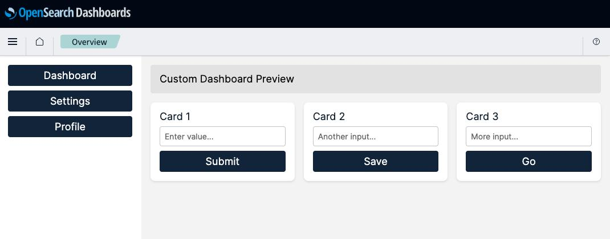

# OpenSearch Dashboards – Design System Enhancement

## Overview
This project updates the OpenSearch Dashboards UI by introducing a cohesive design system and improving core components.  
The goal is to demonstrate design consistency, modern front-end practices, and attention to usability and accessibility.



## Design Rationale
The new design system focuses on:
- Clear visual hierarchy
- Consistent spacing and typography
- Improved contrast and accessibility
- Scalable tokens for future extension

Design tokens were introduced to centralize colors, typography, and spacing, making the UI easier to maintain and evolve.

## Design System
### Colors
- Primary, secondary, neutral, and semantic colors defined as tokens
- Applied globally via CSS variables

### Typography
- Defined font families, sizes, weights, and line-heights
- Consistent usage across headers, body text, and UI components

### Spacing
- Spacing scale defined with reusable tokens
- Applied consistently to layout and components

## Modified Components
The following components were updated to reflect the new design system:
- Button
- Header
- Sidebar
- Card
- Form Input

Each component was refined for better usability, visual clarity, and accessibility while keeping alignment with OpenSearch patterns.

## Setup & Build Instructions

### Prerequisites
- Node.js (recommended version from OpenSearch Dashboards docs)
- Yarn
- Java (required by Gradle)
- Gradle

### Important Note (Docker Limitation)
At the time of this challenge, Docker images for **OpenSearch 3.5** were not yet available.  
Because of this, the project was set up and executed **locally using Gradle** instead of Docker.

### Running OpenSearch locally
1. Download OpenSearch 3.5 source or distribution.
2. Start OpenSearch using Gradle:
   ```bash
   ./gradlew run
    ```

### Running OpenSearch Dashboards locally
1. Clone this repository.
2. Navigate to the OpenSearch Dashboards directory.
3. Install dependencies:
   ```bash
   yarn install
   ```
4. Bootstrap OpenSearch Dashboards:
   ```bash
    yarn osd bootstrap
    ```
5. Start OpenSearch Dashboards:
    ```bash
    yarn start --no-base-path --opensearch=http://localhost:9200
    ```
6. Open your browser and navigate to `http://localhost:5601/app/myCustomThemeDemo` to view the test page showcasing the new design system and components.
