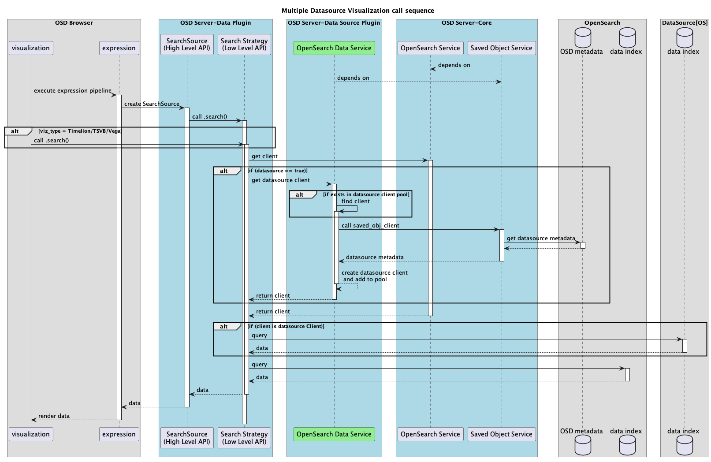
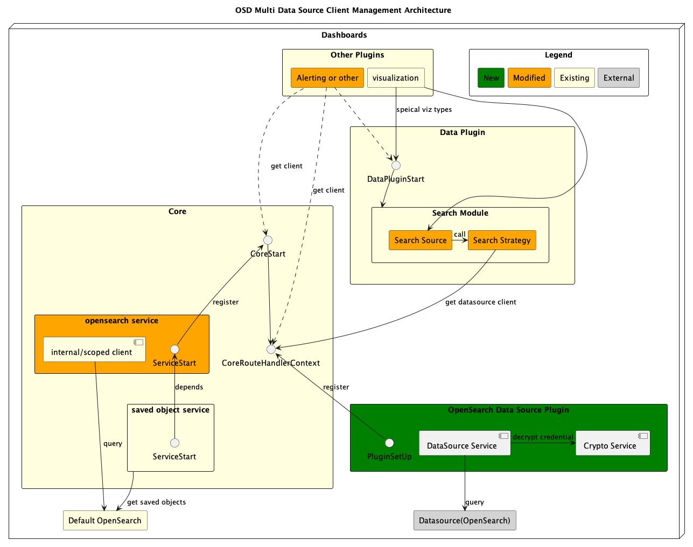

# Multi Data Source Client Management

## 1. Problem Statement

This design is part of the OpenSearch Dashboards multi data source project [[RFC](https://github.com/opensearch-project/OpenSearch-Dashboards/issues/1388)], where we need to manage and expose datasource clients. Connections are established by creating clients that can then be used by a caller to interact with any data source (OpenSearch is the only data source type in scope at this phase).

**Overall the critical problems we are solving are:**

1. How to set up connection(clients) for different data sources?
2. How to expose data source clients to callers through clean interfaces?
3. How to maintain backwards compatibility if user turn off this feature?
4. How to manage multiple clients/connection efficiently, and not consume all the memory?

## 2. Requirements

1. **Accessibility**:
   1. Clients need to be accessible by other OpenSearch Dashboards plugins or modules through interfaces, in all stages of the plugin lifecycle. E.g “Setup”, and “Start”
   2. Clients should be accessible by plugin through request handler context.
2. **Client Management**: Clients needs to be reused in a resource-efficient way to not harm the performance.
3. **Backwards compatibility**: if user enables this feature and later disabled it. Any related logic should be able to take in this config change, and deal with any user cases.
   1. Either switching to connect to default OpenSearch cluster
   2. Or blocking the connection to data source, and throw error message
4. **Auditing:** Need to log different user query on different data sources, for troubleshooting, or log analysis

## 3. Architecture/Dataflow

- We are adding a new service in core to manage data source clients, and expose interface for plugins and modules to access data source client.
- Existing OpenSearch services and saved object services should not be affected by this change

#### 3.1 Dataflow of plugin(use viz plugin as example) call sequence to retrieve data form any datasource.



#### 3.2 Architecture Diagram



## 4. Detailed Design

### 4.0 Answer some critical design questions

**1.** **How to set up connection(clients) for different data sources?**
Similar to how current OpenSearch Dashboards talks to default OpenSearch by creating a client using [opensearch-js](https://github.com/opensearch-project/opensearch-js) library, for data sources we also create clients for each connection. Critical params that differentiate data sources are `url` and `auth`

```ts
const { Client } = require('@opensearch-project/opensearch');

const dataSourceClient = new Client({
  node: url,
  auth: {
    username,
    password,
  },
  ...OtherClientOptions,
});

dataSourceClient.search();
dataSourceClient.ping();
```

**2. How to expose datasource clients to callers through clean interfaces?**
We create a `data source service`. Similar to existing `opensearch service` in core, which provides client of default OpenSearch cluster. This new service will be dedicated to provide clients for data sources. Following the same paradigm we can register this new service to `CoreStart`, `CoreRouteHandlerContext` , in order to expose data source client to plugins and modules. The interface is exposed from new service, and thus it doesn’t mess up with any existing services, and keeps the interface clean.

```
*// Existing*
*const defaultClient: OpenSearchClient = core.opensearch.client.asCurrentUser
*
// With openearch_data_services added
const dataSourceClient: OpenSearchClient = core.openearchData.client
```

**3.How to maintain backwards compatibility if user turns off this feature?**
The context is that user can only turn on/off multiple datasource feature by updating boolean config `data_source.enabled` in `opensearch_dashboards.yml` and reboot.

1. **Browser side**, if datasource feature is turned off, browser should detect the config change and update UI not allowing request to be submitted to any datasource. Multiple datasource related UI shouldn't render. If the request is not submitted to a datasource, the logic won’t return a datasource client at all.
2. **Server side**, if user submits the request to datasource manually, on purpose. Or the plugin tries to access datasource client from server side. In the corresponding core service we’ll have a **flag** that maps to the **enable_multi_datasource** boolean config, and throw error if API is called while this feature is turned off.

**4.How to manage multiple clients/connection efficiently, and not consume all the memory?**

- For data sources with different endpoint, user client Pooling (E.g. LRU cache)
- For data sources with same endpoint, but different user, use connection pooling strategy (child client) provided by opensearch-js.

**5.Where should we implement the core logic?**
Current `opensearch service` exists in core. The module we'll implement has similarity function wise, but we choose to implement `data source service` in plugin along with `crypto` service for the following reasons.

1. Data source is a feature that can be turned on or off. Plugin is born for such pluggable use case.
2. We don't mess up with OpenSearch Dashboards core, since this is an experimental feature, the potential risk of breaking existing behavior will be lowered if we use plugin. Worst case, user could just uninstall the plugin.
3. Complexity wise, it's about the same amount of work.

### 4.1 Data Source Plugin

Create a data source plugin that only has server side code, to hold most core logic of data source feature. Including data service, crypto service, and client management. A plugin will have all setup, start and stop as lifecycle.

**Functionality**

- Setup plugin configuration such as `data_source.enabled`
- Define and register datasource as a new saved object type
- Initiate data source service and crypto service
- Register API to get datasource client to core route handler context
- Setup logging and auditing
- Stop all running services in plugin `stop()` phase

### 4.1 Data Source Service

We need to create a data source service in the data source plugin, to provide the main functionality and APIs for callers to `getDataSourceClient()`. A service in a plugin will have all setup, start and stop as lifecycle.

**Functionality**

- Initialize client pool as empty data structure but with size mapped to user config value. (`data_source.clientPool.size`)
- Configuring a data source client and expose as `getDataSourceClient()` from service level.

### 4.2. Data source client

We need to configure the data source client by either creating a new one, or looking up the client pool.

**Functionality**

- Get data source meta info: Use saved object client to retrieve data source info from OpenSearch Dashboards system index by id, and parse results to `DataSource` object.

  ```ts
  {
    title: ds-sample;
    description?: data source;
    endpoint: http://opensearch.com;
    auth: {
      type: "Basic Auth"
      username: "user name"
      password: "encrypted content"
    };
  }
  ```

- Get root client: Look up the client pool by **endpoint** and return the client if it exists. If a client was not found, a new client instance is created and loaded into pool. At this step, the client won't have any auth info.

- Get credentials: Call crypto service utilities to **decrypt** user credentials from `DataSource` Object.
- Assemble the actual query client: With auth info and root client, we’ll leverage the `opensearch-js` connection pooling strategy to create the actual query client from root client by `client.child()`.

#### 4.2.1 Legacy Client

OpenSearch Dashboards had two types of clients available for use when created. One was the "new client" which has since been separated into `opensearch-js`, and the other was the legacy client named `elasticsearch-js`. Legacy clients are still used by some core features like visualization and index pattern management.

```ts
// legacy client
context.core.opensearch.legacy.client.callAsCurrentUser;
// new client
context.core.opensearch.client.asCurrentUser;
```

Since deprecating legacy client could be a bigger scope of project, multiple data source feature still need to implement a substitute for it as for now. Implementation should be done in a way that's decoupled with data source client as much as possible, for easier deprecation. Similar to [opensearch legacy service](https://github.com/opensearch-project/OpenSearch-Dashboards/tree/main/src/core/server/opensearch/legacy) in core.

```ts
context.dataSource.opensearch.legacy.getClient(dataSourceId);
```

### 4.3 Register datasource client to core context

This is for plugin to access data source client via request handler. For example, by `core.client.search(params)`. It’s a very common use case for plugin to access cluster while handling request. In fact data plugin uses it in its search module to get client, and I’ll talk about it in details in next section.

- **param**
  - **dataSourceId**: need it to retrieve **datasource info** for either creating new client, or look up the client pool
- **return type:** OpenSearchClient
  ```ts
  core.http.registerRouteHandlerContext(
      'dataSource',
      {
        opensearch: {
          getClient: (dataSourceId: string) = {
            ...
            return dataSourceService.getDataSourceClient()
          }
        }
      }
  ```

### 4.4 Refactor data plugin search module to call core API to get datasource client

`Search strategy` is the low level API of data plugin search module. It retrieves clients and queries OpenSearch. It needs to be refactored to switch between the default client and the datasource client, depending on whether or not a request is sent to the datasource.

Currently default client is retrieved by search module of data plugin to interact with OpenSearch by this API call. Ref: [opensearch-search-strategy.ts](https://github.com/opensearch-project/opensearch-dashboards/blob/e3b34df1dea59a253884f6da4e49c3e717d362c9/src/plugins/data/server/search/opensearch_search/opensearch_search_strategy.ts#L75)

```ts
const client: OpenSearchClient = core.opensearch.client.asCurrentUser;
// use API provided by opensearch-js lib to interact with OpenSearch
client.search(params);
```

Similarly we’ll have the following for datasource use case. `AsCurrentUser` doesn't really apply to a datasource because it’s always the “current” user's credentials, defined in the “datasource”, that gets used to initialize the client or lookup the client pool.

```ts
if (request.dataSource) {
    await client: OpenSearchClient =
    core.opensearchData.getClient(<datasourceId>)
} else {
// existing logic to retrieve default client
  client: OpenSearchClient = core.opensearch.client.asCurrentUser
}

// use API provided by opensearch-js lib to interact with OpenSearch
client.ping()
client.search(params)
```

### 4.5 Client Management

When loading a dashboard with visualizations, each visualization sends at least 1 request to server side to retrieve data. With multiple data source feature enabled, multiple requests are being sent to multiple datasources, that requires multiple clients. If we return a new client **per request**, it will soon fill up the memory and sockets with idle clients hanging there. Of course we can close a client anytime. But the connection is supposed to be kept alive for easy reload and periodic pulling data. Therefore, we should come up with better solution to manage clients efficiently.

#### Client pooling by LRU cache

- Key: data source endpoint
- Value: OpenSearch client object
- Configurable pool size: `data_source.clientPool.size`, default to 5
- Use existing js `lru-cache` lib in OpenSearch Dashboards, that enables easy initialization, look up, and dumping outdated client.
- While stopping the service, we can close all the connections by looping the LRU cache and calling `client.close()` for each.
- For data sources with same endpoint, but different user, use connection pooling strategy (child client) provided by opensearch-js.

```ts
import LRUCache from 'lru-cache';

export class OpenSearchClientPool {
  private cache?: LRUCache<string, Client>
  ...
```

## 5. Audit & Logging

[#1986](https://github.com/opensearch-project/OpenSearch-Dashboards/issues/1986)
