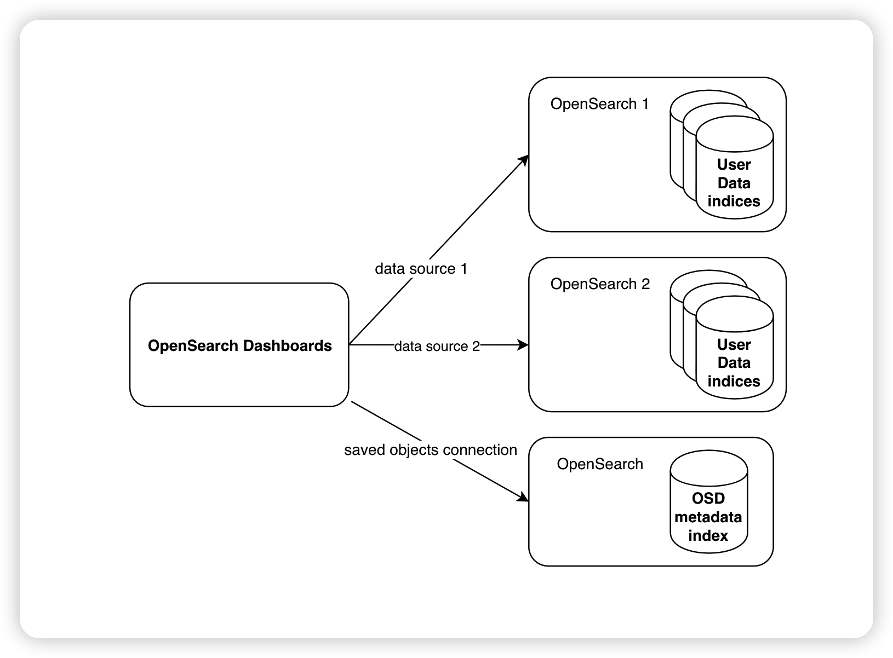
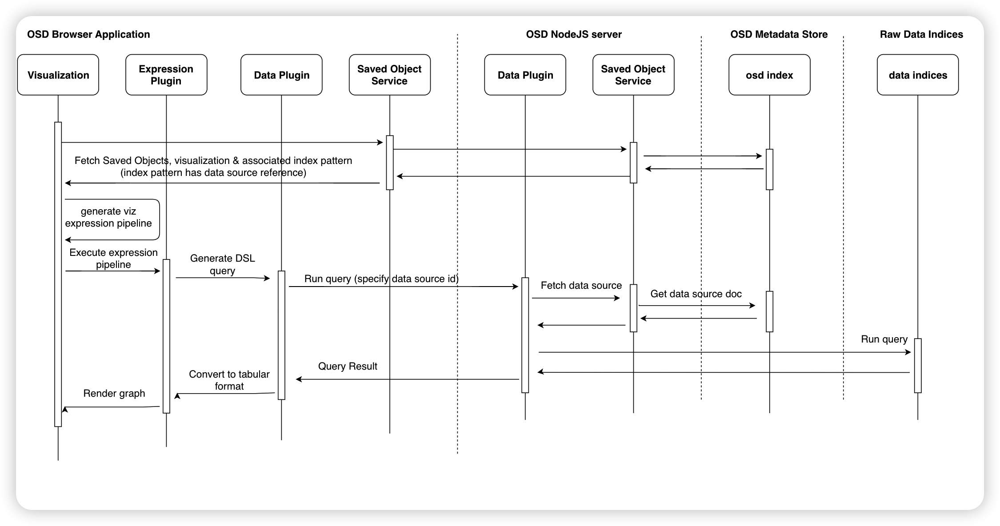

# Multiple Data Source Support High Level Design

OpenSearch Dashboards is designed and implemented to only work with one single OpenSearch cluster. This documents discusses the design to enable OpenSearch Dashboards to work with multiple OpenSearch endpoints, which can be a centralized data visualization and analytics application.

For more context, see RFC [Enable OpenSearch Dashboards to support multiple OpenSearch clusters](https://github.com/opensearch-project/OpenSearch-Dashboards/issues/1388)

## User Stories

[OpenSearch Dashboards Multiple OpenSearch Data Source Support User Stories](user_stories.md)

From a very high level, we introduce `data-source` as a new OpenSearch Dashboards saved object type.

## Terminologies

- **Dashboards metadata**: refers to data documents saved in the `.kibana` index. Equivalent to Dashboards **saved objects**.
- **User data**: in this document, user data refers to the log, metrics or search catalog data that saved in OpenSearch, users run analysis against these user data with OpenSearch Dashboards.
- **Data source**: an OpenSearch endpoint, it could be a on-prem cluster, or AWS managed OpenSearch domain or a serverless collection, which stores the user log/metrics data for visualization and analytics purpose.
  - in this document, we may also refer data source as a new type of OpenSearch Dashboards saved objects, which is a data model to describe a data source, including endpoint, auth info, capabilities etc.

## Scope

We are targeting to release the multiple data source support in OpenSearch 2.4 preview as an experimental feature, and make it GA over a few minor version throughout 2.x versions.

### Preview Scope

- data source only support basic authentication with OpenSearch
  - API key, JWT, Sigv4 and other auth types are out of scope
- data source will only work with visualizations, and discover
  - plugins like AD/Alerting/ISM doesn’t work with data source
  - DevTool console maybe in scope depending on the progress and resource
  - Observability visualizations are out of scope
- data source support can be enabled/disable based on config in OpenSearch Dashboards yml config file
- multiple data source project doesn’t change existing security experience
  - e.g. if a user have access to a security tenant, they will be able to use the data sources defined in that tenant

### GA Scope

- Support all Elasticsearch 7.10 DSL/API compatible data sources, including customer self managed Elasticsearch 7.10, OpenSearch 2.x clusters, AWS managed OpenSearch and Elasticsearch 7.10 domains. OpenSearch Serverless collections.
  - Support Basic auth, AWS SigV4 signing with Data sources
- OpenSearch Dashboards plugins such as Alerting/AD etc. can work with each data source depending on the data source capability
- Observability visualizations are out of scope
- Support of different (major) versions of ES/OpenSearch data sources is out of scope

## Requirements

### Functional requirements

- OpenSearch Dashboards users should be able to dynamically add/view/update/remove OpenSearch data sources using UI and API
- OpenSearch Dashboards users should be able to save/update/remove credentials( username/password in preview, and AWS Sigv4 in GA)
- OpenSearch Dashboards users can create index pattern with specific data source
- Data source credentials should be handled securely
- OpenSearch Dashboards users can put data visualizations of different data sources into one dashboard
- OpenSearch analytics and management functions (such as AD, ISM and security) can work with specific data source to manage those functions in corresponding data source
  - such as user can choose a data source and then edit/view Anomaly detectors and security roles with OpenSearch Dashboards
- OpenSearch Dashboards should be able to work with self managed and AWS managed

### Limitations

- One index pattern can only work with one data source
- One visualization will still only work with one index pattern
- Plugins like AD and alerting will only work with one data source at any point of time

## Design

### Introducing data source saved object model

Generally, OpenSearch Dashboards works with 2 kinds of data:

1. User data, such as application logs, metrics, and search catalog data in data indices.
2. OpenSearch Dashboards metadata, which are the saved objects in `.kibana` index

Currently both OpenSearch Dashboards metadata and user data indices are saved in the same OpenSearch cluster. However in the case to support OpenSearch Dashboards to work with multiple OpenSearch data sources, OpenSearch Dashboards metadata index will be stored in one OpenSearch cluster, and user data indices will be saved in other OpenSearch clusters. Thus we will need to differentiate OpenSearch Dashboards metadata operations and user data access.

OpenSearch Dashboards admin will still define an OpenSearch cluster in the `opensearch.host` config in `opensearch_dashboards.yml` file. It will be used as the OpenSearch Dashboards metadata store, and OpenSearch Dashboards metadata will still be saved in the `.kibana` index in this OpenSearch cluster.

Regarding the user data access, we propose to add a new “data-source” saved objects type, which describes a data source connection, such as

- cluster endpoint
- auth info, like auth types and credentials to use when accessing the data source
- data source capabilities, such as if the data source supports AD/ISM etc.

Users can dynamically add data source in OpenSearch Dashboards using UI or API, OpenSearch Dashboards will save the data source saved objects in its metadata index. And then users can do as they want with their data sources. For example, when OpenSearch Dashboards needs to access user data on behalf of the customer, customer will need to specify a data source id, then OpenSearch Dashboards can fetch the data source info from its metadata store, then send the request to the corresponding data source endpoint.

So the Dashboards and OpenSearch setup may look like:

Refer to the proposed solution in [#1388](https://github.com/opensearch-project/OpenSearch-Dashboards/issues/1388) for the data modeling of data source

### Data source integration

[opensearch_service](https://github.com/opensearch-project/OpenSearch-Dashboards/tree/main/src/core/server/opensearch) is one of the core modules of OpenSearch Dashboards, it is a singleton instance in OpenSearch Dashboards which manages OpenSearch Dashboards connection with the backend OpenSearch endpoint. It makes another level of abstraction of OpenSearch client, and provide a set of interfaces for other OpenSearch Dashboards modules and plugins to interact with OpenSearch for example running DSL queries, or calling arbitrary OpenSearch APIs.

Currently, OpenSearch Dashboards only works with one OpenSearch cluster, OpenSearch Dashboards metadata index and user data indices are stored in the same OpenSearch cluster. So the OpenSearch Dashboards [saved object service](https://github.com/opensearch-project/OpenSearch-Dashboards/tree/main/src/core/server/saved_objects), which the core OpenSearch Dashboards module handles all OpenSearch Dashboards metadata operations, also relies on `opensearch_service` interfaces to work with OpenSearch.

With multi-datasource, we will need to diverge the `opensearch_service` for these 2 use cases. We propose to fork a new `metadata_client` from existing `opensearch_service` to manage the metadata store connection, so that `saved_objects_service` can use `metadata_client` to perform saved objects operations. And then we repurpose the `opensearch_service` to serve the user data access use cases. The new `opensearch_service` needs will expose following interface to allow other OpenSearch Dashboards components to interact with a specific data source cluster.

```
core.opensearch.withDataSource(<data_source_id>).callAsCurrentUser(searchParams)
```

OpenSearch Dashboards plugins like data plugin, alerting plugin will need to introduce the data source concept into their use case, letting users to specify a data source when using their functions, and then switch to this new opensearch interface when calling OpenSearch APIs or executing queries.

### Visualization solution with support of multiple datasource

Current OpenSearch Dashboards visualization solution replies on 3 major saved object types: index-pattern, visualization and dashboard.

- Index pattern is a level of data abstraction. Index pattern describes a set of data indices, and their data schema.
- Visualization works starts with index pattern. OpenSearch Dashboards users can create data visualizations against an index pattern. A visualization includes the OpenSearch DSL query, aggregation and a reference to an index pattern, as well as graph metadata such as legend and labels. When rendering a visualization graph, the visualization executes the query & aggregation against that specific index pattern, and draw the graph according to graph settings.
- Dashboard references visualizations. OpenSearch Dashboards users can place a set of visualizations into a dashboard. A OpenSearch Dashboards dashboards describes the layout and control (time picker, field filters) of all visualizations on the dashboard.

To support multiple data source in OpenSearch Dashboards, we will add “data source” saved object as a reference to the index pattern model. One index pattern will have one data source reference. An index pattern can only refer to one data source, one data source can be used by multiple index patterns.

With this new “data source” reference in index pattern, OpenSearch Dashboards users will need to first create data sources in OpenSearch Dashboards, then select a data source when creating index patterns. Then the visualization and dashboard creation experience will remain the same. Also for any other save object types, if they reference index-pattern, or reference any save object that references index-pattern. Retrieving data from data source will be supported out of the box.

- For OpenSearch Dashboards multiple data source user experience, refer to [OpenSearch Dashboards Multiple OpenSearch Data Source Support User Stories](https://quip-amazon.com/VXQ0AhpPs3gU)

- The OpenSearch Dashboards visualization rendering flow will look like following with multi-datasource support: 

### Backward Compatibility

We plan to release this multi-datasource support as an experimental feature with OpenSearch 2.4. OpenSearch Dashboards admins will be able to enable or disable the multi-datasource feature using configurations in `opensearch_dashboards.yml` .

If multi-datasource is enabled, OpenSearch Dashboards users will be able to see all data source related feature and APIs, that they can manage their data sources, and build visualization and dashboards with data sources. While if multi-datasource is disabled, users will not see anything related to data sources, and their OpenSearch Dashboards experience will remain the same as single data source.

If OpenSearch Dashboards admin enables multi-datasource for an existing OpenSearch Dashboards service, users will still able to use their existing index patterns and visualizations, which will by default fetch data from the same endpoint as their metadata store.

If an OpenSearch Dashboards service has enabled multi-datasource, and it already has index pattern with remote data source created, admin will not able to disable multi-datasource feature. OpenSearch Dashboards will fail to start if it detected data source in the saved object while multi-datasource is disabled.

### Security

#### Data source access control

Multi-datasource project doesn’t plan to change the security (authN & authZ) controls for OpenSearch Dashboards. The `data-source` is a new type of saved objects, so the access control of `data source` will follow the same way as other saved objects such as index patterns and visualizations.

Based on existing OpenSearch and OpenSearch Dashboards security implementations, OpenSearch Dashboards saved objects access control is implemented via `security tenants`. OpenSearch users are mapped to a set of roles, and each role has corresponding permission to access certain tenants. If a user has permission to access a tenant, they will be able to access all saved objects in that tenant. With this mechanism, if a user created a data source in a shared tenant, other users who has access to that shared tenant will be able to see the data source object and see/create visualizations with the data source.

#### Data source credential handling

Credentials is part of the data source object, and will be saved in OpenSearch Dashboards metadata index. OpenSearch Dashboards will use that credentials to authenticate with the data source when executing queries. This credentials will need to be encrypted regardless OpenSearch Dashboards has access control or not.

We will use a symmetric key to encrypt the credentials before saving data source into OpenSearch Dashboards metadata index, and use the same key to decrypt it when OpenSearch Dashboards needs to authenticate with corresponding data source. For open source release, we will allow admins to configure the encryption key in the `opensearch_dashboards.yml` file.

For more about credential encryption/decryption strategy, refer to [#1756](https://github.com/opensearch-project/OpenSearch-Dashboards/issues/1756)

#### Auditing

As part of the security effort, OpenSearch Dashboards needs to support the logging for all use of data sources, so that admins can have a clear view of which OpenSearch Dashboards user accessed data source, and queried data from that data source. The audit log could be saved in the metadata store, or local logs for potential auditing work.
