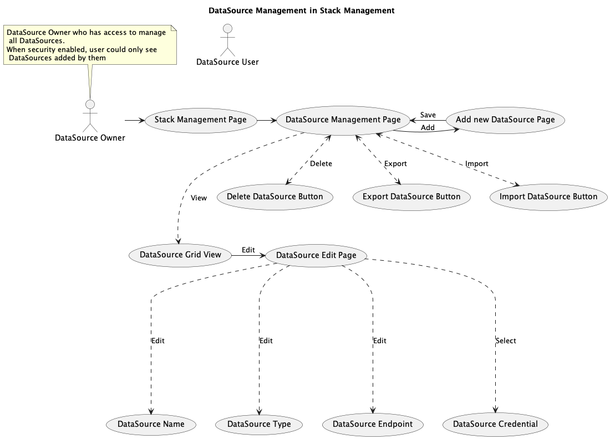

# OpenSearch Dashboards Multiple OpenSearch Data Source Support User Stories

Today, OpenSearch Dashboards (OpenSearch Dashboards) can only connect to one single OpenSearch cluster by configuring the cluster endpoint in the `opensearch_dashboards.yml` config file. We want to allow OpenSearch Dashboards users to dynamically add/update/remove OpenSearch compatible endpoints, and then do their analytics work with data in those OpenSearch data stores.

RFC: https://github.com/opensearch-project/OpenSearch-Dashboards/issues/1388

This document discusses the user experience of the OpenSearch Dashboards multiple data source support.

## User Story

### Current user experience

- OpenSearch Dashboards admin setup the OpenSearch Dashboards service and configure the OpenSearch endpoint in `opensearch_dashboards.yml`
  - Both the OpenSearch Dashboards metadata index (`opensearch_dashboards` index) and data indices are saved in the same OpenSearch cluster
- OpenSearch Dashboards users can work with visualizations, usually they will
  - Create/update index patterns
  - Create/update visualization, each visualization is built on top of one index pattern
  - Create/update dashboard using a group of visualizations
  - Run adhoc queries against an index pattern using discover feature
  - View index patterns/visualization/dashboards
- OpenSearch Dashboards users can work with analytics functions, such as Alerting/AD etc

### Expected user experience with multiple data source

We are planning to introduce a new `data-source` model, to describe an OpenSearch data source, and letting index pattern to refer to a `data-source`.

- OpenSearch Dashboards admin setup the OpenSearch Dashboards service and configure the OpenSearch **metadata store endpoint** in `opensearch_dashboards.yml`
  - the metadata store OpenSearch cluster only saves the `.kibana` index, data indices can be saved in other OpenSearch stores
- Users will need to have a data-source before they can do any visualization or analytics work with OpenSearch Dashboards
  - Users can create/update/view data sources
  - Users need to specify a data source when creating new index patterns, data source is not mutable after index pattern is created
  - Create/update visualization and dashboards experience remains the same as is today.
  - View index patterns/visualization/dashboards experience remains the same as is today.
- When users want to work with analytics features like AD and alerting. they need to specify a data source to work with. (We may consider to add default data source concept)

## UI Change

This multiple data source support and introduction of data source model requires several UI changes on OpenSearch Dashboards

### Data source management

Data source, as a new saved object type, should have a management page, like index pattern.

We will need to

- add a new data source entry in the stack management Nav app, with a data source list table
- a data source detail page, to show detailed information of a specific data source, such as URL, auth type, endpoint capabilities etc.

### Index Pattern

- Index pattern creation flow: With the data sources, users will need to specify which data source to use when creating a new index pattern.
- Index pattern detail page: On the index pattern detail page, we will need to show which data source this index pattern uses
- Data source selector for plugins: when OpenSearch Dashboards users working with analytics functions like Alerting and AD, we will want to allow users to switch between data sources

## Appendix

### Data source security

For the initial launch with OpenSearch 2.4 preview, we do not plan to change security design of OpenSearch.

When creating a data source, users need to provide endpoint URL, username and password(if using basic authentication). OpenSearch Dashboards service will encrypt the username and password when storing it into metadata store.

Data source is a new type of OpenSearch Dashboards saved objects. In current OpenSearch security model, access control on data source document is the same as other saved objects documents. Basically data source docs will be accessible by any user who has access to the tenant.
