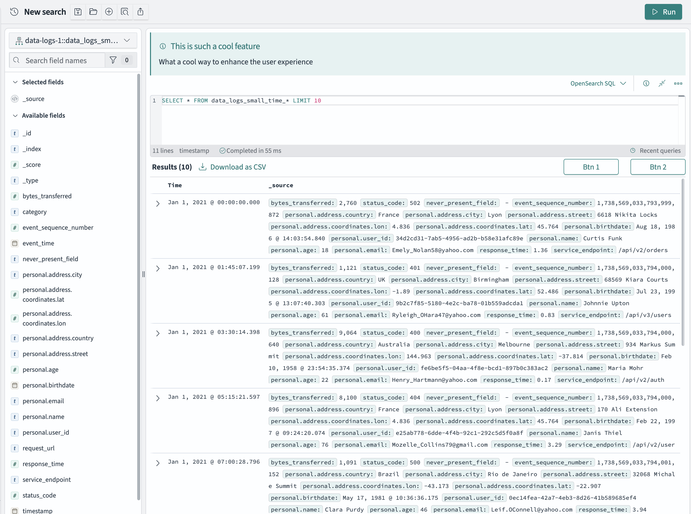

# Enhancing the Data Plugin

# 1. Introduction

One of the core functionalities of the Data plugin is the query editor, which is a key component in several places such as the Discover page.

We have dedicated a few areas around the query editor to be customized by plugin developers, and this guide will walk through how to do so.

**Note:** this is an experimental feature, and is subject to change at any time in the future.

# 2. Data Plugin Setup API

Within the [DataPlugin setup method](https://github.com/opensearch-project/OpenSearch-Dashboards/blob/main/src/plugins/data/public/types.ts) we expose a method called `__enhance`. This exposes [two areas](https://github.com/opensearch-project/OpenSearch-Dashboards/blob/main/src/plugins/data/public/types.ts#L45) where plugin developers can enhance:

- [search](https://github.com/opensearch-project/OpenSearch-Dashboards/blob/main/src/plugins/data/public/search/types.ts#L42-L44)
- [queryEditor](https://github.com/opensearch-project/OpenSearch-Dashboards/blob/main/src/plugins/data/public/ui/query_editor/query_editor_extensions/query_editor_extension.tsx#L55-L114)

This guide will focus on the query editor enhancements.

# 3. Query Editor Extension Interface

```ts
export interface QueryEditorExtensionConfig {
  /**
   * The id for the query editor extension.
   */
  id: string;
  /**
   * Lower order indicates higher position on UI.
   */
  order: number;
  /**
   * A function that determines if the query editor extension is enabled and should be rendered on UI.
   * @returns whether the extension is enabled.
   */
  isEnabled$: (dependencies: QueryEditorExtensionDependencies) => Observable<boolean>;
  /**
   * @returns DataStructureMeta for a given data source id.
   */
  getDataStructureMeta?: (
    dataSourceId: string | undefined
  ) => Promise<DataStructureMeta | undefined>;
  /**
   * A function that returns the query editor extension component. The component
   * will be displayed on top of the query editor in the search bar.
   * @param dependencies - The dependencies required for the extension.
   * @returns The query editor extension component.
   */
  getComponent?: (dependencies: QueryEditorExtensionDependencies) => React.ReactElement | null;
  /**
   * A function that returns the query editor extension banner. The banner is a
   * component that will be displayed on top of the search bar.
   * @param dependencies - The dependencies required for the extension.
   * @returns The query editor extension component.
   */
  getBanner?: (dependencies: QueryEditorExtensionDependencies) => React.ReactElement | null;
  /**
   * A function that returns the action bar buttons. The action bar is a
   * component that will be displayed on top of the results table in the discover page, to the right
   * of the Results count. Requires the Discover plugin for it to be rendered
   * @param dependencies - The dependencies required for the extension.
   * @returns The query editor extension component.
   */
  getActionBarButtons?: (
    dependencies: QueryEditorExtensionDependencies
  ) => React.ReactElement | null;
  /**
   * A function that returns the query control buttons. The query controls is the section to the right
   * of the query editor bar.
   * @param dependencies - The dependencies required for the extension.
   * @returns The query editor extension component.
   */
  getQueryControlButtons?: (
    dependencies: QueryEditorExtensionDependencies
  ) => React.ReactElement | null;
  /**
   * Returns the footer element that is rendered at the bottom of the query editor.
   * @param dependencies - The dependencies required for the extension.
   * @returns The query editor extension component.
   */
  getBottomPanel?: (dependencies: QueryEditorExtensionDependencies) => React.ReactElement | null;
}
```

The methods that return a React elements are the functions you can use to extend the query editor. Each of them are a callback function with `dependencies` as a parameter that you can use to add conditional statements to your rendered components:

```ts
export interface QueryEditorExtensionDependencies {
  /**
   * Currently selected query language.
   */
  language: string;
  /**
   * Change the selected query language.
   */
  onSelectLanguage: (language: string) => void;
  /**
   * Whether the query editor is collapsed.
   */
  isCollapsed: boolean;
  /**
   * Set whether the query editor is collapsed.
   */
  setIsCollapsed: (isCollapsed: boolean) => void;
  /**
   * Currently set Query
   */
  query: Query;
  /**
   * Fetch status for the currently running query
   */
  fetchStatus?: ResultStatus;
}
```

# 4. Example

Here is an example of this feature's usage within a plugin:

```tsx
import { QueryEditorExtensionDependencies } from './query_editor_extension';

export class ExamplePlugin {
...

  public setup(
    core: CoreSetup,
    { data }: ExamplePluginSetupDependencies
  ) {
    data.__enhance({
      editor: {
        queryEditorExtension: createQueryEditorExtensionConfig()
      }
    })
  }
}

export const createQueryEditorExtensionConfig = (): QueryEditorExtensionConfig => {
  return {
    id: 'example-plugin-extension',
    order: 1,
    isEnabled$: (dependencies: QueryEditorExtensionDependencies) => {
      // render only for SQL language
      return new BehaviorSubject(dependencies.language === 'SQL');
    },
    getBanner: (dependencies: QueryEditorExtensionDependencies) => {
      return (
        <EuiCallOut
          title="This is such a cool feature"
          iconType={'iInCircle'}
        >
          What a cool way to enhance the user experience
        </EuiCallOut>
      )
    },
    getActionBarButtons: (dependencies: QueryEditorExtensionDependencies) => {
      return (
        <EuiFlexGroup direction="row" justifyContent="flexStart">
          <EuiFlexItem grow={false}>
            <EuiSmallButton>Btn 1</EuiSmallButton>
          </EuiFlexItem>
          <EuiFlexItem grow={false}>
            <EuiSmallButton>Btn 2</EuiSmallButton>
          </EuiFlexItem>
        </EuiFlexGroup>
      )
    }
  }
}
```

This will make the UI look like this:


