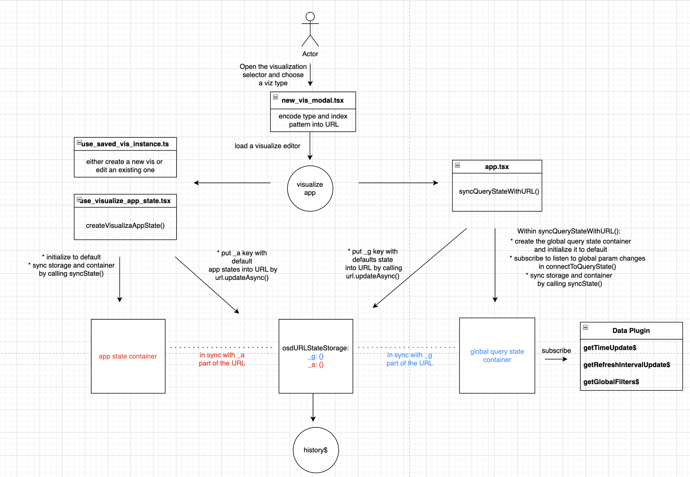
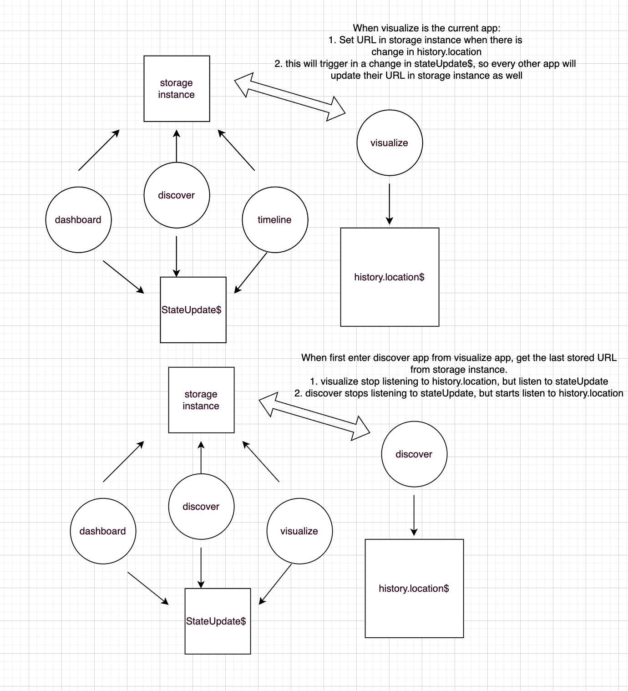

# Data persistence
There are currently five plugins that have the ability to persist user data and configurations: `dashboard`, `discover`, `timeline`, `visualize`, and `vis-builder`. Data will be persisted globally when users navigate between them in OpenSearch Dashboards; data will also be persisted locally across the action of refreshes. To achieve this, they use services and mechanisms from `opensearch_dashboard_utils` plugin.

State syncing utils are a set of helpers to sync application state with URL or browser storage (when setting state: `storeInSessionStore` to `true` in advanced setting, or in the case of an overflowed URL):
1. `syncState()`: subscribe to state changes and push them to state storage; subscribe to state storage and push them to state container
2. storages that are compatible with `syncState()`
    1. `OsdUrlStateStorage`: serialize state and persist it to URL's query param in [Rison](https://github.com/w33ble/rison-node) format; listen for state change in URL and update them back to state
    2. `SessionStorageStateStorage`: serialize state and persist it to URL's query param in session storage
3. state containers: redux-store like objects to help manage states and provide a central place to store state

# Two types of persistence
There are two types for data persistence: 
1. App state (example from visualization plugin)
    1. App state storage key: '_a'
    2. App state is persistent only within the specific app, values will persist when we refresh the page, values will not be persist when we navigate away from the app
    3. For visualize app, the params are:
       1. Query

       

       2. App filters 

       
       
       3. Vis & UI state

       
2. Global query state 
    1. Global state storage key: '_g'
    2. Global query state is persistent across the entire OpenSearch Dashboards application, values will persist when we refresh the page, or when we navigate across visualize, discover, timeline or dashboard page. For example, if we set time range to last 24 hours, and refresh intervals to every 30 min, the same time range and refresh intervals will be applied if we navigate to any of the other pages.
    3. Params:
       1. global filters (Select `pin filter` to make the filters global)

       

       2. refresh intervals

       

       3. time range

       

# URL breakdown & example


# Global state persistence

1. In plugin.ts, during plugin setup, call `createOsdUrlTracker()`, listen to history changes and global state changes, then update the nav link URL. This also returns function such as `onMountApp()`, `onUnmountedApp()`
    ```ts
            const {
        appMounted,
        appUnMounted,
        ...
        } = createOsdUrlTracker({
        baseUrl: core.http.basePath.prepend('/app/visualize'),
        defaultSubUrl: '#/',
        storageKey: `lastUrl:${core.http.basePath.get()}:visualize`,
        navLinkUpdater$: this.appStateUpdater,
        stateParams: [
        {
            osdUrlKey: '_g',
            stateUpdate$: data.query.state$.pipe(
            filter(
                ({ changes }) => !!(changes.globalFilters || changes.time || changes.refreshInterval)
            ),
            map(({ state }) => ({
                ...state,
                filters: state.filters?.filter(opensearchFilters.isFilterPinned),
            }))
            ),
        },
        ],
        ....
    ```

    * When we enter the app and app is mounted, it initializes nav link by getting previously stored URL from storage instance: `const storedUrl = storageInstance.getItem(storageKey)`. (Storage instance is a browser wide session storage instance.) Then it unsubscribes to global `state$` and subscribes to `URL$`. The current app actively listens to history location changes. If there are changes, set the updated URL as the active URL

    ```ts
      function onMountApp() {
      unsubscribe();
      ...
      // track current hash when within app
            unsubscribeURLHistory = historyInstance.listen((location) => {
                  ...
                  setActiveUrl(location.hash.substr(1));
               }
            });
         }
    ```

    * When we are leaving the app and app is unmounted, unsubscribe `URL$` and subscribe to global `state$`. If the global states are changed in another app, the global state listener will still get triggered in this app even though it is unmounted, it will set the updated URL in storage instance, so next time when we enter the app, it gets the URL from the storage instance thus the global state will persist.

    ```ts
        function onUnmountApp() {
            unsubscribe();
            // propagate state updates when in other apps
                unsubscribeGlobalState = stateParams.map(({ stateUpdate$, osdUrlKey }) =>
                        stateUpdate$.subscribe((state) => {
                        ...
                        const updatedUrl = setStateToOsdUrl( ... );
                        ...
                        storageInstance.setItem(storageKey, activeUrl);
                })
            );
        }
    ```

2. In `app.tsx`, call `syncQueryStateWithUrl(query, osdUrlStateStorage)` to sync `_g` portion of url with global state params
    * When we first enter the app, there is no initial state in the URL, then we initialize and put the _g key into url

    ```ts
        if (!initialStateFromUrl) {
        osdUrlStateStorage.set<QueryState>(GLOBAL_STATE_STORAGE_KEY, initialState, {
        replace: true,
        });
        }
    ```

    * When we enter the app, if there is some initial state in the URL(the previous saved URL in `storageInstance`), so we retrieve global state from `_g` URL

    ```ts
      // retrieve current state from `_g` url
        const initialStateFromUrl = osdUrlStateStorage.get<QueryState>(GLOBAL_STATE_STORAGE_KEY);
        // remember whether there was info in the URL
        const hasInheritedQueryFromUrl = Boolean(
            initialStateFromUrl && Object.keys(initialStateFromUrl).length
        );
        // prepare initial state, whatever was in URL takes precedences over current state in services
        const initialState: QueryState = {
            ...defaultState,
            ...initialStateFromUrl,
        };
    ```

    * If we make some changes to the global state: 1. `stateUpdate$` get triggered for all other unmounted app(if we made the change in visualize plugin, then the `stateUpdate$` will get triggered for dashboard, discover, timeline), then it will call `setStateToOsdUrl()` to set `updatedURL` in `storageInstance` so global state get updated for all unmounted app. 2. `updateStorage()` get triggered for `currentApp` to update current URL state storage, then global query state container will also be in sync with URL state storage

    ```ts
        const { start, stop: stopSyncingWithUrl } = syncState({
        stateStorage: osdUrlStateStorage,
        stateContainer: {
            ...globalQueryStateContainer,
            set: (state) => {
            if (state) {
                // syncState utils requires to handle incoming "null" value
                globalQueryStateContainer.set(state);
            }
            },
        },
        storageKey: GLOBAL_STATE_STORAGE_KEY,
        });
        start();
    ```

# App state persistence

1. We use `useVisualizeAppState()` hook to instantiate the visualize app state container, which is in sync with '_a' URL

```ts
    const { stateContainer, stopStateSync } = createVisualizeAppState({
            stateDefaults,
            osdUrlStateStorage: services.osdUrlStateStorage,
            byValue,
        });
```
2. When we first enter the app, there is no app state in the URL, so we set the default states into URL in `createDefaultVisualizeAppState()`: `osdUrlStateStorage.set(STATE_STORAGE_KEY, initialState, { replace: true });`

3. When we make changes to the app state, the `dirtyStateChange` event emitter will get triggered, then osd state container will call `updateStorage()` to update the URL state storage, then state container(appState) will also be in sync with URL state storage

```ts
    const onDirtyStateChange = ({ isDirty }: { isDirty: boolean }) => {
        if (!isDirty) {
        // it is important to update vis state with fresh data
        stateContainer.transitions.updateVisState(visStateToEditorState(instance, services).vis);
        }
        setHasUnappliedChanges(isDirty);
    };
    eventEmitter.on('dirtyStateChange', onDirtyStateChange);
    ... 
    const { start, stop: stopSyncingWithUrl } = syncState({
            stateStorage: osdUrlStateStorage,
            stateContainer: {
                ...globalQueryStateContainer,
                set: (state) => {
                    if (state) {
                        globalQueryStateContainer.set(state);
                        }
                },
            },
            storageKey: GLOBAL_STATE_STORAGE_KEY,
        });
        // start syncing the appState with the ('_a') url
        startStateSync();
```

4. In `useEditorUpdates()`, we use the saved appState to load the visualize editor

5. We can also choose to do state sync without using state container by directing hooking up the state managers with the URL data storage. For example, we implemented state management in Vis Builder with redux store, while the global state persistence implementation is the same, we implemented app state persistence without using any state containers or state syncing utils. For the actual visual data, we directly hook up redux store with `OsdUrlStateStorage` to sync the values by using `saveReduxState()` and `loadReduxState()`. For app filter and query, since they are part of the app states but not part of the redux store, we directly hook up their state managers from data plugin with `OsdUrlStateStorage` and `connectStorageToQueryState()`.

# Refresh
When we refresh the page, both app state and global state should persist:

1. `appMounted()` gets triggered for the current app, so current app subscribe to URL$
2. `syncQueryStateWithUrl()` gets called within app.tsx for the current app, and we are getting the global states from URL '_g', and then `connectToQueryState()` gets called to sync global states and state container for the current app so the current app load the saved global states in top nav
3. `stateUpdate$` will get triggered for every other unmounted app, so the global states are updated for their URL in storage instance as well by calling `setStateOsdUrl()`
4. When we load the visualize editor, `createDefaultVisualizeAppState()` gets called, and it gets app state from URL '_a', and it updates appState based on URL
5. In `useEditorUpdates()`, it uses the updated appState to load the visualization with previous saved states
# Navigate to another app

When we navigate to another app from the current app, global state should persist:

1. `appUnmounted()` triggered for the current app, unsubscribe to `URLHistory$`, and subscribe to stateUpdate$
2. `appMounted()` triggered for the app that we navigated to, so it unsubscribe its `stateUpdate$`, and subscribe to `URLHistory$`
3. `syncQueryStateWithUrl` is triggered, it then gets the saved global state from the `osdurlstatestorage` and set the top nav global states by using `globalQueryStateContainer`

# Diagrams

1. When first navigate to the visualize app, initialize and sync state storage and state containers


2. When we navigate to another app, the browser wide storage instance stores the last active URL for each app and also updates the URL if there are any new global state values. This ensure global data persistence across different apps. For example, if we navigate from visualize app to discover app:


Here is an example of the storage instance: 


3. When we made some changes to the global params, the global query state container will receive updates and push the updates to osd url state storage. Other unmounted app will update their last active URL in instance storage as well.


4. When we made some changes to the app params, the app state container will receive updates and also push the updates to osd url state storage.


5. When we refresh the page, we parse the information from the URL(_g for global state, _a for app state). We use the saved information to create new state containers and set up synchronization between state containers and state storage.

