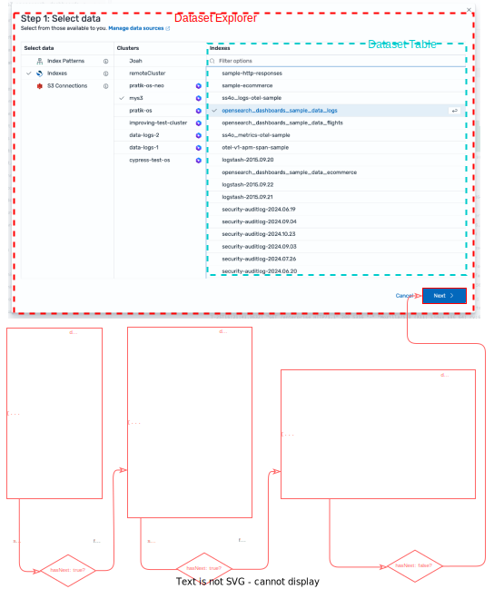
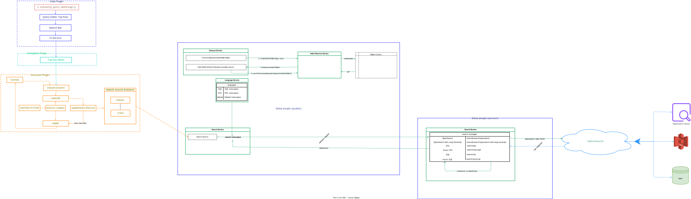
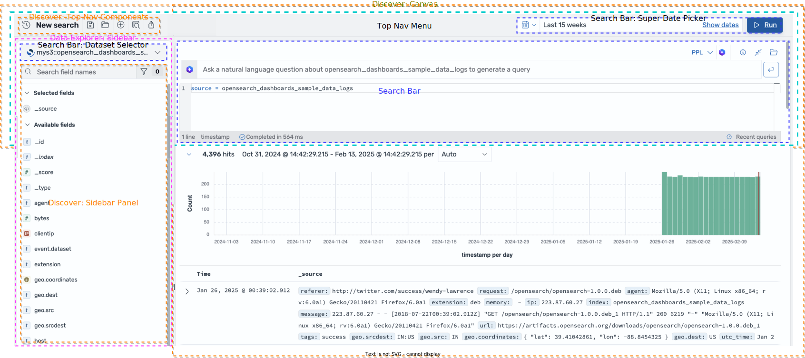

# Understanding and Extending the Discover Plugin

## 1. Introduction

**Discover** is a core plugin in OpenSearch Dashboards that allows users to explore and visualize data on the fly without needing in-depth knowledge of its structure. Traditionally, Discover worked only with OpenSearch indices; however, as organizations increasingly store data in various formats and locations, the ability to support different data sources (or “datasets”) has become essential.

In this guide, you will:

- Start with the basic Discover user experience: what it looks like, how it’s used, and what problems it solves.  
- Progressively uncover the underlying architecture, data flows, and code structure.  
- Learn how to extend Discover to support custom data sources and query languages.

By the end, you should have a clear mental model of how Discover works and the confidence to add new functionality—whether that means integrating your favorite data lake or registering a custom query language.

---

## 2. User Perspective: Discovering and Exploring Data

From a user standpoint, Discover is all about **quick data exploration**:

1. **Dataset Selection:** Users choose a dataset (e.g., an OpenSearch index, an S3 connection, or a custom source) via the **Dataset Selector** in the search bar.  
2. **Search Input:** Once a dataset is selected, users enter a query in the search box (supported query languages might be Lucene, DQL, SQL, or PPL).  
3. **Time Range Selection:** They use the date/time picker to narrow results to the desired period.  
4. **Search Execution:** When the user submits the search, Discover fetches and displays matching records in a table, optionally charting the distribution of results over time.  
5. **Filter & Refine:** Users can add filters, change the query, or choose different fields for display. Discover quickly updates and re-renders the results.

### Example: Discovering Data Logs

Imagine your web server logs reside in an OpenSearch index called `data_logs`. A user might:

- Select **`data_logs`** from the Dataset Selector.  
- Enter a PPL query such as `source = data_logs | where status = "200"` to see only successful requests.  
- Adjust the date picker to the last 24 hours.    
- Continue iterating to drill into interesting patterns.

This intuitive experience remains similar for other data sources—like an S3 bucket for unstructured logs or a custom data warehouse—thanks to the extensible data services under the hood.

---

## 3. Architecture Overview

Underneath the user-facing simplicity is involves a number of plugins, each with its own responsibilities. These plugins integrate primarily through the **Data Plugin**, which supplies core services such as search execution, query state management, and UI components.

1. **Data Plugin** – Houses the fundamental **Search** and **Query** services.  
2. **Navigation Plugin** – Provides top-level navigation and menu components.  
3. **Discover Plugin** – Focuses on data visualization and the table/field interface.  
4. **Query Enhancements Plugin** – Adds new query languages or specialized data transformations.  
5. **Data Explorer Plugin** – Offers a more advanced data exploration interface (often building on Discover’s features).

### 3.1 Data Plugin Components

Within the Data Plugin, several services come together:

- **Search Service:** Executes searches using different strategies (e.g., direct, async, etc.).  
- **Query Service:** Manages the current query, filters, and time ranges. Includes the *Dataset Service* (to handle multiple data types) and the *Language Service* (to handle multiple query languages).  
- **Ui Service:** Provides UI components (like the search bar) shared across plugins.  
- **Autocomplete Service:** Offers query auto-completion and suggestions.  
- **Field Formats Service:** Formats the data for display.  
- **Data Storage:** Manages local storage of query history and saved state.

A simplified look at the Data Plugin:

```ts
export class DataPublicPlugin implements Plugin<DataPublicPluginSetup, DataPublicPluginStart> {
  private readonly searchService: SearchService;
  private readonly uiService: UiService;
  private readonly queryService: QueryService;
  private readonly fieldFormatsService: FieldFormatsService;
  private readonly autocomplete: AutocompleteService;
  private readonly storage: DataStorage;
  private readonly sessionStorage: DataStorage;
  private readonly config: ConfigSchema;

  // ...
}
```

---

## 4. Core Concepts: Data Structures, Datasets, and Query Languages

Discover’s multi-data type support revolves around a few key ideas: **`DataStructure`**, **`Dataset`**, and **query languages**.

### 4.1 DataStructure Interface

A `DataStructure` describes how data is arranged or nested, enabling hierarchical browsing. For example, an S3 bucket might be broken down into:

```
Indices → Data sources → Indices
```

Using the interface:

```ts
export interface DataStructure {
  id: string;
  title: string;
  type: string;
  parent?: DataStructure;
  children?: DataStructure[];
  hasNext?: boolean;
  paginationToken?: string;
  multiSelect?: boolean;
  columnHeader?: string;
  meta?: DataStructureMeta;
}
```

Would result in these data structures:


### 4.2 Dataset Interface

A `Dataset` provides a **normalized** view of a data for the query system. When a user selects an item in the dataset browser, it becomes a `Dataset`:

```ts
export interface Dataset extends BaseDataset {
  timeFieldName?: string;
  language?: string; // e.g., 'kuery', 'lucene', 'sql', 'ppl'
}

export interface BaseDataset {
  id: string;
  title: string;
  type: string;    // e.g., 'INDEX_PATTERN', 'INDEX', 'S3', 'CUSTOM_SOURCE'
  dataSource?: DataSource;
}
```

## 4.3 Datasets and Temporary Index Patterns

### Understanding Index Patterns

An **index pattern** is a core concept in OpenSearch Dashboards that defines which OpenSearch indices you want to explore. Traditionally, index patterns are created manually by users and stored as saved objects in OpenSearch. They provide:

- A pattern to match one or more indices (e.g., `logs-*`)
- Field mappings and metadata
- A designated time field for time-based operations
- Format configurations for different fields

Index patterns have historically been the foundation of data visualization in OpenSearch Dashboards, requiring users to create and manage them explicitly before data exploration.

### The Temporary Index Pattern Pattern

With the introduction of multi-data support, Discover uses a more flexible approach called **temporary index patterns**. When a user selects a dataset through the Dataset Explorer, instead of requiring them to create a permanent index pattern saved object, the system:

1. Converts the selected dataset into an index pattern specification
2. Creates a temporary in-memory index pattern
3. Stores this pattern in a cache keyed by the dataset ID
4. Uses this temporary pattern for all search and display operations

```ts
public async cacheDataset(dataset: Dataset, services: Partial<IDataPluginServices>): Promise<void> {
  const type = this.getType(dataset?.type);
  try {
    if (dataset && dataset.type !== DEFAULT_DATA.SET_TYPES.INDEX_PATTERN) {
      // For non-index pattern datasets, create a temporary index pattern
      const fetchedFields = await type?.fetchFields(dataset, services);
      const spec = {
        id: dataset.id,
        title: dataset.title,
        timeFieldName: dataset.timeFieldName,
        fields: fetchedFields,
        dataSourceRef: dataset.dataSource ? {
          id: dataset.dataSource.id!,
          name: dataset.dataSource.title,
          type: dataset.dataSource.type,
        } : undefined,
      } as IndexPatternSpec;
      
      // Create temporary index pattern from spec
      const temporaryIndexPattern = await this.indexPatterns?.create(spec, true);
      
      if (temporaryIndexPattern) {
        // Store in cache for future use
        this.indexPatterns?.saveToCache(dataset.id, temporaryIndexPattern);
      }
    }
  } catch (error) {
    throw new Error(`Failed to load dataset: ${dataset?.id}`);
  }
}
```

### Advantages of Temporary Index Patterns

This approach offers several benefits:

1. **No Write Permissions Required**: Users don't need permissions to create saved objects
2. **Ephemeral Existence**: Patterns last only as long as the browser session
3. **Dynamic Creation**: Patterns are generated on-demand when users select datasets
4. **Cross-Source Compatibility**: The same mechanism works for both OpenSearch indices and external sources

### Field Discovery and Mapping

One crucial aspect of temporary index patterns is field discovery. When creating these patterns, the system:

1. Fetches field definitions using the dataset type's `fetchFields` method
2. Maps external data types to OpenSearch field types (e.g., mapping S3 Glue table column types)
3. Determines which fields are searchable, aggregatable, or can be used for time filtering
4. Sets appropriate formatters for different field types

For external data sources that may have very large schemas (like S3 tables with hundreds of columns), the `isFieldLoadAsync` option in the dataset type configuration enables incremental field loading:

```ts
meta: {
  icon: { type: S3_ICON },
  tooltip: 'S3 Connections',
  searchOnLoad: true,
  isFieldLoadAsync: true, // Enable async field loading
},
```

### Managing Temporary Index Pattern Lifecycle

Temporary index patterns are:

- **Created** when a user selects a dataset in the UI
- **Cached** in the IndexPatternsService for the duration of the session
- **Retrieved** from cache when the same dataset is used again
- **Updated** when field definitions change
- **Not persisted** to the saved objects index

This ephemeral approach gives users the flexibility to explore different data sources without administrator intervention while maintaining the powerful search and visualization capabilities that index patterns enable.

### Architectural Considerations

From an architectural perspective, temporary index patterns serve as an adapter between diverse data sources and OpenSearch Dashboards' search infrastructure. By normalizing external data into the index pattern format, the system can leverage existing query and visualization components without major modifications.

This pattern is a key enabler for the dataset service's flexibility, allowing new data sources to be integrated without changing the core search experience.

### 4.4 Query Languages

When query enhancements is enabled, out of the box, the system supports:

- **Lucene** – For unstructured text searches  
- **DQL (Kuery)** – A simpler domain-specific language for OpenSearch  
- **SQL** – SQL-based queries against OpenSearch  
- **PPL** – Pipe Processing Language for log analytics  

The **Language Service** lets plugin developers register new languages.

---

## 5. The Query System and Flow

Everything in Discover revolves around a single `Query` object that includes the textual query, its language, and the target dataset.

```ts
interface Query {
  query: string;       // "status:200", "SELECT * FROM logs", etc.
  language: string;    // "kuery", "sql", "ppl", or custom
  dataset?: Dataset;   // The dataset to query
}
```

The **Query String Manager** is responsible for holding the active `Query` and broadcasting changes. Whenever a user modifies the query string or switches datasets, the manager updates its internal `BehaviorSubject<Query>`.

**But how does that new query get to the actual search execution layer?** 

Usually, Discover has an observable subscription to watch for query changes, that then trigger an update on a **Search Source** instance to perform the fetching of the search results.

### 5.1 Putting It All Together: A Simplified Example

Below is a conceptual example of how you might tie these pieces together in a React-based plugin using a `useSearch` hook. (This is not official code but illustrates the flow.)

```ts
// Simplified: Listening for query changes and executing them via a SearchSource.
import { useEffect, useState } from 'react';
import { BehaviorSubject } from 'rxjs';
import { DataPublicPluginStart, SearchSource } from 'path-to-data-plugin';

interface UseSearchProps {
  data: DataPublicPluginStart; // from the Data plugin
}

export function useSearch({ data }: UseSearchProps) {
  const [results, setResults] = useState<any>(null);

  // We get the QueryStringManager from the QueryService
  const { queryString } = data.query;

  // Create a top-level SearchSource once
  const searchSource = await data.search.searchSource.create();

  useEffect(() => {
    // Subscribe to query updates
    const subscription = queryString.getUpdates$().subscribe(async (currentQuery) => {
      if (!currentQuery) return;

      // Configure our SearchSource with the latest query & dataset
      // Typically you'd also set filters, index pattern, time range, etc.
      searchSource.setField('query', { query: currentQuery.query, language: currentQuery.language });
      if (currentQuery.dataset) {
        searchSource.setField('index', currentQuery.dataset.id); 
      }

      // Now execute the search. This is where interceptors & strategies come into play.
      const response = await searchSource.fetch();
      setResults(response);
    });

    return () => {
      // Clean up subscription on unmount
      subscription.unsubscribe();
    };
  }, [searchSource, queryString]);

  return { results };
}
```

In this simplified code:

1. We subscribe to the `QueryStringManager` so every time the `Query` changes, we update our **Search Source**.  
2. We call `searchSource.fetch()`, which triggers the **Search Interceptor** logic (based on the current language or dataset) and ultimately runs the query via an appropriate **Search Strategy** on the server.

> **Key Insight:** `searchSource.fetch()` is where the query actually travels through the interceptors and ends up executed by the correct search strategy.

---

## 6. Search Execution Flow in Detail



Let’s break down the steps end-to-end:

1. **UI Input**  
   A user types a query or picks a dataset. Perhaps they click “Search” or the UI automatically triggers a refresh.

2. **Query String Manager Update**  
   The new query is sent to the `QueryStringManager`, which updates its `BehaviorSubject<Query>`. Any subscribers to that observable (e.g., a custom hook, a container component) receive the updated query object.

3. **Search Source Configuration**  
   The subscriber (in the example above, the `useSearch` hook) takes the new query and configures or reconfigures its `SearchSource` instance:
   - Sets the `query` and `language`  
   - Sets the `index` (i.e., the dataset ID)  
   - May set additional fields like time filters or sorting  

4. **`SearchSource.fetch()`**  
   Invoking `fetch()` constructs a search request object and routes it through the **Search Interceptor**. The interceptor used depends on the language (e.g., Lucene, SQL, PPL) or dataset type. The interceptor may transform the query, add additional parameters, or decide which server-side **Search Strategy** to invoke.

5. **Server-Side Search Strategy**  
   The chosen strategy (e.g., `opensearch`, `opensearch-with-long-numerals ` `sql` `sqlasync`, `ppl`, `pplasync` etc.) sends the request to OpenSearch utilizing an HTTP Client for a specific data source. When the request gets fired it's intercepted and checked for a data-source ID. Then the create client is selected and used to fire the request. Once the data is returned, the response is converted to a **DataFrame**. This standard shape ensures consistency across different data sources.
    - **NOTE**: Search Strategies should implemented per data source not by language. We plan on refactoring this bit.
    - **NOTE**: There are no hard requirements that it calls out to OpenSearch. As of writing this document, we only call out to OpenSearch and OpenSearch handles fetching the data from a different source

6. **Results Returned**  
   The final response is passed back up through the interceptor, which might do post-processing or error handling. Eventually, it arrives at the `searchSource.fetch()` call, which resolves to the results in the UI.

7. **UI Rendering**  
   The React component sets state with the new results, causing a re-render to display the updated data.

---

## 7. UI Components Overview



Discover is made of the following components

- **Search Bar:** Contains a query editor, dataset selector, time picker, and filter bar.  
- **Dataset Selector:** Lets users browse or pick from available data sources.  
- **Query Editor:** Adjusts UI (syntax highlighting, auto-complete, error hints) based on the selected language.  
- **Discover Canvas:** Displays records and visual insights from the returned data.

Rather than showing all the component code, it’s more useful to understand **how** they interact:

1. The **Search Bar** or **Query Editor** calls `setQuery(...)` on the `QueryStringManager`.  
2. The **Dataset Selector** can either directly set the dataset on the `QueryStringManager` or show an “Advanced” modal that does the same.  
3. Whenever the query or dataset changes, the flow described in [Section 6](#6-search-execution-flow-in-detail) re-runs.

---

## 8. Extension Points: Adding Custom Data Sources and Languages

Developers can extend Discover to handle new data sources (datasets) or query languages. The process usually involves:

1. **Dataset Type Registration**  
   Implement a `DatasetTypeConfig` to describe how to fetch and configure your custom data source, then register it with the `DatasetService`.

2. **Custom Search Interceptors**  
   If your dataset or language requires custom transformations or routing (e.g., specialized endpoints, unique parameters), implement a class extending `SearchInterceptor`.

3. **Server-Side Search Strategies**  
   On the backend, provide a strategy that knows how to translate requests to your data store. Return results in a standardized DataFrame format.

4. **Custom Query Language** (Optional)  
   If you want your own DSL or syntax, register a `LanguageConfig`. This is especially handy if you have an in-house query engine with domain-specific commands.

### 8.1 Example: Registering a Custom Dataset

```ts
export const customTypeConfig: DatasetTypeConfig = {
  id: 'CUSTOM_SOURCE',
  title: 'Custom Data Source',
  meta: {
    icon: { type: 'myCustomIcon' },
    tooltip: 'Custom Data Source',
    searchOnLoad: true,
  },
  toDataset: (path: DataStructure[]): Dataset => {
    // Convert path elements to a Dataset
  },
  fetch: async (services, path): Promise<DataStructure> => {
    // Return child structures for hierarchical browsing
  },
  fetchFields: async (dataset: Dataset): Promise<DatasetField[]> => {
    // Return field definitions for the dataset
  },
  supportedLanguages: () => {
    // Indicate which query languages are allowed
    return ['SQL', 'PPL'];
  },
};
```

Then:

```ts
queryString.getDatasetService().registerType(customTypeConfig);
```

### 8.2 Example: A Custom Search Interceptor

```ts
export class CustomSearchInterceptor extends SearchInterceptor {
  public search(request: IOpenSearchDashboardsSearchRequest, options: ISearchOptions) {
    // Possibly transform the request or choose a different search strategy
    return this.runSearch(request, options.abortSignal, 'custom_source_search');
  }

  protected runSearch(
    request: IOpenSearchDashboardsSearchRequest,
    signal?: AbortSignal,
    strategy?: string
  ): Observable<IOpenSearchDashboardsSearchResponse> {
    // Connect to your backend, add parameters, handle errors, etc.
  }
}
```

---

## 9. Step-by-Step: Extending Discover with a Custom Data Source

1. **Create a `DatasetTypeConfig`**  
   - Define how to fetch structure and fields for your source.  
   - Register with `queryString.getDatasetService().registerType(...)`.

2. **Create a Custom Search Interceptor**  
   - Extend `SearchInterceptor` to handle your custom query logic or backend routes.

3. **Implement a Server-Side Search Strategy**  
   - On the OpenSearch Dashboards server side, handle your queries and transform raw data into DataFrame objects.

4. **(Optional) Register a Custom Query Language**  
   - If you need a new DSL, define a `LanguageConfig` and wire it up in your plugin’s setup.

5. **Add API Endpoints**  
   - Provide a backend route (e.g., `/api/custom_source_search`) to receive and process queries.

6. **Test Your Integration**  
   - Open Discover in your local dev environment, pick the new source in the Dataset Selector, and run a query.

---

## 10. Performance Considerations

### 10.1 Minimizing Re-renders

- Use **BehaviorSubject** in your hooks/services so the UI only updates when relevant state changes.  
- Memoize expensive operations with `useMemo` or `React.memo`.  
- Avoid deeply nested or rapidly changing objects in React states.

### 10.2 Handling Large or Asynchronous Queries

- Consider paginated or streaming strategies for big data sets.  
- Provide loading indicators or partial results.  
- Cache repeated queries on the server side to accelerate subsequent requests.

### 10.3 Caching

- Cache known data structures or field definitions so you’re not refetching on every open.  
- Use the dataset ID as a key for quick lookups.  
- For extremely large datasets, store partial indexes or utilize an incremental fetching approach.

---

## 11. Conclusion

The Discover plugin in OpenSearch Dashboards provides a powerful, extensible platform for interactive data exploration across multiple backends. By:

- **Standardizing** data sources as `Datasets`  
- **Managing** queries and filters via the `QueryStringManager`  
- **Routing** to appropriate backends using search interceptors and strategies  

…you can seamlessly integrate specialized data sources and custom query languages.

For **users**, this delivers a consistent UI that handles everything from simple text searches to advanced SQL and PPL. For **developers**, it provides a set of straightforward extension points—registering new dataset types, adding interceptors, or even building custom query languages—without having to rewrite core UI code.

Armed with these concepts, you can:

- Add **Custom Query Languages** for domain-specific syntax.  
- Connect **Complex Hierarchical Data Structures** (e.g., S3, big data lakes).  
- Improve **Performance** with caching, async strategies, and reduced re-renders.

With this architecture in mind, you can confidently deliver a flexible, high-performance data exploration experience within OpenSearch Dashboards—no matter where your data lives.