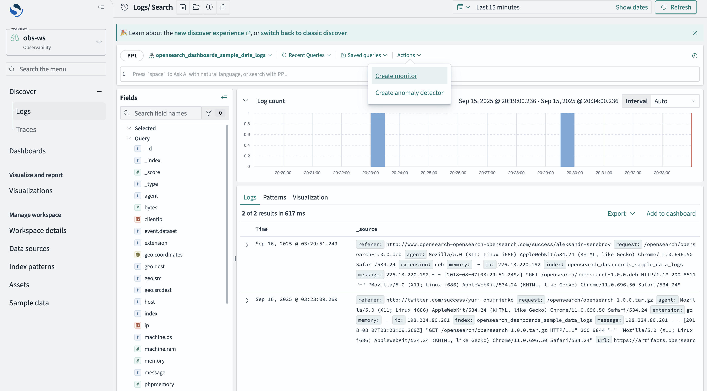

# Query Panel Actions Registry

# 1. Introduction

There is a way to enhance the explore's query panel by adding custom buttons (which we are calling "actions"). This doc will go into details into how to use that feature.

**Note:** this is an experimental feature, and is subject to change at any time in the future.

# 2. Data Plugin Setup API

Within the [Explore Plugin's setup method](https://github.com/opensearch-project/OpenSearch-Dashboards/blob/main/src/plugins/explore/public/types.ts) we expose a property called `queryPanelActionsRegistry`. This exposes a `register()` method that has the following interface:

# 3. Query Panel Actions Registry Setup Interface

```ts
export interface QueryPanelActionsRegistryServiceSetup {
  /**
   * Register an action or a list of actions
   * @param actionConfig
   */
  register: (actionConfig: QueryPanelActionConfig | QueryPanelActionConfig[]) => void;
}

export interface QueryPanelActionConfig {
  /**
   * The id for the action
   */
  id: string;
  /**
   * Lower order indicates higher position in the dropdown UI.
   */
  order: number;
  /**
   * A function that determines if the action button is enabled or disabled
   */
  getIsEnabled?(deps: QueryPanelActionDependencies): boolean;
  /**
   * A function that returns the Label of the action item in the dropdown
   */
  getLabel(deps: QueryPanelActionDependencies): string;

  /**
   * A function that returns the icon of the action item in the dropdown
   */
  getIcon?(deps: QueryPanelActionDependencies): IconType;
  /**
   * Callback that gets called when the action is clicked
   */
  onClick(deps: QueryPanelActionDependencies): void;
}
```

The `register()` method either accepts a single `actionConfig` or an array of `actionConfig`. Within each config, there are several methods that gives you the `QueryPanelActionDependencies`, which you can use to conditionally render specific things:

```ts
export interface QueryPanelActionDependencies {
  /**
   * Currently set Query
   */
  query: QueryWithQueryAsString;
  /**
   * Fetch status for the current query
   */
  resultStatus: QueryResultStatus;
}
```

# 4. Example

Here is an example of this feature's usage within a plugin:

```tsx
export class ExamplePlugin {
...

  public setup(
    core: CoreSetup,
    { explore }: ExamplePluginSetupDependencies
  ) {
    explore.queryPanelActionsRegistry.register({
      id: 'create-monitor',
      order: 1,
      getIsEnabled: (deps) => deps.resultStatus.status === ResultStatus.READY, // only enable button when results came back
      getLabel: () => 'Create monitor',
      getIcon: () => 'lineChart',
      onClick: (deps) => application.navigateToApp('monitor', {
        path: `/opensearch-dashboards/monitor?query=${deps.query.query}`
      })
    })
  }
}

export const createQueryEditorExtensionConfig = (): QueryEditorExtensionConfig => {
  return {
    id: 'example-plugin-extension',
    order: 1,
    isEnabled$: (dependencies: QueryEditorExtensionDependencies) => {
      // render only for SQL language
      return new BehaviorSubject(dependencies.language === 'SQL');
    },
    getBanner: (dependencies: QueryEditorExtensionDependencies) => {
      return (
        <EuiCallOut
          title="This is such a cool feature"
          iconType={'iInCircle'}
        >
          What a cool way to enhance the user experience
        </EuiCallOut>
      )
    },
    getActionBarButtons: (dependencies: QueryEditorExtensionDependencies) => {
      return (
        <EuiFlexGroup direction="row" justifyContent="flexStart">
          <EuiFlexItem grow={false}>
            <EuiSmallButton>Btn 1</EuiSmallButton>
          </EuiFlexItem>
          <EuiFlexItem grow={false}>
            <EuiSmallButton>Btn 2</EuiSmallButton>
          </EuiFlexItem>
        </EuiFlexGroup>
      )
    }
  }
}
```


