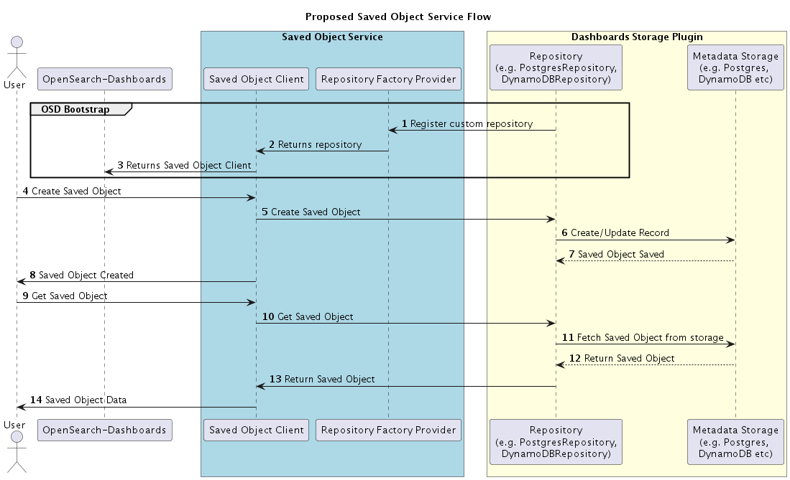

# Proposed Saved Object Service Interface for Custom Repository

## Introduction

The new saved object service interface for custom repository is a project that aims to improve scalability of the existing saved object service by introducing a new interface. The goal of this project is to provide a more efficient and flexible interface that will make it easier for developers to configure metadata of Dashboards in any different storage than OpenSearch, such as mysql, postgres, DDB, serverless (S3+ Athena).

Currently, Dashboards stores its metadata configuration inside OpenSearch index (called .kibana). This approach is by design of Dashboards and biased towards product decision by upstream which works seamlessly and out of the box for customers but it introduces challenges while operating at scale and providing high availability for Dashboards. While choosing OpenSearch as a storage for Dashboards metadata, availability of Dashboards depends on OpenSearch cluster’s availability and other cluster parameters such as cluster health, state, versions which could make Dashboards unavailable.

To mitigate above problem and unblock future extensibility of Dashboards, we are building Dashboards Meta storage adaptor to decouple Dashboards metadata storage from OpenSearch. This project will focus on introducing new interface in Saved Object Service using which developer can build their custom repository and save Dashboards metadata in storage of their choice.

The stakeholders of this new interface include the developers of the Dashboards and community contributors who wants to use other metadata store.

## Architecture Overview

The Saved Object Service is a critical component of Dashboards that provides a way to store and manage application data. It is built using a modular architecture that provides a high degree of flexibility and extensibility. The new interface will be designed to replace [ISavedObjectRepository](https://github.com/opensearch-project/OpenSearch-Dashboards/blob/main/src/core/server/saved_objects/service/lib/repository.ts#L134) implementation so that developers can build plugins that leverage the power of existing saved object service and use their own database to store and retrieve metadata of OpenSearch Dashboards.

### Current Architecture

The repository interface named [ISavedObjectRepository](https://github.com/opensearch-project/OpenSearch-Dashboards/blob/main/src/core/server/saved_objects/service/lib/repository.ts#L134) in OpenSearch-Dashboards is a module that provides an interface for managing saved objects. The [SavedObjectRepository](https://github.com/opensearch-project/OpenSearch-Dashboards/blob/main/src/core/server/saved_objects/service/lib/repository.ts#L139) is the implementation of [ISavedObjectRepository](https://github.com/opensearch-project/OpenSearch-Dashboards/blob/main/src/core/server/saved_objects/service/lib/repository.ts#L134), which uses OpenSearch index as it’s data store. It is responsible for storing, retrieving, and deleting saved objects for Dashboards, such as visualizations, dashboards, and searches.

The Saved Object Repository is built on top of the OpenSearch client and provides a simplified interface for working with OpenSearch. It uses the Saved Object Serializer to convert saved objects between their internal and external representations. The repository is then being consumed by Saved object client to create scoped saved object client. 


### Proposed Architecture

- **Approach 1 (Preferred)**: The proposed architecture will add one more layer of abstraction in Saved Object Service. `The Repository Factory Provider` in OpenSearch Dashboards will be responsible for creating and managing instances of the Repository (e.g. SavedObjectRepository, PostgresRepository, DynamoDBRepository etc.), which is used to interact with the metadata storage that stores the saved objects. Currently we have an repository interface named [ISavedObjectRepository](https://github.com/opensearch-project/OpenSearch-Dashboards/blob/main/src/core/server/saved_objects/service/lib/repository.ts#L134), and the [SavedObjectRepository](https://github.com/opensearch-project/OpenSearch-Dashboards/blob/main/src/core/server/saved_objects/service/lib/repository.ts#L139) is the implementation, which use an OpenSearch index as its data store. This approach would make the implementation of [ISavedObjectRepository](https://github.com/opensearch-project/OpenSearch-Dashboards/blob/main/src/core/server/saved_objects/service/lib/repository.ts#L134) replaceable by plugin.

    

   * Pros: 
        * Only change needed in Dashboard is to introduce one more abstraction layer in Saved Object Service.
        * Adds opportunity for community developers to contribute for other meta store.
        
    * Cons
        * Code reusability is low.    
    <br/>  

**POC**: 
1) Core Dashboards Change: https://github.com/bandinib-amzn/OpenSearch-Dashboards/commit/b9cfc14   
2) Postgres Repository Plugin: https://github.com/bandinib-amzn/metadata_plugin/commit/dac35f0

`SavedObjectsServiceSetup` provides interface to create custom Saved Object Repository.
```
/**
* Set the default {@link SavedObjectRepositoryFactoryProvider | factory provider} for creating Saved Objects repository.
* Only one repository can be set, subsequent calls to this method will fail.
*/
registerRepositoryFactoryProvider: (
respositoryFactoryProvider: SavedObjectRepositoryFactoryProvider
) => void;
```

Here are the main steps involved in using the Saved Objects Repository Factory in Dashboards:  
1. Define the dependencies: The Saved Object Repository Factory Provider requires the function which creates instance of [ISavedObjectRepository](https://github.com/opensearch-project/OpenSearch-Dashboards/blob/main/src/core/server/saved_objects/service/lib/repository.ts#L134).
    ```
    export const repositoryFactoryProvider: SavedObjectRepositoryFactoryProvider = (
    options: SavedObjectsRepositoryOptions
    ) => {
    .
    .
    .
    return new PostgresRepository({
        typeRegistry,
        serializer,
        migrator,
        allowedTypes,
    });
    }
    ```
2. Register the provider: Register the repository factory provider with right dependencies. 
    ```
    core.savedObjects.registerRepositoryFactoryProvider(repositoryFactoryProvider);
    ```
3. Implement the Saved Object Operations for chosen storage type: Implement the CRUD and other operations for contracts defined in [ISavedObjectRepository](https://github.com/opensearch-project/OpenSearch-Dashboards/blob/main/src/core/server/saved_objects/service/lib/repository.ts#L134) 
    ```
    async create<T = unknown>(
        type: string,
        attributes: T,
        options: SavedObjectsCreateOptions = {}
        ): Promise<SavedObject<T>> {
        ...
    }

    async get<T = unknown>(
        type: string,
        id: string,
        options: SavedObjectsBaseOptions = {}
        ): Promise<SavedObject<T>> {
        ...
    }

    async update<T = unknown>(
        type: string,
        id: string,
        attributes: Partial<T>,
        options: SavedObjectsUpdateOptions = {}
        ): Promise<SavedObjectsUpdateResponse<T>> {
        ...
    }

    async deleteFromNamespaces(
        type: string,
        id: string,
        namespaces: string[],
        options: SavedObjectsDeleteFromNamespacesOptions = {}
        ): Promise<SavedObjectsDeleteFromNamespacesResponse> {
        ...
    }
    .
    .
    .
    ```

- **Approach 2**: Build external plugin and using saved object client wrapper or client factory provider injection mechanism we can build custom object for Postgres or other DB.

    * Pros: 
        * No changes in core Dashboards. That means we can keep Dashboards as it is with very minimal changes.


    * Cons
        * Code reusability is low. 
        * Some components of Saved object service such as Serializer, Type registry, interface to create internal and scoped repository are only available during Saved Object Service Start. As per the current architecture, first Saved Object Service Setup → Plugin Setup → Saved Object Service Start → Plugin Start. Some core plugin (e.g. opensearch_dashboards_usage_collection) calls find operation before plugin start and it fails because some components are still not available before plugin start.   
        <br/>

    **POC**: https://github.com/bandinib-amzn/metadata_plugin/compare/f040daf...89213eb    
        

- **Approach 3**: In this approach, we just extend the `SavedObjectsRepository` class and override CRUD and other saved object operation in core Dashboards.

    * Pros: 
        * As we are extending the repository in core saved object service itself, we can reuse the validation and utility functions for other database options. 


    * Cons
        * Changes in core Dashboards : We will be making considerable changes in critical component of Dashboards. 
        * With this approach, user will have to use the data storage option that we choose.  
        <br/>

    **POC**: https://github.com/bandinib-amzn/OpenSearch-Dashboards/compare/main...22d7f30

## Implementation Details


| Repository      | Component | Change |
| ----------- | ----------- | ----------- |
| OpenSearch-Dashboards      | Saved Object Service       | Add Saved object repository factory provider       |
| OpenSearch-Dashboards   | Config        | Configuration for metadata storage        | 
| MetaStorage-Plugin [Name TBD]   | Plugin / Extension        | We will build new plugin for Postgres. This is use case for new interface in Saved Object Repository.        | 

### Configuration for metadata storage:
```
metaStorage.enabled: true
metaStorage.config: {
  type: 'xxxx',
  hostName: 'xxxx',
  userName: 'xxxx',
  password: 'xxxx',
  port: xxxx,
}
```

## Testing and Quality Assurance

### Testing Approach

The following testing approach will be used to ensure the quality of the system:

1. **Unit testing**: Metadata store plugin will be thoroughly unit tested to ensure it meets its requirements and performs as expected. Also we will add new test cases in OpenSearch-Dashboards to test new repository factory provider.
2. **Integration testing**: Components will be integrated and tested together to ensure they work together seamlessly and without conflicts.

