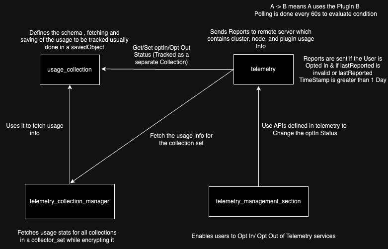
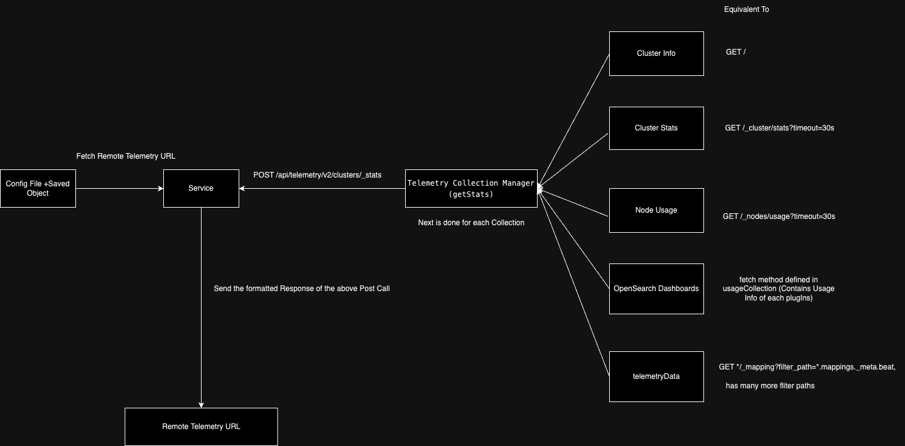
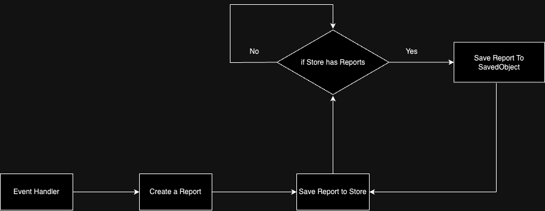

# Telemetry Plugin
These features hasn't been enabled yet. This documentation discusses the current architecture of Telemetry Services within OpenSearch Dashboards.

## Introduction

The article covers the working of telemetry services within the OpenSearch Application. 
Telemetry services provides various page level analytics and other tools to track users behaviour on OpenSearch Dashboards. Currently the user can either Opt In/ Opt out entirely of the telemetry, they can't opt In /opt Out for a specifc feature of telemetry.
The telemetry services are governed by the following four plugins.
* telemetry
* telemetry_collection_manager
* telemetry_management_section
* usage_collection

THe relationship amongst the above plugins are described in the below diagram. 




## Details about plugins

### telemetry plugin

This plugin serves as the base for all the telemetric activity. It exposes APIs to set/get users optIn statuses for telemetry services while also exposing services to send reports to the server containing the telemetry data.

#### Public APIs

The `start` function exposes the following interface:

- **TelemetryService**:
  - `async fetchTelemetry()`: Collates the data from cluster stats, nodes stats, node usage and plugin usage.
  - `async getIsOptedIn() => Promise<boolean>`: An async function that resolves into `true` if the user has opted into send OpenSearch usage data.
  Resolves to `false` if the user explicitly opted out of sending usage data to OpenSearch or did not choose
  to opt-in or out yet after a minor or major upgrade (only when previously opted out).
  - `async getTelemetryUrl() => Promise<URL>:` An async function that resolves into the telemetry Url used to send telemetry. The url is wrapped with node's [URL constructor](https://nodejs.org/api/url.html). Here is an example on how to grab the url origin:
  ```
  const telemetryUrl = await getTelemetryUrl();
    > telemetryUrl.origin; // 'https://telemetry.opensearch.org'
  ```
  Note that the telemetry URL is a opensearch_dashboards.yml configuration hence it is recommended to call the `getTelemetryUrl` everytime before using the actual url.

#### Usage

To use the exposed plugin start and setup contracts:

1. Make sure `telemetry` is in your `optionalPlugins` in the `opensearch_dashboards.json` file:

```json5
// <plugin>/opensearch_dashboards.json
{
"id": "...",
"optionalPlugins": ["telemetry"]
}
```

2. Use the exposed contracts:
```ts
// <plugin>/public/plugin.ts

import { TelemetryPluginsStart } from '../telemetry/public`;


class MyPlugin {
  public async start(
    core: CoreStart,
    { telemetry }: MyPlyginStartDeps
  ) {
    const isOptedIn = await telemetry?.telemetryService?.getIsOptedIn();
    ...
  }
}
```


### telemetry_collection_manager plugin:

Telemetry's collection manager goes through all the telemetry sources when fetching it before reporting it.  

### telemetry_management_section:

This plugin adds in functionality of Opting In/ Opting out of telemetry under the Advanced Settings Section. 

### usage_collection

Usage Collection forms the basic unit that allows collection of usage data which is consumed by other services (like telemetry). The Usage Collection provides methods to create a new usage colector, register the new collector and also houses a predefined usage collector in UI Metric App. 

#### Public APIs
The `setup` method under `public` exposes following methods.

- `async reportUiStats():` This method utilizes the UiMetric Usage collector to track the event and type of Metric. This method taks 2 parameters `METRIC_TYPE` and `event_name`.

The `setup` method under `server` exposes following methods.

- `makeUsageCollector<T,U=T>(CollectorOptions<T,U>) => UsageCollector<T,U>` This method is used to create a new UsageCollector based on the CollectorOptions arguments. Please refer the schema section below to identify the right data types that could be used for T. 

- `registerCollector<T,U=T>(Collector<T,U>) => void`: This method is used to register a new collection to the collectorSet.

- `makeStatsCollector<T,U=T>(CollectorOptions<T,U>) => Collector<T,U>`:  This method is used to create a new Collector based on the CollectorOptions arguments. Please refer the schema section below to identify the right data types that could be used for T. 

- `async bulkFetch(LegacyAPICaller,OpensearchClient) => Map<Collector, any>`: This method provides the fetch response for each of the individual collectors, while filtering out the undefined responses.

- `async bulkUsageFetch(LegacyAPICaller,OpensearchClient) => Map<Collector, any>`: This method provides the fetch response for each of the  UsageCollectors, while filtering out the undefined responses.

#### Usage
```json5
// <plugin>/opensearch_dashboards.json
{
"id": "...",
"optionalPlugins": ["usageCollection"]
}
```

2. Use the exposed contracts:
```ts
// <plugin>/public/plugin.ts

import { UsageCollectionSetup } from 'src/plugins/usage_collection/server';

 interface Usage {
    my_objects: {
      total: number,
    },
  }

class MyPlugin {
  public async start(
    core: CoreStart,
    plugins: { usageCollection?: UsageCollectionSetup }
  ) {
    plugins.usageCollection.makeUsageCollector<Usage>({
      type: 'MY_USAGE_TYPE',
      schema: {
        my_objects: {
          total: 'long',
        },
      },
      fetch: async (callCluster: APICluster, opensearchClient: IClusterClient) => {

      // query OpenSearch and get some data
      // summarize the data into a model
      // return the modeled object that includes whatever you want to track

        return {
          my_objects: {
            total: SOME_NUMBER
          }
        };
      },
    });
  }
}
```

## Telemetry Report
The diagram below showcases the flow of how a telemetry Report is being sent. 



A sample telemetry report is shown below.

```json
  [
      {
          "timestamp": "2024-02-28T23:00:03.741Z",
          "cluster_uuid": "BO4QBTj1Q6-rg0hhreXsRA",
          "cluster_name": "opensearch",
          "version": "3.0.0-SNAPSHOT",
          "cluster_stats": {
              "cluster_uuid": "BO4QBTj1Q6-rg0hhreXsRA",
              "timestamp": 1709161203730,
              "status": "yellow",
              "indices": {
                  "count": 3,
                  "shards": {
                      "total": 3,
                      "primaries": 3,
                      "replication": 0,
                      "index": {
                          "shards": {
                              "min": 1,
                              "max": 1,
                              "avg": 1
                          },
                          "primaries": {
                              "min": 1,
                              "max": 1,
                              "avg": 1
                          },
                          "replication": {
                              "min": 0,
                              "max": 0,
                              "avg": 0
                          }
                      }
                  },
                  "docs": {
                      "count": 37,
                      "deleted": 4
                  },
                  "store": {
                      "size_in_bytes": 85160,
                      "reserved_in_bytes": 0
                  },
                  "fielddata": {
                      "memory_size_in_bytes": 0,
                      "evictions": 0
                  },
                  "query_cache": {
                      "memory_size_in_bytes": 0,
                      "total_count": 0,
                      "hit_count": 0,
                      "miss_count": 0,
                      "cache_size": 0,
                      "cache_count": 0,
                      "evictions": 0
                  },
                  "completion": {
                      "size_in_bytes": 0
                  },
                  "segments": {
                      "count": 5,
                      "memory_in_bytes": 0,
                      "terms_memory_in_bytes": 0,
                      "stored_fields_memory_in_bytes": 0,
                      "term_vectors_memory_in_bytes": 0,
                      "norms_memory_in_bytes": 0,
                      "points_memory_in_bytes": 0,
                      "doc_values_memory_in_bytes": 0,
                      "index_writer_memory_in_bytes": 0,
                      "version_map_memory_in_bytes": 0,
                      "fixed_bit_set_memory_in_bytes": 240,
                      "max_unsafe_auto_id_timestamp": -1,
                      "remote_store": {
                          "upload": {
                              "total_upload_size": {
                                  "started_bytes": 0,
                                  "succeeded_bytes": 0,
                                  "failed_bytes": 0
                              },
                              "refresh_size_lag": {
                                  "total_bytes": 0,
                                  "max_bytes": 0
                              },
                              "max_refresh_time_lag_in_millis": 0,
                              "total_time_spent_in_millis": 0,
                              "pressure": {
                                  "total_rejections": 0
                              }
                          },
                          "download": {
                              "total_download_size": {
                                  "started_bytes": 0,
                                  "succeeded_bytes": 0,
                                  "failed_bytes": 0
                              },
                              "total_time_spent_in_millis": 0
                          }
                      },
                      "segment_replication": {
                          "max_bytes_behind": 0,
                          "total_bytes_behind": 0,
                          "max_replication_lag": 0
                      },
                      "file_sizes": {}
                  },
                  "mappings": {
                      "field_types": [
                          {
                              "name": "boolean",
                              "count": 7,
                              "index_count": 2
                          },
                          {
                              "name": "date",
                              "count": 9,
                              "index_count": 2
                          },
                          {
                              "name": "integer",
                              "count": 21,
                              "index_count": 2
                          },
                          {
                              "name": "keyword",
                              "count": 43,
                              "index_count": 2
                          },
                          {
                              "name": "long",
                              "count": 12,
                              "index_count": 2
                          },
                          {
                              "name": "nested",
                              "count": 2,
                              "index_count": 2
                          },
                          {
                              "name": "object",
                              "count": 59,
                              "index_count": 2
                          },
                          {
                              "name": "text",
                              "count": 62,
                              "index_count": 2
                          }
                      ]
                  },
                  "analysis": {
                      "char_filter_types": [],
                      "tokenizer_types": [],
                      "filter_types": [],
                      "analyzer_types": [],
                      "built_in_char_filters": [],
                      "built_in_tokenizers": [],
                      "built_in_filters": [],
                      "built_in_analyzers": []
                  }
              },
              "nodes": {
                  "count": {
                      "total": 1,
                      "cluster_manager": 1,
                      "coordinating_only": 0,
                      "data": 1,
                      "ingest": 1,
                      "master": 1,
                      "remote_cluster_client": 1,
                      "search": 0
                  },
                  "versions": [
                      "3.0.0"
                  ],
                  "os": {
                      "available_processors": 48,
                      "allocated_processors": 48,
                      "names": [
                          {
                              "name": "Linux",
                              "count": 1
                          }
                      ],
                      "pretty_names": [
                          {
                              "pretty_name": "Ubuntu 22.04.3 LTS",
                              "count": 1
                          }
                      ],
                      "mem": {
                          "total_in_bytes": 98983333888,
                          "free_in_bytes": 57885601792,
                          "used_in_bytes": 41097732096,
                          "free_percent": 58,
                          "used_percent": 42
                      }
                  },
                  "process": {
                      "cpu": {
                          "percent": 1
                      },
                      "open_file_descriptors": {
                          "min": 276,
                          "max": 276,
                          "avg": 276
                      }
                  },
                  "jvm": {
                      "max_uptime_in_millis": 13726615,
                      "versions": [
                          {
                              "version": "21.0.2",
                              "vm_name": "OpenJDK 64-Bit Server VM",
                              "vm_version": "21.0.2+13-LTS",
                              "vm_vendor": "Eclipse Adoptium",
                              "bundled_jdk": true,
                              "using_bundled_jdk": true,
                              "count": 1
                          }
                      ],
                      "mem": {
                          "heap_used_in_bytes": 568064768,
                          "heap_max_in_bytes": 1073741824
                      },
                      "threads": 255
                  },
                  "fs": {
                      "total_in_bytes": 520120602624,
                      "free_in_bytes": 486887292928,
                      "available_in_bytes": 486870515712,
                      "cache_reserved_in_bytes": 0
                  },
                  "plugins": [],
                  "network_types": {
                      "transport_types": {
                          "netty4": 1
                      },
                      "http_types": {
                          "netty4": 1
                      }
                  },
                  "discovery_types": {
                      "zen": 1
                  },
                  "packaging_types": [
                      {
                          "type": "tar",
                          "count": 1
                      }
                  ],
                  "ingest": {
                      "number_of_pipelines": 0,
                      "processor_stats": {}
                  },
                  "usage": {
                      "nodes": [
                          {
                              "timestamp": 1709161203730,
                              "since": 1709147480822,
                              "rest_actions": {
                                  "nodes_usage_action": 20,
                                  "document_update_action": 45,
                                  "cat_plugins_action": 4,
                                  "nodes_info_action": 10816,
                                  "get_mapping_action": 19,
                                  "document_index_action": 19,
                                  "cat_indices_action": 20,
                                  "get_indices_action": 12,
                                  "create_index_action": 1,
                                  "document_create_action_auto_id": 1,
                                  "indices_stats_action": 19,
                                  "cluster_stats_action": 40,
                                  "search_action": 200,
                                  "document_mget_action": 25,
                                  "document_get_action": 165,
                                  "document_delete_action": 52,
                                  "count_action": 4,
                                  "bulk_action": 58,
                                  "main_action": 23
                              },
                              "aggregations": {
                                  "terms": {
                                      "bytes": 19
                                  }
                              },
                              "node_id": "Om8Amo8STkWMBhUa0pwyGA"
                          }
                      ]
                  }
              }
          },
          "collection": "local",
          "stack_stats": {
              "data": [],
              "opensearch_dashboards": {
                  "dashboard": {
                      "total": 0
                  },
                  "visualization": {
                      "total": 0
                  },
                  "search": {
                      "total": 0
                  },
                  "index_pattern": {
                      "total": 0
                  },
                  "graph_workspace": {
                      "total": 0
                  },
                  "count": 1,
                  "indices": 1,
                  "os": {
                      "platforms": [
                          {
                              "platform": "linux",
                              "count": 1
                          }
                      ],
                      "platformReleases": [
                          {
                              "platformRelease": "linux-6.2.0-1017-aws",
                              "count": 1
                          }
                      ],
                      "distros": [
                          {
                              "distro": "Ubuntu",
                              "count": 1
                          }
                      ],
                      "distroReleases": [
                          {
                              "distroRelease": "Ubuntu-22.04",
                              "count": 1
                          }
                      ]
                  },
                  "versions": [
                      {
                          "version": "3.0.0",
                          "count": 1
                      }
                  ],
                  "plugins": {
                      "telemetry": {
                          "opt_in_status": true,
                          "usage_fetcher": "server"
                      },
                      "stack_management": {},
                      "ui_metric": {
                          "superPlugin": [
                              {
                                  "key": "clicked_get_time_button",
                                  "value": 3
                              },
                              {
                                  "key": "button_clicked",
                                  "value": 2
                              },
                              {
                                  "key": "opened_app",
                                  "value": 44
                              },
                              {
                                  "key": "superPulgin_button_clicked",
                                  "value": 48
                              }
                          ],
                          "console": [
                              {
                                  "key": "GET_search",
                                  "value": 3
                              },
                              {
                                  "key": "GET_cluster.stats",
                                  "value": 1
                              },
                              {
                                  "key": "GET_nodes.usage",
                                  "value": 1
                              },
                              {
                                  "key": "opened_app",
                                  "value": 12
                              }
                          ],
                          "opensearchDashboards-user_agent": [
                              {
                                  "key": "Mozilla/5.0 (Macintosh; Intel Mac OS X 10_15_7) AppleWebKit/537.36 (KHTML, like Gecko) Chrome/121.0.0.0 Safari/537.36",
                                  "value": 1
                              }
                          ],
                          "OpenSearch_Dashboards_home": [
                              {
                                  "key": "welcomeScreenMount",
                                  "value": 3
                              },
                              {
                                  "key": "sampleDataDecline",
                                  "value": 3
                              }
                          ]
                      },
                      "application_usage": {
                          "home": {
                              "clicks_total": 42,
                              "clicks_7_days": 42,
                              "clicks_30_days": 42,
                              "clicks_90_days": 42,
                              "minutes_on_screen_total": 23.5473,
                              "minutes_on_screen_7_days": 23.5473,
                              "minutes_on_screen_30_days": 23.5473,
                              "minutes_on_screen_90_days": 23.5473
                          },
                          "dashboards": {
                              "clicks_total": 2,
                              "clicks_7_days": 2,
                              "clicks_30_days": 2,
                              "clicks_90_days": 2,
                              "minutes_on_screen_total": 0.0020833333333333333,
                              "minutes_on_screen_7_days": 0.0020833333333333333,
                              "minutes_on_screen_30_days": 0.0020833333333333333,
                              "minutes_on_screen_90_days": 0.0020833333333333333
                          },
                          "opensearchDashboardsOverview": {
                              "clicks_total": 1,
                              "clicks_7_days": 1,
                              "clicks_30_days": 1,
                              "clicks_90_days": 1,
                              "minutes_on_screen_total": 0.07795,
                              "minutes_on_screen_7_days": 0.07795,
                              "minutes_on_screen_30_days": 0.07795,
                              "minutes_on_screen_90_days": 0.07795
                          },
                          "management": {
                              "clicks_total": 52,
                              "clicks_7_days": 52,
                              "clicks_30_days": 52,
                              "clicks_90_days": 52,
                              "minutes_on_screen_total": 30.768516666666667,
                              "minutes_on_screen_7_days": 30.768516666666667,
                              "minutes_on_screen_30_days": 30.768516666666667,
                              "minutes_on_screen_90_days": 30.768516666666667
                          },
                          "superPlugin": {
                              "clicks_total": 181,
                              "clicks_7_days": 181,
                              "clicks_30_days": 181,
                              "clicks_90_days": 181,
                              "minutes_on_screen_total": 748.5297833333333,
                              "minutes_on_screen_7_days": 748.5297833333333,
                              "minutes_on_screen_30_days": 748.5297833333333,
                              "minutes_on_screen_90_days": 748.5297833333333
                          },
                          "dev_tools": {
                              "clicks_total": 57,
                              "clicks_7_days": 57,
                              "clicks_30_days": 57,
                              "clicks_90_days": 57,
                              "minutes_on_screen_total": 43.42594999999999,
                              "minutes_on_screen_7_days": 43.42594999999999,
                              "minutes_on_screen_30_days": 43.42594999999999,
                              "minutes_on_screen_90_days": 43.42594999999999
                          }
                      },
                      "csp": {
                          "strict": false,
                          "warnLegacyBrowsers": true,
                          "rulesChangedFromDefault": false
                      },
                      "core": {
                          "config": {
                              "opensearch": {
                                  "apiVersion": "7.x",
                                  "sniffOnStart": false,
                                  "sniffIntervalMs": -1,
                                  "sniffOnConnectionFault": false,
                                  "numberOfHostsConfigured": 1,
                                  "customHeadersConfigured": false,
                                  "healthCheckDelayMs": 2500,
                                  "logQueries": false,
                                  "pingTimeoutMs": 30000,
                                  "requestHeadersWhitelistConfigured": false,
                                  "requestTimeoutMs": 30000,
                                  "shardTimeoutMs": 30000,
                                  "ssl": {
                                      "alwaysPresentCertificate": false,
                                      "certificateAuthoritiesConfigured": false,
                                      "certificateConfigured": false,
                                      "keyConfigured": false,
                                      "verificationMode": "full",
                                      "truststoreConfigured": false,
                                      "keystoreConfigured": false
                                  }
                              },
                              "http": {
                                  "basePathConfigured": true,
                                  "maxPayloadInBytes": 1048576,
                                  "rewriteBasePath": true,
                                  "keepaliveTimeout": 120000,
                                  "socketTimeout": 120000,
                                  "compression": {
                                      "enabled": true,
                                      "referrerWhitelistConfigured": false
                                  },
                                  "xsrf": {
                                      "disableProtection": false,
                                      "whitelistConfigured": false
                                  },
                                  "requestId": {
                                      "allowFromAnyIp": false,
                                      "ipAllowlistConfigured": false
                                  },
                                  "ssl": {
                                      "certificateAuthoritiesConfigured": false,
                                      "certificateConfigured": false,
                                      "cipherSuites": [
                                          "TLS_AES_256_GCM_SHA384",
                                          "TLS_CHACHA20_POLY1305_SHA256",
                                          "TLS_AES_128_GCM_SHA256",
                                          "ECDHE-RSA-AES128-GCM-SHA256",
                                          "ECDHE-ECDSA-AES128-GCM-SHA256",
                                          "ECDHE-RSA-AES256-GCM-SHA384",
                                          "ECDHE-ECDSA-AES256-GCM-SHA384",
                                          "DHE-RSA-AES128-GCM-SHA256",
                                          "ECDHE-RSA-AES128-SHA256",
                                          "DHE-RSA-AES128-SHA256",
                                          "ECDHE-RSA-AES256-SHA384",
                                          "DHE-RSA-AES256-SHA384",
                                          "ECDHE-RSA-AES256-SHA256",
                                          "DHE-RSA-AES256-SHA256",
                                          "HIGH",
                                          "!aNULL",
                                          "!eNULL",
                                          "!EXPORT",
                                          "!DES",
                                          "!RC4",
                                          "!MD5",
                                          "!PSK",
                                          "!SRP",
                                          "!CAMELLIA"
                                      ],
                                      "keyConfigured": false,
                                      "redirectHttpFromPortConfigured": false,
                                      "supportedProtocols": [
                                          "TLSv1.1",
                                          "TLSv1.2",
                                          "TLSv1.3"
                                      ],
                                      "clientAuthentication": "none",
                                      "keystoreConfigured": false,
                                      "truststoreConfigured": false
                                  }
                              },
                              "logging": {
                                  "appendersTypesUsed": [
                                      "legacy-appender"
                                  ],
                                  "loggersConfiguredCount": 0
                              },
                              "savedObjects": {
                                  "maxImportPayloadBytes": 26214400,
                                  "maxImportExportSizeBytes": 10000
                              }
                          },
                          "environment": {
                              "memory": {
                                  "heapSizeLimit": 4345298944,
                                  "heapTotalBytes": 167399424,
                                  "heapUsedBytes": 152697808
                              }
                          },
                          "services": {
                              "savedObjects": {
                                  "indices": [
                                      {
                                          "alias": ".kibana",
                                          "docsCount": 36,
                                          "docsDeleted": 4,
                                          "storeSizeBytes": 79582,
                                          "primaryStoreSizeBytes": 79582
                                      }
                                  ]
                              }
                          }
                      },
                      "dql": {
                          "optInCount": 0,
                          "optOutCount": 0,
                          "defaultQueryLanguage": "default-kuery"
                      },
                      "search": {
                          "successCount": 0,
                          "errorCount": 0,
                          "averageDuration": null
                      },
                      "tsvb-validation": {
                          "failed_validations": 0
                      },
                      "localization": {
                          "locale": "en",
                          "integrities": {},
                          "labelsCount": 0
                      }
                  }
              }
          },
          "collectionSource": "local"
      }
  ]
```

## Tracking a Metric

### Using the UI Metric App

UI Metric App is predefined application that can be used to gather data about user interaction patterns within OpenSearch Dashboard UIs. It can gather information regarding the number of times a page has been loaded, number of clicks on a given Ui element or counting other interactions. 

#### Architecture

 

The above diagram shows the flow of how data is being recorded when user interacts with an UI element. 

THe UI Metric App saves the app and metric type in a savedObject of type `user-metric` and along the path `ui-metric:my_app:my_event`.

```json
  {
      "ui_metric": {
          "my_app": [{
              "key": "my_event",
              "value": 3
          }]
      }
  }
```

This metrics are sent to the telemetry server using the workflow described above.

#### How to Use it

- Ensure `usageCollection` is in your optional Plugins
  ```json
  // plugin/opensearch_dashboards.json
  {
    "id": "...",
    "optionalPlugins": ["usageCollection"]
  }
  ```
- Register the Usage
  ```ts
      // public/plugin.ts
      class Plugin {
        setup(core, { usageCollection }) {
          if (usageCollection) {
            // Call the following method as many times as you want to report an increase in the count for this event
            usageCollection.reportUiStats(`<AppName>`, usageCollection.METRIC_TYPE.CLICK, `<EventName>`);
          }
        }
      }
  ```

- Metric Types

  - `METRIC_TYPE.CLICK` for tracking clicks `trackMetric(METRIC_TYPE.CLICK, 'my_button_clicked');`
  - `METRIC_TYPE.LOADED` for a component load or page load `trackMetric(METRIC_TYPE.LOADED', 'my_component_loaded');`
  - `METRIC_TYPE.COUNT` for a tracking a misc count `trackMetric(METRIC_TYPE.COUNT', 'my_counter', <count> });`

To track any event the plugin can call the function `trackUiMetric` which accepts two arguments `metricType` and `eventNames`. For example to track an event `my_click_event` we need to call
`trackUiMetric(METRIC_TYPE.CLICK, 'my_click_event')` 

❌ Avoid using `:` in the app name and event name since they carry a special role in how the metrics are stored as saved ojects. 

#### Verifying the results
`/api/stats`: Get the metrics and usage ([details](../../src/plugins/usage_collection/server/routes/stats/README.md))


### Using a Custom Usage Collection
- Ensure `usageCollection` is in your optional Plugins:
  ```json
      // plugin/opensearch_dashboards.json
      {
        "id": "...",
        "optionalPlugins": ["usageCollection"]
      }
  ```
 - Register Usage Collector in Setup

    ```ts
        // server/plugin.ts
        import { UsageCollectionSetup } from 'src/plugins/usage_collection/server';
        import { CoreSetup, CoreStart } from 'opensearch-dashboards/server';

        class Plugin {
          public setup(core: CoreSetup, plugins: { usageCollection?: UsageCollectionSetup }) {
            registerMyPluginUsageCollector(plugins.usageCollection);
          }

          public start(core: CoreStart) {}
        }
    ```
- Creating and registering a Usage Collector. Ideally collectors would be defined in a separate directory `server/collectors/register.ts`


  ```ts
    // server/collectors/register.ts
    import { UsageCollectionSetup } from 'src/plugins/usage_collection/server';
    import { APICluster } from 'opensearch-dashboards/server';

    interface Usage {
      my_objects: {
        total: number,
      },
    }

    export function registerMyPluginUsageCollector(usageCollection?: UsageCollectionSetup): void {
      // usageCollection is an optional dependency, so make sure to return if it is not registered.
      if (!usageCollection) {
        return;
      }

      // create usage collector
      const myCollector = usageCollection.makeUsageCollector<Usage>({
        type: 'MY_USAGE_TYPE',
        schema: {
          my_objects: {
            total: 'long',
          },
        },
        fetch: async (callCluster: APICluster, opensearchClient: IClusterClient) => {

        // query OpenSearch and get some data
        // summarize the data into a model
        // return the modeled object that includes whatever you want to track

          return {
            my_objects: {
              total: SOME_NUMBER
            }
          };
        },
      });

      // register usage collector
      usageCollection.registerCollector(myCollector);
    }
    ```

  💡 Background

  - `MY_USAGE_TYPE` can be any string. It usually matches the plugin name. As a safety mechanism, we double check there are no duplicates at the moment of registering the collector.
  - The `fetch` method needs to support multiple contexts in which it is called. For example, when stats are pulled from a OpenSearch Dashboards Metricbeat module, the Beat calls OpenSearch Dashboards's stats API to invoke usage collection.
  In this case, the `fetch` method is called as a result of an HTTP API request and `callCluster` wraps `callWithRequest` or `opensearchClient` wraps `asCurrentUser`, where the request headers are expected to have read privilege on the entire `.opensearch_dashboards' index. 

 Note: there will be many cases where you won't need to use the `callCluster` (or `opensearchClient`) function that gets passed in to your `fetch` method at all. Your feature might have an accumulating value in server memory, or read something from the OS, or use other clients like a custom SavedObjects client. In that case it's up to the plugin to initialize those clients like the example below:

 ```ts
// server/plugin.ts
import { UsageCollectionSetup } from 'src/plugins/usage_collection/server';
import { CoreSetup, CoreStart } from 'opensearch-dashboards/server';

class Plugin {
  private savedObjectsRepository?: ISavedObjectsRepository;

  public setup(core: CoreSetup, plugins: { usageCollection?: UsageCollectionSetup }) {
    registerMyPluginUsageCollector(() => this.savedObjectsRepository, plugins.usageCollection);
  }

  public start(core: CoreStart) {
    this.savedObjectsRepository = core.savedObjects.createInternalRepository();
  }
}
```

```ts
// server/collectors/register.ts
import { UsageCollectionSetup } from 'src/plugins/usage_collection/server';

export function registerMyPluginUsageCollector(
  usageCollection?: UsageCollectionSetup
  ): void {
  // usageCollection is an optional dependency, so make sure to return if it is not registered.
  if (!usageCollection) {
    return;
  }

  // create usage collector
  const myCollector = usageCollection.makeUsageCollector<Usage>(...)

  // register usage collector
  usageCollection.registerCollector(myCollector);
}
```

#### Schema Field

The `schema` field is a proscribed data model assists with detecting changes in usage collector payloads. To define the collector schema add a schema field that specifies every possible field reported when registering the collector. Whenever the `schema` field is set or changed please run `node scripts/telemetry_check.js --fix` to update the stored schema json files.

##### Allowed Schema Types

The `AllowedSchemaTypes` is the list of allowed schema types for the usage fields getting reported:

```
'keyword', 'text', 'number', 'boolean', 'long', 'date', 'float'
```

##### Arrays

If any of your properties is an array, the schema definition must follow the convention below:

```
{ type: 'array', items: {...mySchemaDefinitionOfTheEntriesInTheArray} }
```

#### Verifying the results
The `/api/stats?extended=true&legacy=true` HTTP API in OpenSearch Dashboards (added in 6.4.0) will call the fetch methods of all the registered collectors, and add them to a stats object you can see in a browser or in curl. To test that your usage collector has been registered correctly and that it has the model of data you expected it to have, call that HTTP API manually and you should see a key in the `usage` object of the response named after your usage collector's `type` field. This method tests the Metricbeat scenario described above where `callCluster` wraps `callWithRequest`.


