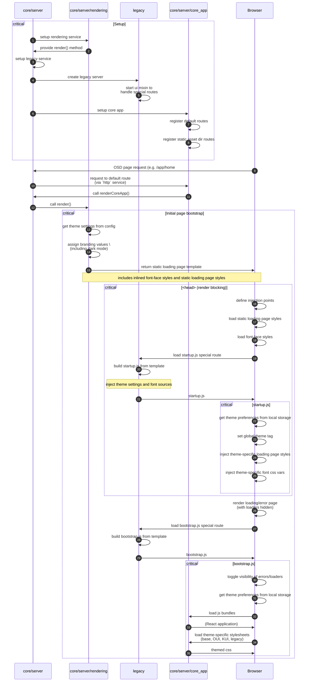

# Theme System

## Basic concepts

### Theme definitions in OUI

Themes are defined in OUI via https://github.com/opensearch-project/oui/blob/main/src/themes/themes.ts. When Building OUI, there are several theming artifacts generated (beyond the react components) for each mode (light/dark) of each theme:

1. Theme compiled stylesheets (e.g. `@elastic/eui/dist/eui_theme_dark.css`). Consumed as entry files in [/packages/osd-ui-shared-deps/webpack.config.js](/packages/osd-ui-shared-deps/webpack.config.js) and republished by `osd-ui-shared-deps` (e.g. [UiSharedDeps.themeCssDistFilenames](/packages/osd-ui-shared-deps/index.js)).
2. Theme compiled and minified stylesheets (e.g. `@elastic/eui/dist/eui_theme_dark.min.css`). These appear unused by OpenSearch Dashboards
3. Theme computed SASS variables as JSON (e.g. `@elastic/eui/dist/eui_theme_dark.json`). Consumed by [/packages/osd-ui-shared-deps/theme.ts](/packages/osd-ui-shared-deps/theme.ts) and made available to other components via the mode and theme aware `euiThemeVars`. In general, these should not be consumed by any other component directly.
4. Theme type definition file for SASS variables as JSON (e.g. `@elastic/eui/dist/eui_theme_dark.json.d.ts`)

Note that all of these artifacts should ideally only be imported or used directly in one place (by `osd-ui-shared-deps`).

In addition to these artifacts, OpenSearch Dashboards also makes heavy use of the theme SASS variables and mixins as defined in the source files (e.g. `@elastic/eui/src/theme_dark.scss`).

### Theme definitions in OpenSearch Dashboards

1. Theme tags are defined in [/packages/osd-optimizer/src/common/theme_tags.ts](/packages/osd-optimizer/src/common/theme_tags.ts) corresponding to each mode (light/dark) of each OUI theme.
2. These tags must correspond to entrypoint SCSS files in [/src/core/public/core_app/styles/](/src/core/public/core_app/styles/_globals_v8dark.scss), because they are imported by all SCSS files as part of the `sass-loader` in [/packages/osd-optimizer/src/worker/webpack.config.ts](/packages/osd-optimizer/src/worker/webpack.config.ts) and [/packages/osd-optimizer/src/worker/theme_loader.ts](/packages/osd-optimizer/src/worker/theme_loader.ts). Note that the optimizer webpack will compile a separate stylesheet for each unique mode and theme combination.
3. OUI SCSS source files are also imported by `osd-ui-framework`, which generates the legacy KUI stylesheets (e.g. [/packages/osd-ui-framework/src/kui_next_dark.scss](/packages/osd-ui-framework/src/kui_next_dark.scss)). KUI is a UI library that predates EUI/OUI, and should be deprecated and fully removed via [#1060](https://github.com/opensearch-project/OpenSearch-Dashboards/issues/1060). Because it's a legacy package it has its own build process that doesn't use webpack; it just [compiles the SCSS files with grunt](/packages/osd-ui-framework/Gruntfile.js). But similarly to 2., a separate stylesheet is generated for each mode and theme combination.

### Thmemed assets in OpenSearch Dasboards

In general, most themed assests can be found in [/src/core/server/core_app/assets](src/core/server/core_app/assets/fonts/readme.md) (it also includes non-themed assets such as `favicons`, which could easily be themed if desired in the future).

Most of the graphics/images are only dark/light mode-specific, not theme-specific:

1. `default_branding` marks
2. `logos`

This directory also includes legacy CSS files ([/src/core/server/core_app/assets/legacy_dark_theme.css](/src/core/server/core_app/assets/legacy_dark_theme.css) and [/src/core/server/core_app/assets/legacy_light_theme.css](/src/core/server/core_app/assets/legacy_light_theme.css)), which predate even KUI, and are still used by some plugins (notably `discover`). See [#4385](https://github.com/opensearch-project/OpenSearch-Dashboards/pull/4385) for an experiment in removing these. Unlike KUI, they don't rely on OUI themes at all.

Finally, font assets are a bit of a special case. Theme-specific fonts are defined by OUI, but it doesn't include the font definitions directly. Instead, the font assets are in [/src/core/server/core_app/assets/fonts](/src/core/server/core_app/assets/fonts/readme.md). The corresponding `@font-face` style definitions are generated at runtime via [/src/core/server/rendering/views/fonts.tsx](/src/core/server/rendering/views/fonts.tsx).

## Theme settings

## Theme loading

### Loading

`src/legacy/ui/ui_render/ui_render_mixin.js` via `src/legacy/ui/ui_render/bootstrap/template.js.hbs` and `src/legacy/ui/ui_render/bootstrap/app_bootstrap.js`. Aliased in `src/legacy/ui/ui_mixin.js`, called by `src/legacy/server/osd_server.js`. Called by `src/core/server/legacy/legacy_service.ts` via `src/core/server/server.ts`

### Injected style tags

1. `src/core/server/rendering/views/styles.tsx` - depends on dark/light mode and injects style tag in head
2. `src/core/server/rendering/views/fonts.tsx` - depends on theme version and injects font style tag in head
3. Monaco editor styles
4. Ace styles
5. Ace TM overrides
6. Ace error styles
6. Component styles

### Styleshsheets loaded

Each of the following are loaded in the browser by the [bootstrap script](/src/legacy/ui/ui_render/bootstrap/template.js.hbs) in this order. Currently, these are never unloaded.

1. Monaco editor styles (e.g. [/packages/osd-ui-shared-deps/target/osd-ui-shared-deps.css](/packages/osd-ui-shared-deps/target/osd-ui-shared-deps.css)), packaged by [/packages/osd-ui-shared-deps/webpack.config.js](/packages/osd-ui-shared-deps/webpack.config.js). In theory, this file could include styles from other shared dependencies, but currently `osd-monaco` is the only package that exports styles. Note that these are the default, un-themed styles; theming of monaco editors is handled by [/src/plugins/opensearch_dashboards_react/public/code_editor/editor_theme.ts](/src/plugins/opensearch_dashboards_react/public/code_editor/editor_theme.ts).
2. Theme and mode-specific OUI styles (e.g. , compiled by `packages/osd-ui-shared-deps/webpack.config.js`).
3. Theme and mode-specific KUI styles (e.g. `packages/osd-ui-framework/src/kui_next_dark.scss`, compiled by `packages/osd-ui-framework/Gruntfile.js`). Separate stylesheets for each theme version/dark mode combo (colors).
4. Mode-specific legacy styles (e.g. [/src/core/server/core_app/assets/legacy_dark_theme.css](/src/core/server/core_app/assets/legacy_dark_theme.css))

Component styles are not loaded as stylesheets.

## Current theme usage

### JSON/JS Vars

1. Defined by `packages/osd-ui-shared-deps/theme.ts`
	1. Used by `src/plugins/charts/public/static/color_maps/color_maps.ts` to set vis colors
	2. Used by `src/plugins/discover/public/application/components/chart/histogram/histogram.tsx` to define Discover histogram Elastic Chart styling
	3. Used by `src/plugins/maps_legacy/public/map/opensearch_dashboards_map.js` and `src/plugins/region_map/public/choropleth_layer.js` for minor map UI styling (line color, empty shade)
	4. Used by `src/plugins/vis_type_vega/public/data_model/vega_parser.ts` for Vega/Vega-Lite theming
2. Used by `src/plugins/vis_type_vislib/public/vislib/components/tooltip/tooltip.js` for tooltip spacing
3. Used by `src/plugins/expressions/public/react_expression_renderer.tsx` to define padding options.
4. Used by `src/core/server/rendering/views/theme.ts` to inject values into `src/core/server/rendering/views/styles.tsx`
5. Used (incorrectly) to style a badge color in `src/plugins/index_pattern_management/public/components/create_button/create_button.tsx`
6. Used by `src/plugins/opensearch_dashboards_react/public/code_editor/editor_theme.ts` to create Monaco theme styles

## Theme Management

### Change default theme

Update `DEFAULT_THEME_VERSION` in `src/core/server/ui_settings/ui_settings_config.ts` to point to the desired theme version.

### Adding a new theme

1. Add a [a new theme to OUI](https://github.com/opensearch-project/oui/blob/main/wiki/theming.md) and publish new OUI version
2. Update OSD to consume new OUI version
3. Make the following changes in OSD:
    1. Load your theme by creating sass files in `src/core/public/core_app/styles`
    2. Update [webpack config](packages/osd-ui-shared-deps/webpack.config.js) to create css files for your theme
    2. Add kui css files:
        1. Create kui sass files for your theme in `packages/osd-ui-framework/src/`
        2. Update `packages/osd-ui-framework/Gruntfile.js` to build these files
        3. Generate the files by running `npx grunt compileCss` from this package root
    3. Add fonts to OSD:
        1. Make sure your theme fonts are in [/src/core/server/core_app/assets/fonts](/src/core/server/core_app/assets/fonts/readme.md)
        2. Update `src/core/server/rendering/views/fonts.tsx` to reference those files
        3. Update src/core/server/core_app/assets/fonts/readme.md to reference the fonts
    4. Update `packages/osd-ui-shared-deps/theme_config.js`:
        1. Add version and label for version to `THEME_VERSION_LABEL_MAP`
        2. Update `kuiCssDistFilenames` map for new theme
        3. Update `ThemeTag` type in corresponding definition file (`theme_config.d.ts`)
    5. Load variables for new theme in `packages/osd-ui-shared-deps/theme.ts'`
    6. Update `src/legacy/ui/ui_render/ui_render_mixin.js':
        1. Load variables for your theme in `THEME_SOURCES`
        2. Define the text font for your theme in `fontText`
        3. Define the code font for your theme in `fontCode`
    7. If on a branch without user specific themes:
        1. Update `THEME_SOURCES` in `src/core/server/rendering/views/theme.ts`
        2. Update `fontText` and `fontCode` in `src/core/server/rendering/views/fonts.tsx`
    