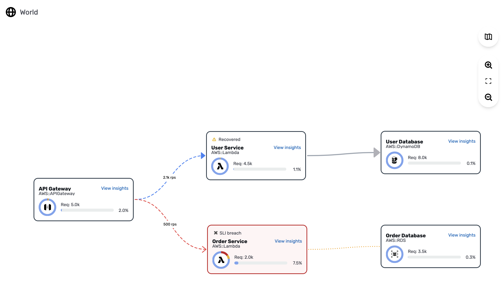
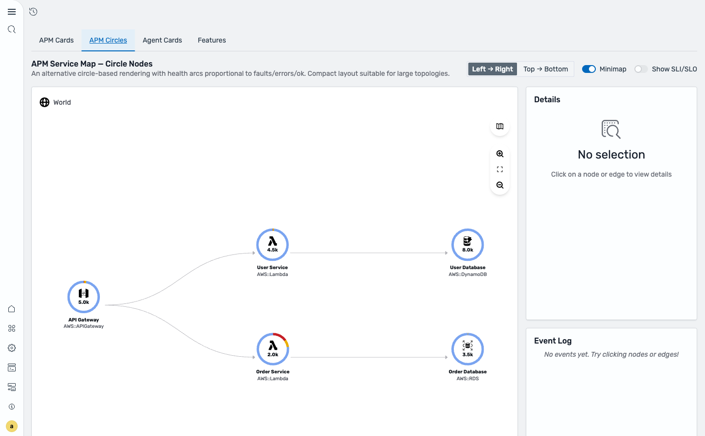
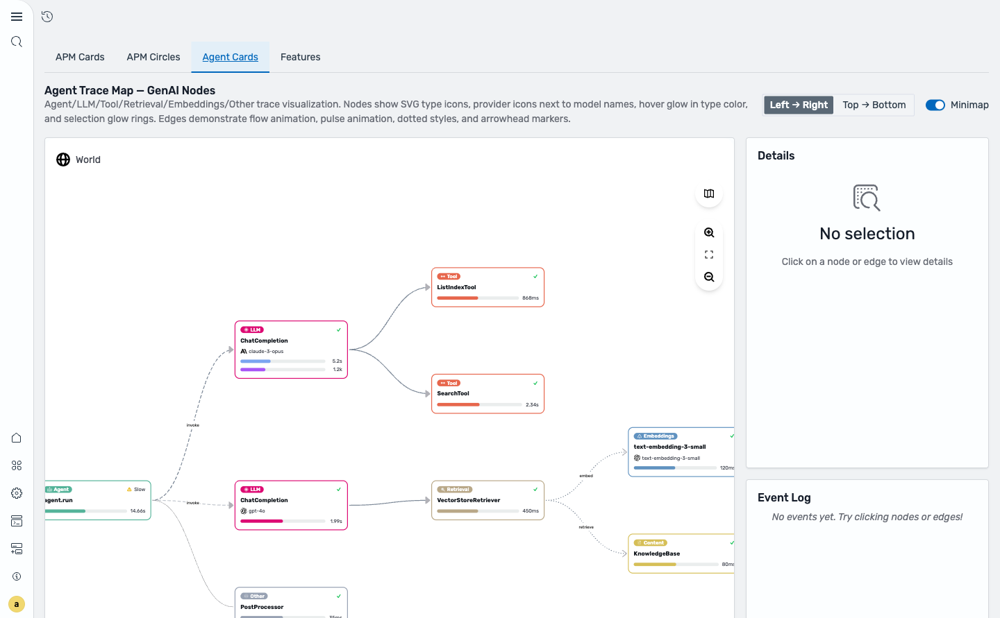
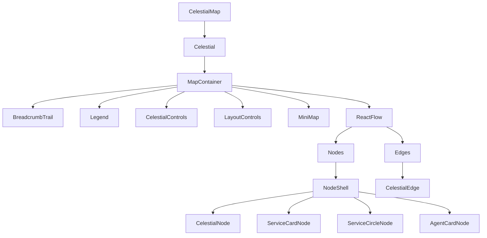
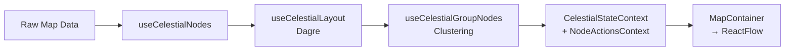
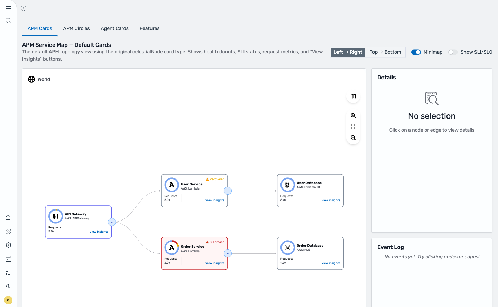
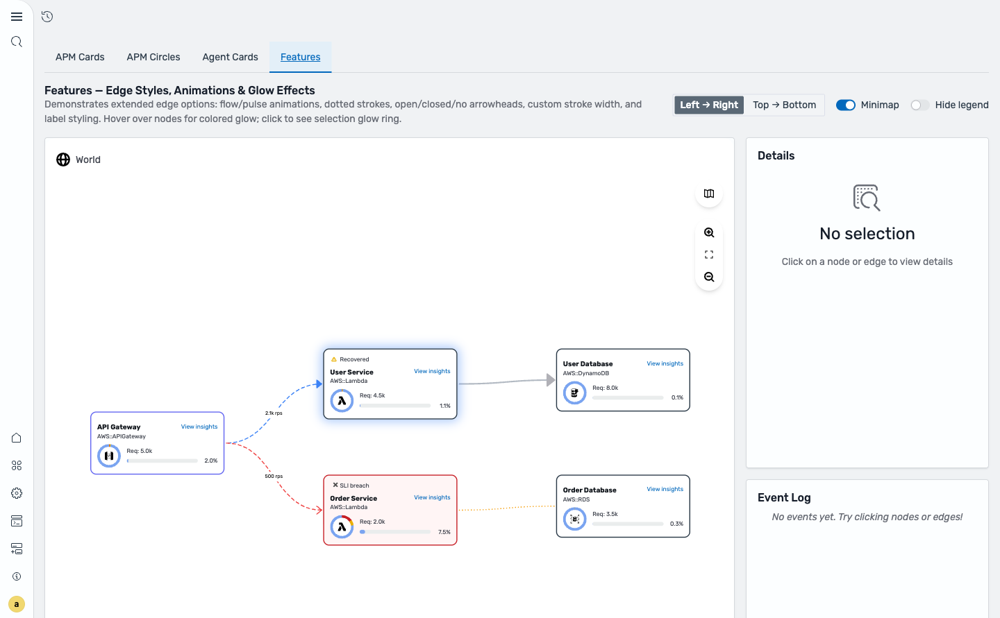
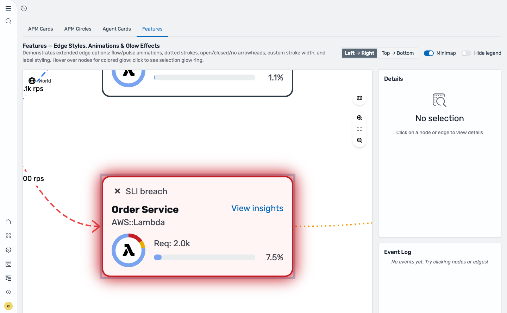

# @osd/apm-topology

A feature-rich React component library for rendering APM service topology maps and GenAI agent trace visualizations inside OpenSearch Dashboards. Built on top of [ReactFlow](https://reactflow.dev/) (`@xyflow/react`) with automatic hierarchical layout via [Dagre](https://github.com/dagrejs/dagre), the library provides interactive nodes, styled edges, health donuts, breadcrumb navigation, minimap, legend, and full dark-mode support.

**Key capabilities:**

- APM service maps with health donuts, SLI/SLO status, and request metrics
- GenAI agent trace visualization with 7 node kinds (Agent, LLM, Tool, Retrieval, Embeddings, Content, Other)
- Styled edges with flow/pulse animations, dashed/dotted strokes, and arrowhead markers
- Automatic Dagre-based hierarchical layout (LR, RL, TB, BT)
- Dark mode (auto-detected from OSD theme)
- Breadcrumb navigation with health indicators
- Minimap, legend, zoom controls, and fit-to-view
- Custom node and edge type extensibility

**Technology stack:** React 18, @xyflow/react 12, @dagrejs/dagre, Tailwind CSS v4 (prefixed `osd:`), Ramda



---

## Table of Contents

1. [Components](#components)
   - [Node Types](#node-types)
   - [Edges](#edges)
   - [Legend](#legend)
   - [Minimap](#minimap)
   - [Breadcrumbs](#breadcrumbs)
2. [Props / API Reference](#props--api-reference)
3. [Architecture Overview](#architecture-overview)
4. [CSS Custom Properties Reference](#css-custom-properties-reference)
5. [Hooks Reference](#hooks-reference)
6. [Usage Patterns in Plugins](#usage-patterns-in-plugins)
7. [Creating Custom Node Types](#creating-custom-node-types)
8. [Example Screenshots](#example-screenshots)
9. [Future Updates](#future-updates)
10. [AI Agent Reference](#ai-agent-reference)

---

## Components

### Node Types

The library ships four node types. All are wrapped in `NodeShell`, which provides consistent selection glow, fade state, border color, keyboard accessibility (`Enter`/`Space` to select), and 8 ReactFlow handles (top/right/bottom/left, source + target).

| Node | Component | Use Case |
|------|-----------|----------|
| **CelestialNode** | `celestialNode` (default) | Original APM card — health donut, SLI status badge, request count, "View insights" button, group expand/collapse, stacking |
| **ServiceCardNode** | `serviceCard` | Modern APM card — TypeBadge, title/subtitle, optional donut, MetricBar, custom action button |
| **ServiceCircleNode** | `serviceCircle` | Compact circle — HealthArc with proportional segments, center icon + metric value, label below |
| **AgentCardNode** | `agentCard` | GenAI trace card — 7 node kinds with colored badges, provider icons, duration/token metric bars |

#### CelestialNode (Default APM Card)

The default node type (`type: 'celestialNode'`). Displays a health donut chart showing the proportion of faults (5xx), errors (4xx), and OK requests. Shows SLI status (breached/recovered), request count, and a "View insights" action button. Supports group expand/collapse and node stacking.

**Key data props:** `title`, `subtitle`, `icon`, `metrics` (`{ requests, faults5xx, errors4xx }`), `health` (`{ status, breached, recovered, total }`), `color`, `isGroup`, `stackedNodeIds`

#### ServiceCardNode

A modernized card layout (`type: 'serviceCard'`). Features a `TypeBadge` pill at the top, title/subtitle row, optional health donut, a `MetricBar` showing error rate, and a custom action button ("View insights" by default). Shows SLI status indicators when health data is present.

**Key data props:** Same as CelestialNode, plus `typeBadge` (`{ label, color, icon?, textColor? }`) and `actionButton` (`{ label, onClick?, icon? }`)


#### ServiceCircleNode

A compact circular representation (`type: 'serviceCircle'`). Renders a `HealthArc` with colored segments proportional to faults/errors/ok. The center displays the service icon overlaid with the formatted request count. Title and subtitle appear as labels below the circle.

**Key data props:** Same as CelestialNode, plus `circleDiameter` (default: `80`)



#### AgentCardNode

Purpose-built for GenAI/LLM agent trace visualization (`type: 'agentCard'`). Each node displays a colored `TypeBadge` matching its `nodeKind`, the operation name as the title, an optional model name with provider icon, and metric bars for duration/latency and token usage.

**Key data props:** `nodeKind`, `duration`, `latency`, `tokens` (`{ prompt, completion }`), `cost`, `model`, `provider`, `status`, `metrics`



##### Agent Node Kinds

| Kind | Label | Default Color | Icon | OTel Mapping |
|------|-------|---------------|------|-------------|
| `agent` | Agent | `#54B399` (teal) | Orchestrator arrows | `create_agent`, `execute_agent`, `invoke_agent` |
| `llm` | LLM | `#DD0A73` (pink) | Brain/chat bubble | `chat`, `text_completion`, `generate_content` |
| `tool` | Tool | `#E7664C` (coral) | Wrench/gear | `execute_tool` |
| `retrieval` | Retrieval | `#B9A888` (tan) | Search/magnifier | `retrieval` |
| `embeddings` | Embeddings | `#6092C0` (steel blue) | Vector grid | `embeddings` |
| `content` | Content | `#D6BF57` (amber) | Document | Document/knowledge-base operations |
| `other` | Other | `#98A2B3` (gray) | Misc/ellipsis | Unknown operations |

Colors resolve from CSS custom properties (`--osd-color-type-agent`, etc.) with the hex values as fallbacks.

##### Provider Icons

The `provider` field (from OTel `gen_ai.system`) maps to recognized icons:

| Provider Value | Icon |
|---------------|------|
| `openai` | OpenAI |
| `anthropic` | Anthropic |
| `aws_bedrock` / `aws.bedrock` | AWS Bedrock |
| `az_ai_inference` / `az.ai.inference` | Azure AI |
| `gcp_vertex_ai` / `gcp.vertex_ai` | Google Vertex AI |
| `cohere` | Cohere |
| `mistral` | Mistral |
| `meta` | Meta |

Use `getProviderIcon(provider)` to resolve a provider string to its SVG icon URL.

### Edges

The `CelestialEdge` component renders styled connections between nodes. Set `type: 'celestialEdge'` on an edge to activate custom rendering.

**Edge style options** (passed via `edge.data.style`):

| Property | Type | Default | Description |
|----------|------|---------|-------------|
| `type` | `'solid' \| 'dashed' \| 'dotted'` | `'solid'` | Stroke pattern |
| `animationType` | `'none' \| 'flow' \| 'pulse'` | `'none'` | Animation effect — `flow` moves dashes along the path, `pulse` fades opacity |
| `marker` | `'arrow' \| 'arrowClosed' \| 'none'` | `'arrowClosed'` | Arrowhead marker at target end |
| `color` | `string` | theme default | Stroke color (CSS color value) |
| `strokeWidth` | `number` | `2` | Stroke width in pixels |
| `label` | `string` | — | Text label rendered mid-edge |
| `labelStyle` | `{ backgroundColor?, color?, fontSize? }` | — | Label styling overrides |

**Example edge data shape:**

```tsx
const edges = [
  {
    id: 'e1',
    source: 'node-1',
    target: 'node-2',
    type: 'celestialEdge',
    data: {
      style: {
        type: 'dashed',
        animationType: 'flow',
        color: '#3B82F6',
        label: '2.1k rps',
        marker: 'arrow',
      },
    },
  },
];
```

### Legend

The `Legend` component renders a toggle button (top-right of the map canvas) that opens a portal-rendered panel.

- **Default legend:** Shows health status swatches (faults, errors, ok) and optionally SLI/SLO entries when `showSliSlo` is `true`.
- **Custom legend:** Pass any `ReactNode` via the `legend` prop on `CelestialMap`. Pass `false` to hide the legend entirely.

### Minimap

ReactFlow's built-in MiniMap, positioned bottom-right of the canvas. Toggle with the `showMinimap` prop (default: `false`).

### Breadcrumbs

`BreadcrumbTrail` renders horizontal breadcrumbs with health donut icons per crumb. The root breadcrumb shows a globe icon (customizable via `rootBreadcrumbIcon`).

Controlled via:
- `breadcrumbs` — array of `{ title, node? }` objects
- `onBreadcrumbClick` — callback when a breadcrumb is clicked
- `navigateToBreadcrumb` — navigate to a specific breadcrumb index
- `addBreadcrumb` — programmatically add a breadcrumb

---

## Props / API Reference

### CelestialMapProps (Top-Level)

#### Data

| Prop | Type | Default | Description |
|------|------|---------|-------------|
| `map` | `{ [groupId: string]: CelestialMapModel }` | **required** | Map data keyed by group ID. Use `{ root: { nodes, edges } }` for a single group. |
| `nodesInFocus` | `CelestialNode[]` | — | Nodes to highlight/focus |
| `isLoading` | `boolean` | `false` | Show loading spinner overlay |
| `topN` | `number` | — | Limit displayed nodes to top N by metric |

#### Callbacks

| Prop | Type | Description |
|------|------|-------------|
| `onDashboardClick` | `(node?: CelestialCardProps) => void` | Called when a node is clicked |
| `onDataFetch` | `(node?: CelestialCardProps) => void` | Called to fetch additional node data |
| `onEdgeClick` | `(edge: CelestialEdge) => void` | Called when an edge is clicked |
| `onBreadcrumbClick` | `(breadcrumb: Breadcrumb, index: number) => void` | Called when a breadcrumb is clicked |
| `onGroupBy` | `(event: any, detail: any) => void` | Called when grouping changes |

#### Navigation

| Prop | Type | Description |
|------|------|-------------|
| `breadcrumbs` | `Breadcrumb[]` | Breadcrumb trail data |
| `navigateToBreadcrumb` | `(index: number) => void` | Navigate to breadcrumb at index |
| `addBreadcrumb` | `(title: string, node?: CelestialCardProps) => void` | Add a new breadcrumb |
| `breadcrumbHotspot` | `ReactNode` | Custom element rendered in breadcrumb area |
| `rootBreadcrumbIcon` | `string` | Custom icon for root breadcrumb (default: globe) |

#### Layout

| Prop | Type | Default | Description |
|------|------|---------|-------------|
| `layoutOptions` | `LayoutOptions` | `{}` | Dagre layout configuration |
| `nodesDraggable` | `boolean` | `false` | Allow nodes to be dragged |

**LayoutOptions:**

| Option | Type | Default | Description |
|--------|------|---------|-------------|
| `direction` | `'TB' \| 'BT' \| 'LR' \| 'RL'` | `'LR'` | Layout direction |
| `nodeWidth` | `number` | `272` | Node width for layout calculation |
| `nodeHeight` | `number` | `156` | Node height for layout calculation |
| `rankSeparation` | `number` | `200` | Space between ranks (layers) |
| `nodeSeparation` | `number` | `100` | Space between nodes in same rank |
| `edgeSeparation` | `number` | `10` | Space between parallel edges |
| `marginX` | `number` | `20` | Horizontal margin |
| `marginY` | `number` | `20` | Vertical margin |

#### Features

| Prop | Type | Default | Description |
|------|------|---------|-------------|
| `showMinimap` | `boolean` | `false` | Show the ReactFlow minimap |
| `showSliSlo` | `boolean` | `false` | Show SLI/SLO indicators in nodes and legend |
| `showLayoutControls` | `boolean` | `false` | Show layout direction controls |
| `nodesDraggable` | `boolean` | `false` | Allow interactive node dragging |

#### Customization

| Prop | Type | Default | Description |
|------|------|---------|-------------|
| `nodeTypes` | `Record<string, ComponentType>` | — | Custom node type components |
| `edgeTypes` | `Record<string, ComponentType>` | — | Custom edge type components |
| `legend` | `ReactNode \| false` | default legend | Custom legend content, or `false` to hide |
| `selectedNodeId` | `string` | — | Externally controlled selection |
| `emptyState` | `ReactNode` | — | Content shown when map has no nodes |

#### Camera

| Prop | Type | Default | Description |
|------|------|---------|-------------|
| `onNodeClickZoom` | `'none' \| 'zoomToNode' \| 'zoomToNeighborhood'` | `'none'` | Camera behavior on node click |
| `onEdgeClickZoom` | `'none' \| 'zoomToEdge'` | `'none'` | Camera behavior on edge click |

### CelestialCardProps (APM Node Data)

| Prop | Type | Description |
|------|------|-------------|
| `id` | `string` | Unique node identifier |
| `title` | `string` | Node display name |
| `subtitle` | `string?` | Secondary label (e.g., `AWS::Lambda`) |
| `icon` | `ReactNode?` | Node icon |
| `metrics` | `{ requests: number; faults5xx: number; errors4xx: number }?` | Traffic metrics |
| `health` | `{ status: SliStatus; breached: number; recovered: number; total: number }?` | SLI health |
| `color` | `string?` | Custom border/glow color (overridden by breach state) |
| `typeBadge` | `{ label: string; color: string; icon?: ReactNode; textColor?: string } \| false` | Type badge config |
| `actionButton` | `{ label: string; onClick?: () => void; icon?: ReactNode } \| false` | Action button config |
| `isFaded` | `boolean?` | Dim the node |
| `isGroup` | `boolean?` | Renders as expandable group |
| `stackedNodeIds` | `string[]?` | IDs of stacked nodes (shows stack indicator) |
| `keyAttributes` | `Record<string, string>` | Key-value attributes |

### AgentNodeData (GenAI Node Data)

| Prop | Type | Description |
|------|------|-------------|
| `nodeKind` | `AgentNodeKind` | One of: `agent`, `llm`, `tool`, `retrieval`, `embeddings`, `content`, `other` |
| `duration` | `number?` | Operation duration in milliseconds |
| `latency` | `string?` | Formatted latency string (e.g., `"5.2s"`) |
| `tokens` | `{ prompt: number; completion: number }?` | Token usage |
| `cost` | `number?` | Operation cost |
| `model` | `string?` | Model name (e.g., `"claude-3-opus"`) |
| `provider` | `string?` | Provider identifier for icon resolution (e.g., `"anthropic"`) |
| `status` | `'ok' \| 'warning' \| 'error' \| 'critical' \| 'unknown'?` | Operation status |
| `metrics` | `Array<{ label, value, max, color?, formattedValue? }>?` | Custom metric bars |

### CelestialEdgeStyleData

| Prop | Type | Default | Description |
|------|------|---------|-------------|
| `color` | `string?` | theme default | Stroke color |
| `label` | `string?` | — | Mid-edge text label |
| `marker` | `'arrow' \| 'arrowClosed' \| 'none'` | `'arrowClosed'` | Arrowhead type |
| `type` | `'solid' \| 'dashed' \| 'dotted'` | `'solid'` | Stroke pattern |
| `animationType` | `'none' \| 'flow' \| 'pulse'` | `'none'` | Animation effect |
| `strokeWidth` | `number` | `2` | Stroke width (px) |
| `labelStyle` | `{ backgroundColor?, color?, fontSize? }?` | — | Label style overrides |

---

## Architecture Overview

### Component Hierarchy



### Data Flow



### Context Providers

- **CelestialStateContext** — Manages `selectedNodeId`, `unstackedAggregateNodeIds`, view lock state, and layout options.
- **CelestialNodeActionsProvider** — Exposes `onGroupToggle`, `onDashboardClick`, `onUnstackNode`, `onStackNode`, and `onDataFetch` callbacks.

---

## CSS Custom Properties Reference

### Node Type Colors

| Variable | Default | Description |
|----------|---------|-------------|
| `--osd-color-type-agent` | `#54B399` | Agent node badge/glow |
| `--osd-color-type-llm` | `#DD0A73` | LLM node badge/glow |
| `--osd-color-type-tool` | `#E7664C` | Tool node badge/glow |
| `--osd-color-type-retrieval` | `#B9A888` | Retrieval node badge/glow |
| `--osd-color-type-embeddings` | `#6092C0` | Embeddings node badge/glow |
| `--osd-color-type-content` | `#D6BF57` | Content node badge/glow |
| `--osd-color-type-other` | `#98A2B3` | Other/unknown node badge/glow |

### Status Colors

| Variable | Description |
|----------|-------------|
| `--osd-color-status-ok` | Healthy status |
| `--osd-color-status-warning` | Warning status |
| `--osd-color-status-error` | Error status |
| `--osd-color-status-critical` | Critical status |
| `--osd-color-status-breached` | SLI breached |
| `--osd-color-ok` | OK health segment |
| `--osd-color-errors` | Errors (4xx) health segment |
| `--osd-color-faults` | Faults (5xx) health segment |

### Glow

| Variable | Default | Description |
|----------|---------|-------------|
| `--osd-node-glow-color` | `rgba(59, 130, 246, 0.4)` | Node hover/selection glow color |

### Dark Mode

Dark mode is auto-detected from the OSD theme. The library applies a `.celestial--dark` class to the root container. Tailwind v4 classes use the `osd:` prefix (e.g., `osd:bg-container-default`, `osd:text-body-secondary`).

---

## Hooks Reference

Key hooks for plugin developers:

| Hook | Purpose |
|------|---------|
| `useCelestialNodes()` | Transforms SDK-format map data into ReactFlow nodes and edges |
| `useCelestialGroupNodes()` | Groups nodes by shared attributes or edges for cluster visualization |
| `useCelestialNodeActionsContext()` | Access the current selected node and event handler callbacks |
| `useFitViewWithDelay()` | Fit all nodes into the viewport with optional animation delay |
| `useFocusOnNodes()` | Zoom/pan camera to focus on specific nodes |
| `useNodeClustering()` | Cluster nodes by shared edges or attributes |
| `useTopNNodes()` | Filter nodes to top N by a given metric |
| `useContextMenu()` | Manage context menu position and visibility |
| `useDelayedHover()` | Debounced hover state tracking |
| `useElementGeometry()` | Track element dimensions on resize |
| `useOnClickOutside()` | Detect clicks outside a given element |

---

## Usage Patterns in Plugins

### Basic APM Service Map

```tsx
import { CelestialMap, getIcon } from '@osd/apm-topology';

const nodes = [
  {
    id: '1',
    type: 'celestialNode',
    position: { x: 0, y: 0 },
    data: {
      id: '1',
      title: 'API Gateway',
      subtitle: 'AWS::APIGateway',
      icon: getIcon('AWS::APIGateway'),
      isGroup: false,
      keyAttributes: {},
      metrics: { requests: 5000, faults5xx: 25, errors4xx: 100 },
      health: { status: 'ok', breached: 0, recovered: 0, total: 0 },
    },
  },
];

const edges = [{ id: 'e1', source: '1', target: '2' }];

<CelestialMap
  map={{ root: { nodes, edges } }}
  onDashboardClick={(node) => navigateToServiceDetails(node)}
  showMinimap
/>;
```

### Custom Node Types (Agent Cards)

```tsx
import { CelestialMap, AgentCardNode } from '@osd/apm-topology';

<CelestialMap
  map={{ root: { nodes: agentNodes, edges: agentEdges } }}
  nodeTypes={{ agentCard: AgentCardNode }}
  legend={<MyCustomAgentLegend />}
  layoutOptions={{ direction: 'TB' }}
/>;
```

### Edge Styling

```tsx
const styledEdges = [
  {
    id: 'e1',
    source: '1',
    target: '2',
    type: 'celestialEdge',
    data: {
      style: {
        type: 'dashed',
        animationType: 'flow',
        color: '#3B82F6',
        label: '2.1k rps',
        marker: 'arrow',
      },
    },
  },
  {
    id: 'e2',
    source: '2',
    target: '3',
    type: 'celestialEdge',
    data: {
      style: {
        animationType: 'pulse',
        strokeWidth: 3,
      },
    },
  },
];
```

---

## Creating Custom Node Types

1. **Define a data interface** extending `BaseNodeData`:

```tsx
interface MyNodeData extends BaseNodeData {
  myCustomField: string;
  myMetric: number;
}
```

2. **Create a React component** accepting `NodeProps`:

```tsx
import { NodeShell } from '@osd/apm-topology';
import type { NodeProps, Node } from '@xyflow/react';

const MyCustomNode = ({ data }: NodeProps<Node<MyNodeData>>) => (
  <NodeShell borderColor="#6366F1">
    <div>{data.title}</div>
    <div>{data.myCustomField}</div>
    <div>Metric: {data.myMetric}</div>
  </NodeShell>
);
```

3. **Register via `nodeTypes`** and set `type` on your nodes:

```tsx
<CelestialMap
  map={{ root: { nodes: myNodes, edges: myEdges } }}
  nodeTypes={{ myCustom: MyCustomNode }}
/>

// Each node:
{ id: '1', type: 'myCustom', position: { x: 0, y: 0 }, data: { ... } }
```

Using `NodeShell` gives you consistent border/glow/selection behavior, fade state, and 8 ReactFlow connection handles for free.

---

## Example Screenshots

### APM Cards (Default View)
Health donuts, SLI status badges, request metrics, and "View insights" buttons.



### APM Circles (Compact View)
Health arcs proportional to faults/errors/ok with center icon and metric value.


### Agent Cards (GenAI Trace)
Color-coded node kinds, provider icons, duration/token metric bars, flow/pulse edge animations.


### Features (Edge Styles & Animations)
Dashed/dotted strokes, flow/pulse animations, open/closed/no arrowheads, labeled edges, custom stroke widths.


### Node Hover Glow
Nodes show a colored glow effect on hover, using the node's border color.



### Node Selection
Selected nodes display a glow ring and zoom-to-node camera behavior. Details panel shows node metadata.



---

## Future Updates

- Additional node types (database, queue, cache-specific cards)
- Edge animation enhancements
- Search/filter within topology
- Timeline/replay mode for traces
- Performance optimizations for large graphs (1000+ nodes)
- Accessibility improvements (screen reader navigation)

---

## AI Agent Reference

### File Structure

```
packages/osd-apm-topology/
├── src/
│   ├── index.ts                          # Package exports
│   ├── types.ts                          # Core type definitions
│   ├── celestial.tsx                     # Main component (layout, state, dark mode)
│   ├── celestial_map.tsx                 # Entry component (providers)
│   ├── celestial.scss                    # Root styles + Tailwind imports
│   ├── components/
│   │   ├── nodes/
│   │   │   ├── node_shell.tsx            # Shared node wrapper (handles, glow, a11y)
│   │   │   ├── service_card_node.tsx     # ServiceCardNode
│   │   │   ├── service_circle_node.tsx   # ServiceCircleNode
│   │   │   ├── agent_card_node.tsx       # AgentCardNode
│   │   │   ├── health_arc.tsx            # SVG health arc segments
│   │   │   ├── metric_bar.tsx            # Horizontal metric progress bars
│   │   │   ├── status_indicator.tsx      # Status icon + label
│   │   │   └── type_badge.tsx            # Colored pill badge
│   │   ├── edges/
│   │   │   └── celestial_edge.tsx        # Custom styled edge
│   │   ├── breadcrumb_trail/             # Breadcrumb navigation
│   │   ├── celestial_card/               # Legacy APM card
│   │   ├── celestial_controls/           # Zoom/fit controls
│   │   ├── health_donut/                 # Donut chart component
│   │   ├── layout_controls/              # Layout direction controls
│   │   ├── legend/                       # Legend toggle + panel
│   │   ├── map_container.tsx             # ReactFlow wrapper
│   │   └── portal/                       # Portal rendering utility
│   ├── shared/
│   │   ├── constants/
│   │   │   ├── agent.constants.ts        # AGENT_NODE_KINDS config
│   │   │   └── provider_icons.constants.ts # PROVIDER_ICONS mapping
│   │   ├── contexts/
│   │   │   └── node_actions_context.tsx   # Node action callbacks
│   │   └── hooks/                        # All shared hooks (~17 hooks)
│   └── test_utils/                       # Jest setup and test helpers
├── jest.config.js
├── package.json
└── tsconfig.json
```

### Type Quick-Reference

```typescript
// Top-level props
CelestialMapProps { map, onDashboardClick, onEdgeClick, nodeTypes, edgeTypes, legend, showMinimap, layoutOptions, ... }

// Node data
CelestialCardProps { id, title, subtitle, icon, metrics, health, color, typeBadge, actionButton, isGroup, ... }
AgentNodeData { nodeKind, duration, latency, tokens, cost, model, provider, status, metrics }
BaseNodeData { id, title, subtitle, icon, status, statusLabel, isFaded, actionButton }

// Edge data
CelestialEdgeStyleData { color, label, marker, type, animationType, strokeWidth, labelStyle }

// Layout
LayoutOptions { direction, nodeWidth, nodeHeight, rankSeparation, nodeSeparation, ... }
```

### Common Modification Patterns

- **To add a new node type:** Create component using `NodeShell`, export from `components/nodes/index.ts`, register via `nodeTypes` prop.
- **To add a new agent kind:** Add entry to `AGENT_NODE_KINDS` in `shared/constants/agent.constants.ts`, add SVG icon to `shared/resources/agents/`, update `AgentNodeKind` union type.
- **To add a new edge style:** Extend `CelestialEdgeStyleData` in `types.ts`, handle new property in `celestial_edge.tsx`.
- **To add a new provider icon:** Add SVG to `shared/resources/providers/`, add mapping in `shared/constants/provider_icons.constants.ts`.
- **To modify layout defaults:** Edit default values in `use_celestial_layout.hook.ts`.

### Commands

```bash
# Run tests
npx jest --config packages/osd-apm-topology/jest.config.js

# Run a single test
yarn test:jest packages/osd-apm-topology/src/components/nodes/service_card_node.test.tsx

# Start dev server with example app
yarn start --run-examples
# Then navigate to: http://localhost:5601/app/apmTopologyExample
```
