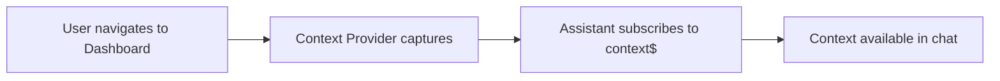
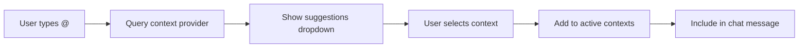
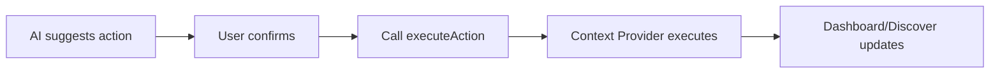

# Context Provider Integration Design Document

## Overview
This document outlines how the assistant plugin integrates with the existing `context_provider` plugin to capture and use context from Dashboard and Discover applications.

## Architecture

### Plugin Dependency
The assistant plugin declares `contextProvider` as a required plugin to ensure context is always available:

```typescript
// opensearch_dashboards.json
{
  "id": "assistant",
  "requiredPlugins": ["navigation", "uiActions", "data", "embeddable", "contextProvider"],
  "optionalPlugins": ["dashboard", "discover"]
}
```

## Integration Points

### 1. Plugin Setup and Start

```typescript
// public/plugin.ts
export class AssistantPlugin {
  public setup(
    core: CoreSetup,
    { contextProvider, ...otherDeps }: AssistantSetupDeps
  ): AssistantSetup {
    // Store reference to context provider
    this.contextProvider = contextProvider;
  }

  public start(
    core: CoreStart,
    { contextProvider, ...otherDeps }: AssistantStartDeps
  ): AssistantStart {
    // Access context provider API
    const contextService = new ContextService(contextProvider);
    
    // Make context service available to React components
    return {
      contextService,
      // ... other services
    };
  }
}
```

### 2. Context Service Wrapper

Located in `public/services/context_service.ts`:

```typescript
import { ContextProviderStart } from '../../../../context_provider/public';
import { BehaviorSubject } from 'rxjs';

export class ContextService {
  private contextProvider: ContextProviderStart;
  private currentContext$ = new BehaviorSubject<any>(null);

  constructor(contextProvider: ContextProviderStart) {
    this.contextProvider = contextProvider;
    
    // Subscribe to context changes from context provider
    this.contextProvider.context$.subscribe((context) => {
      this.currentContext$.next(context);
    });
  }

  // Get current static context
  async getCurrentContext() {
    return this.contextProvider.getCurrentContext();
  }

  // Get available actions from context provider
  getAvailableActions() {
    return this.contextProvider.getAvailableActions();
  }

  // Execute action through context provider
  async executeAction(actionType: string, params: any) {
    return this.contextProvider.executeAction(actionType, params);
  }

  // Get context suggestions for @ mentions
  async getContextSuggestions(query: string) {
    const currentContext = await this.getCurrentContext();
    const suggestions = [];

    // Page-specific context (priority 1)
    if (currentContext?.appId === 'dashboards') {
      suggestions.push({
        id: 'current-dashboard',
        title: currentContext.data.dashboard?.title || 'Current Dashboard',
        category: 'Page Information',
        priority: 1,
        data: currentContext.data,
      });
    } else if (currentContext?.appId === 'discover') {
      suggestions.push({
        id: 'search-results',
        title: 'Search Results',
        category: 'Page Information',
        priority: 1,
        data: currentContext.data,
      });
    }

    // Add other context types from context provider
    // Index patterns, saved objects, etc.
    
    return suggestions;
  }

  // Transform context to AI-Agents format
  transformContextForAgent(contexts: any[]) {
    return {
      automatic: this.getMinimalContext(contexts),
      optional: this.getOptionalContexts(contexts),
    };
  }

  private getMinimalContext(contexts: any[]) {
    // Extract only essential information for automatic inclusion
    const current = contexts.find(c => c.id === 'current-dashboard' || c.id === 'search-results');
    if (!current) return null;

    return {
      page: current.data.appId,
      title: current.data.dashboard?.title || current.data.title,
      timeRange: current.data.dataContext?.timeRange,
      // Keep it minimal - under 1KB
    };
  }

  private getOptionalContexts(contexts: any[]) {
    // Full context data for user-selected items
    return contexts.map(context => ({
      id: context.id,
      type: context.category,
      data: context.data,
    }));
  }
}
```

### 3. React Hook for Context Access

Located in `public/hooks/use_context_provider.ts`:

```typescript
import { useEffect, useState } from 'react';
import { useAssistantServices } from '../contexts/services_context';

export const useContextProvider = () => {
  const { contextService } = useAssistantServices();
  const [currentContext, setCurrentContext] = useState(null);
  const [availableContexts, setAvailableContexts] = useState([]);

  useEffect(() => {
    // Get initial context
    contextService.getCurrentContext().then(setCurrentContext);

    // Subscribe to context changes
    const subscription = contextService.currentContext$.subscribe((context) => {
      setCurrentContext(context);
    });

    return () => subscription.unsubscribe();
  }, [contextService]);

  const addContext = async (contextId: string) => {
    const suggestions = await contextService.getContextSuggestions('');
    const context = suggestions.find(s => s.id === contextId);
    if (context) {
      setAvailableContexts([...availableContexts, context]);
    }
  };

  const removeContext = (contextId: string) => {
    setAvailableContexts(availableContexts.filter(c => c.id !== contextId));
  };

  const executeAction = async (action: string, params: any) => {
    return contextService.executeAction(action, params);
  };

  return {
    currentContext,
    availableContexts,
    addContext,
    removeContext,
    executeAction,
  };
};
```

## Context Flow

### 1. Automatic Context Capture


### 2. @ Mention Context Selection


### 3. Action Execution


## Context Injection into Chat

### Message Enhancement
When sending a message to AI-Agents:

```typescript
const enhanceMessageWithContext = (message: string, contexts: any[]) => {
  const transformed = contextService.transformContextForAgent(contexts);
  
  return {
    message,
    context: {
      automatic: transformed.automatic,  // Minimal, always included
      optional: transformed.optional,    // User-selected via @
      pinned: getPinnedContexts(),      // Persistent across messages
    },
    conversationId,
  };
};
```

### Context Display in UI

```typescript
// Context pills above chat input
<ContextPills>
  {availableContexts.map(context => (
    <ContextPill
      key={context.id}
      context={context}
      isPinned={pinnedContexts.includes(context.id)}
      onRemove={() => removeContext(context.id)}
      onTogglePin={() => togglePin(context.id)}
    />
  ))}
</ContextPills>
```

## Available Actions from Context Provider

The context provider exposes these actions that can be executed from chat:

```typescript
interface AvailableActions {
  ADD_FILTER: (params: { field: string; value: any }) => Promise<void>;
  REMOVE_FILTER: (params: { filterId: string }) => Promise<void>;
  CHANGE_TIME_RANGE: (params: { from: string; to: string }) => Promise<void>;
  REFRESH_DATA: () => Promise<void>;
  NAVIGATE_TO_DISCOVER: (params: { path: string }) => Promise<void>;
  NAVIGATE_TO_DASHBOARD: (params: { dashboardId: string }) => Promise<void>;
}
```

## Error Handling

### Context Provider Unavailable
```typescript
// Graceful degradation if context provider is not available
if (!contextProvider) {
  console.warn('Context provider not available, chat will work without context');
  return {
    getCurrentContext: () => Promise.resolve(null),
    getAvailableActions: () => [],
    executeAction: () => Promise.reject('Context provider not available'),
  };
}
```

### Action Execution Failures
```typescript
try {
  await contextService.executeAction('ADD_FILTER', params);
  showToast('Filter added successfully');
} catch (error) {
  console.error('Failed to execute action:', error);
  showToast('Failed to add filter', 'danger');
}
```

## Testing Strategy

### Mock Context Provider
```typescript
export const mockContextProvider = {
  getCurrentContext: jest.fn().mockResolvedValue({
    appId: 'dashboards',
    data: {
      dashboard: { title: 'Test Dashboard' },
      dataContext: { timeRange: { from: 'now-15m', to: 'now' } },
    },
  }),
  getAvailableActions: jest.fn().mockReturnValue(['ADD_FILTER', 'CHANGE_TIME_RANGE']),
  executeAction: jest.fn().mockResolvedValue(undefined),
  context$: new BehaviorSubject(null),
};
```

### Integration Tests
1. Test context flows from Dashboard to chat
2. Test @ mention suggestions include page context
3. Test action execution updates Dashboard
4. Test context persistence across navigation

## Performance Considerations

### Context Size Management
- Automatic context kept minimal (< 1KB)
- Optional contexts loaded on-demand
- Large contexts (e.g., full dashboard state) summarized

### Subscription Management
- Unsubscribe from context$ on component unmount
- Debounce rapid context changes
- Cache context suggestions for performance

## Benefits of This Integration

1. **No Code Duplication**: Reuses existing context provider logic
2. **Consistent Context**: Same context across all features
3. **Maintainability**: Context provider updates automatically benefit assistant
4. **Separation of Concerns**: Context capture logic stays in context provider
5. **Extensibility**: New apps can add context through context provider

## Migration Notes

Since `ai_chatbot` already uses context provider:
1. Migrate existing `use_context_provider.ts` hook
2. Update imports to use assistant's context service
3. Ensure backward compatibility during transition