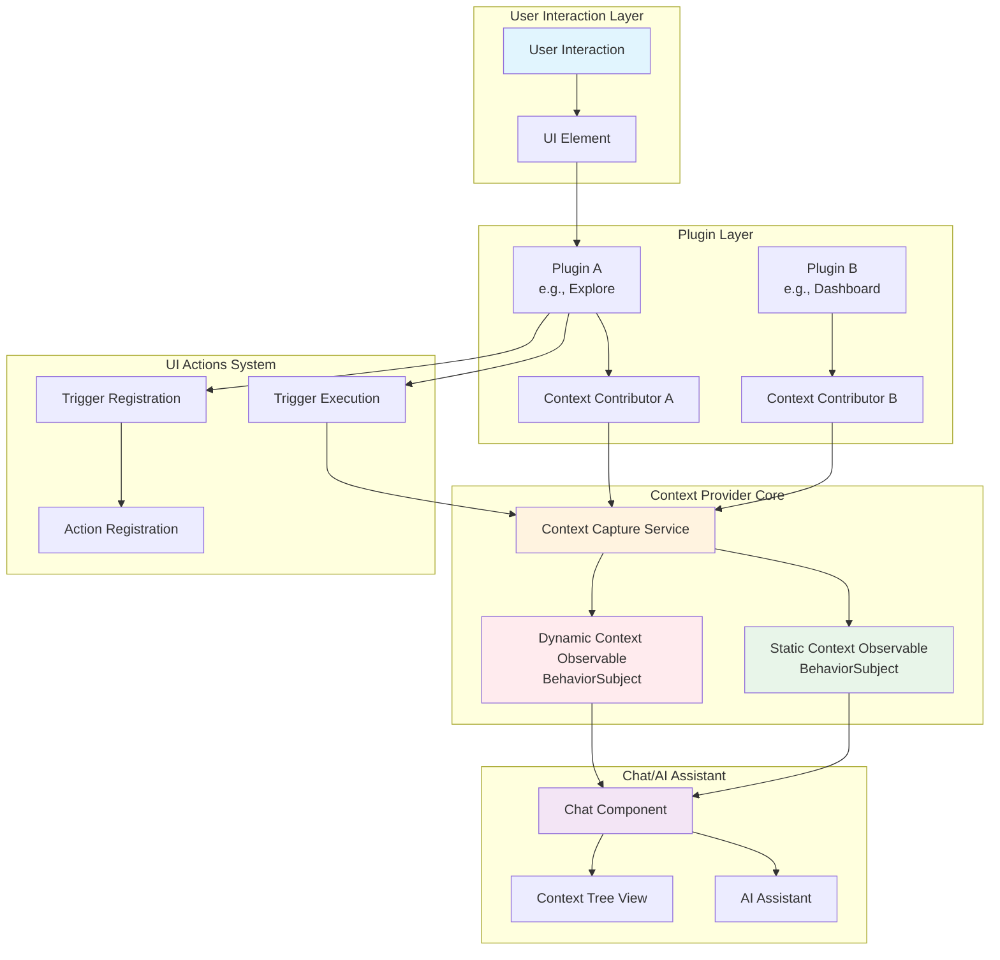
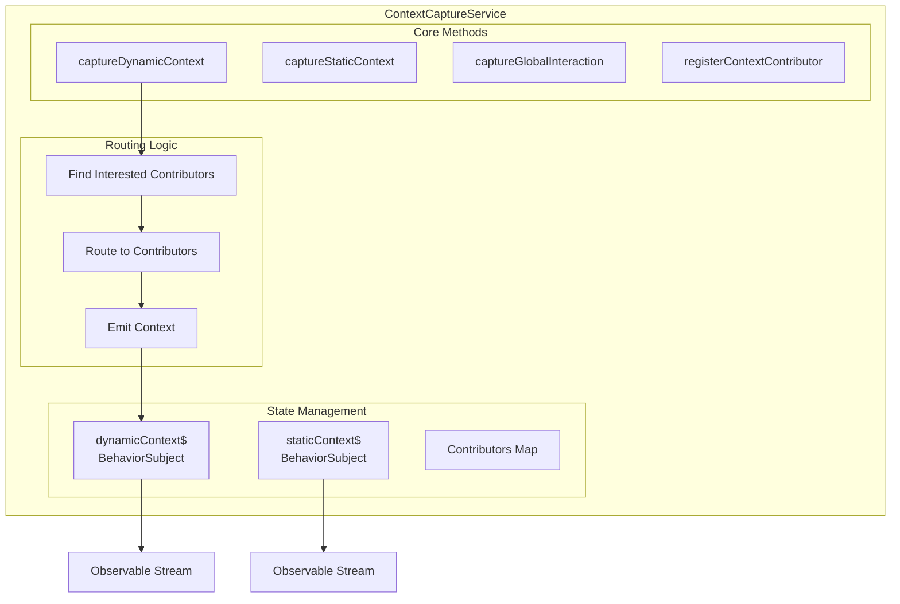
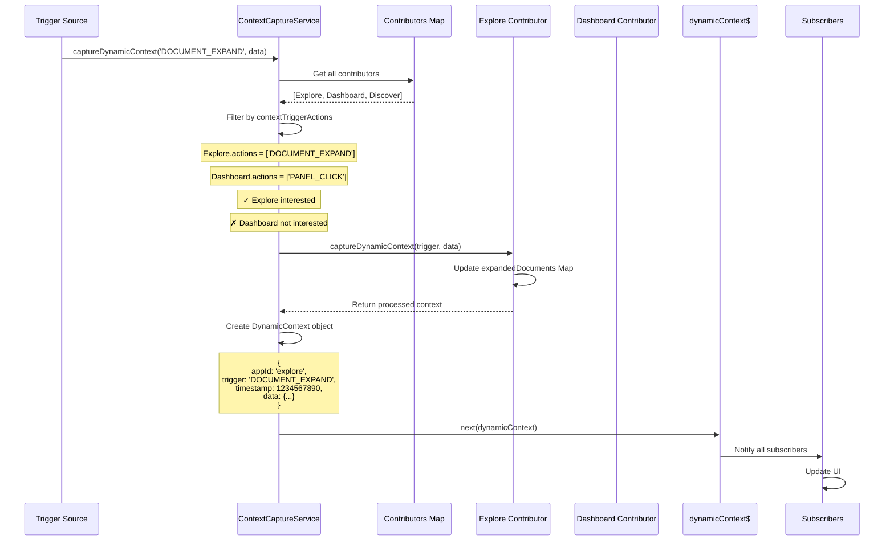
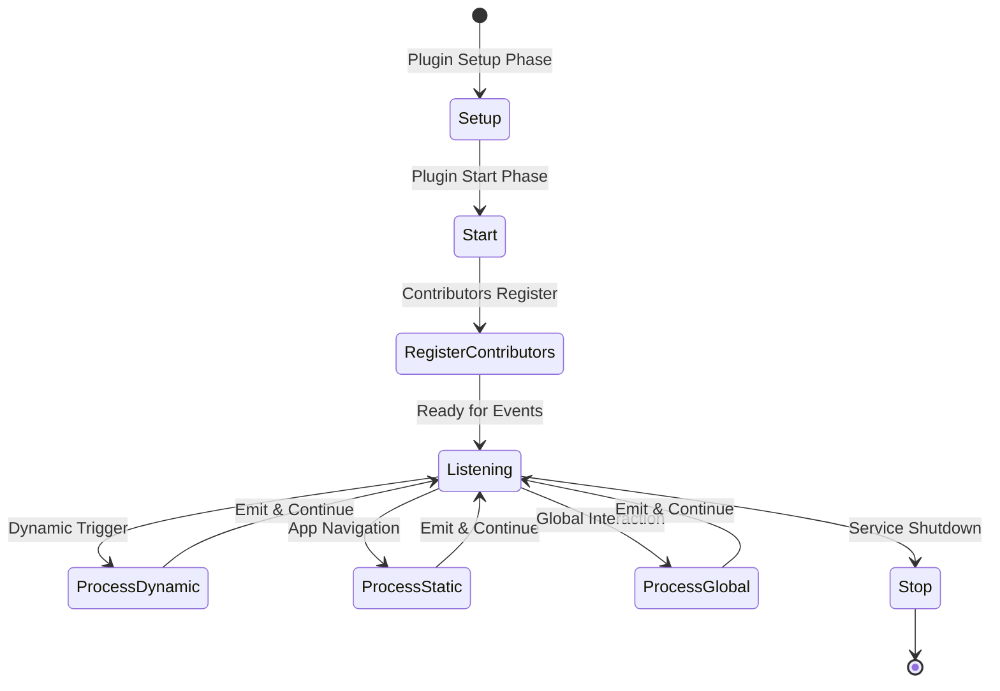
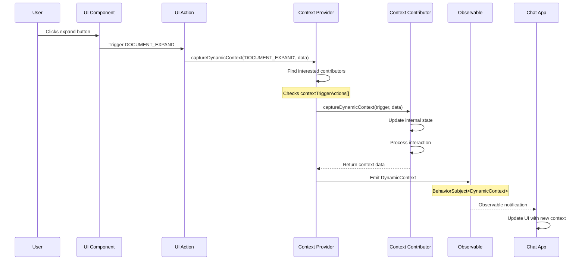
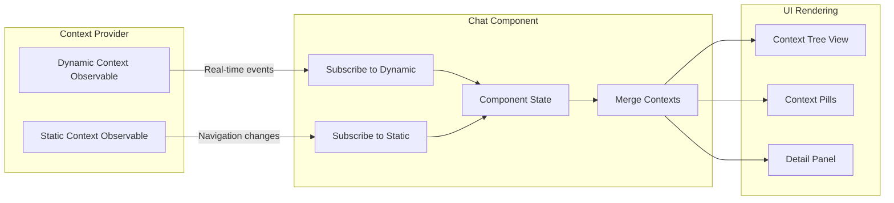
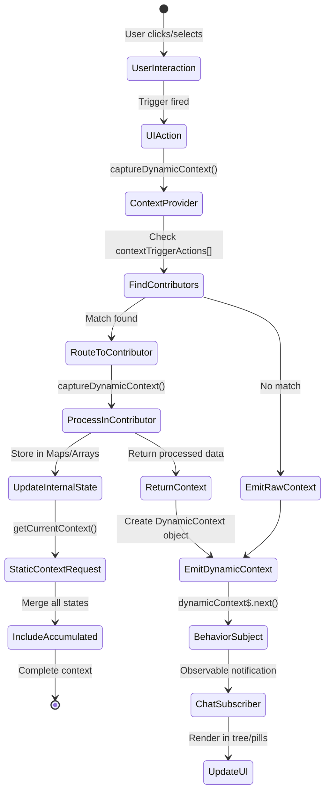

# Dynamic Context System - Complete Guide

## Overview

Dynamic context captures real-time user interactions and transient UI state that isn't reflected in URLs. Unlike static context (captured on navigation), dynamic context tracks what users are actively doing - expanding documents, selecting fields, hovering over elements, etc.

## Architecture Overview



## Context Capture Service - The Core Engine

The `ContextCaptureService` is the central orchestrator for all context capture operations. It manages both static and dynamic context, routes triggers to contributors, and maintains the observable streams.

### Service Architecture



### The `captureDynamicContext` Method

This is the heart of dynamic context capture. Here's exactly how it works:

```typescript
// context_capture_service.ts:111-169
public captureDynamicContext(trigger: string, data: any): void {
  // 1. Log the incoming trigger
  console.log(`⚡ Processing dynamic context for trigger: ${trigger}`);

  // 2. Find all contributors interested in this trigger
  const interestedContributors = Array.from(this.contextContributors.values())
    .filter(contributor =>
      contributor.contextTriggerActions?.includes(trigger)
    );

  // 3. Route to each interested contributor
  interestedContributors.forEach(contributor => {
    if (contributor.captureDynamicContext) {
      try {
        // Let contributor process the trigger
        const contributorContext = contributor.captureDynamicContext(trigger, data);

        // Create DynamicContext object
        const dynamicContext: DynamicContext = {
          appId: contributor.appId,
          trigger,
          timestamp: Date.now(),
          data: contributorContext
        };

        // Emit to observable (replaces previous value)
        this.dynamicContext$.next(dynamicContext);
      } catch (error) {
        console.error(`Error in ${contributor.appId}:`, error);
      }
    }
  });

  // 4. If no contributors handle it, emit raw context
  if (interestedContributors.length === 0) {
    this.dynamicContext$.next({
      trigger,
      timestamp: Date.now(),
      data
    });
  }
}
```

### Key Characteristics of `captureDynamicContext`

1. **Trigger-Based Routing**:
   - Checks each contributor's `contextTriggerActions` array
   - Only routes to contributors that explicitly declared interest

2. **Sequential Processing**:
   - Processes each interested contributor one by one
   - Each emits a separate `DynamicContext` event
   - Last contributor's emission becomes the current value

3. **Error Isolation**:
   - Wraps each contributor call in try-catch
   - One contributor's error doesn't affect others

4. **Fallback Behavior**:
   - If no contributors handle a trigger, emits raw data
   - Ensures no triggers are lost

### Detailed Flow Example



### Contributor Registration

Contributors must be registered before they can receive dynamic context:

```typescript
public registerContextContributor(contributor: ContextContributor): void {
  // Store in map with appId as key
  this.contextContributors.set(contributor.appId, contributor);

  // Contributor MUST declare contextTriggerActions to receive dynamic context
  console.log(`Registered ${contributor.appId} with triggers:`,
    contributor.contextTriggerActions);
}
```

### Observable Management

The service uses RxJS `BehaviorSubject` for state management:

```typescript
// State holders
private dynamicContext$ = new BehaviorSubject<DynamicContext | null>(null);
private contextContributors = new Map<string, ContextContributor>();

// Public access (read-only)
public getDynamicContext$(): Observable<DynamicContext | null> {
  return this.dynamicContext$.asObservable();
}
```

**Important**: `BehaviorSubject` characteristics:
- Holds ONE value at a time
- New emissions replace the previous value
- Subscribers get the last emitted value immediately
- Perfect for "current state" scenarios

### Global Interaction Capture

The service also handles global interactions (clicks, hovers, etc.):

```typescript
public captureGlobalInteraction(interaction: GlobalInteraction): void {
  // Try to route to specific contributor
  const contributor = this.contextContributors.get(interaction.app || 'unknown');

  if (contributor?.handleGlobalInteraction) {
    contributor.handleGlobalInteraction(interaction);
  }

  // Always emit as dynamic context for backward compatibility
  this.dynamicContext$.next({
    appId: interaction.app,
    trigger: interaction.interactionType || 'GLOBAL_CLICK',
    timestamp: interaction.timestamp,
    data: interaction
  });
}
```

### Service Lifecycle



## How Plugins Enable Dynamic Context Capture

### Step 1: Create a Context Contributor

Plugins must implement a `ContextContributor` that declares which UI actions it wants to monitor:

```typescript
// src/plugins/explore/public/context_contributor.ts
export class ExploreContextContributor implements StatefulContextContributor {
  appId = 'explore';
  capturePattern = ContextCapturePattern.HYBRID;

  // Declare which UI actions trigger dynamic context capture
  contextTriggerActions = [
    'DOCUMENT_EXPAND',
    'DOCUMENT_COLLAPSE',
    'FIELD_FILTER_ADD',
    'FIELD_FILTER_REMOVE',
    'TABLE_ROW_SELECT'
  ];

  // Store transient state (not in URL)
  private expandedDocuments = new Map<string, DocumentExpansionContext>();
  private selectedFields = new Map<string, any>();

  // Process dynamic context when triggers fire
  captureDynamicContext(trigger: string, data: any): Record<string, any> {
    switch (trigger) {
      case 'DOCUMENT_EXPAND':
        this.expandedDocuments.set(data.documentId, {
          documentId: data.documentId,
          documentData: data.documentData,
          expandedAt: Date.now(),
          interactionCount: 1
        });
        break;
      case 'DOCUMENT_COLLAPSE':
        this.expandedDocuments.delete(data.documentId);
        break;
    }

    return {
      expandedDocuments: Array.from(this.expandedDocuments.values()),
      selectedFields: Array.from(this.selectedFields.entries())
    };
  }
}
```

### Step 2: Register UI Actions and Triggers

```typescript
// src/plugins/explore/public/ui_actions/explore_ui_actions.ts
export function registerExploreUIActions(uiActions: UiActionsSetup) {
  // Register the trigger
  uiActions.registerTrigger({
    id: 'DOCUMENT_EXPAND',
    title: 'Expand Document',
    description: 'User expanded a document to see full details'
  });

  // Register the action that fires the trigger
  uiActions.registerAction({
    id: 'EXPLORE_DOCUMENT_EXPAND_ACTION',
    type: 'DOCUMENT_EXPAND',
    execute: async (context) => {
      // Get the context provider and trigger dynamic context capture
      const contextProvider = window.contextProvider;
      contextProvider.captureDynamicContext('DOCUMENT_EXPAND', {
        documentId: context.documentId,
        documentData: context.documentData,
        timestamp: Date.now()
      });
    }
  });
}
```

### Step 3: Register the Contributor

```typescript
// src/plugins/explore/public/plugin.ts
export class ExplorePlugin {
  public start(core: CoreStart, deps: ExploreStartDeps) {
    // Create and register the context contributor
    const contributor = new ExploreContextContributor(core.savedObjects.client);
    deps.contextProvider.registerContextContributor(contributor);

    // Make it globally available for debugging
    window.exploreContextContributor = contributor;
  }
}
```

## How Dynamic Context is Captured



## How Dynamic Context is Stored

### 1. Immediate Storage (Single Event)
The Context Provider maintains the **most recent** dynamic context event:

```typescript
// In ContextCaptureService
private dynamicContext$ = new BehaviorSubject<DynamicContext | null>(null);

// Each new event replaces the previous one
captureDynamicContext(trigger: string, data: any) {
  const dynamicContext: DynamicContext = {
    appId: contributor.appId,
    trigger,
    timestamp: Date.now(),
    data: contributorContext
  };

  this.dynamicContext$.next(dynamicContext); // Replaces previous value
}
```

### 2. Accumulated Storage (Context Contributor State)
Contributors maintain their own internal state collections:

```typescript
// In ExploreContextContributor
private expandedDocuments = new Map<string, DocumentExpansionContext>();
private selectedFields = new Map<string, any>();

// Accumulates multiple interactions
captureDynamicContext(trigger: string, data: any) {
  if (trigger === 'DOCUMENT_EXPAND') {
    // ADD to collection (doesn't replace)
    this.expandedDocuments.set(data.documentId, {...});
  }
}
```

### 3. Static Context Integration
When static context is requested, it includes accumulated dynamic state:

```typescript
async captureStaticContext(): Promise<Record<string, any>> {
  return {
    // URL-based context
    indexPattern: this.parseUrlState().indexPattern,

    // Accumulated dynamic context
    expandedDocuments: Array.from(this.expandedDocuments.values()),
    selectedFields: Array.from(this.selectedFields.entries()),

    // Metadata
    interactionSummary: {
      totalInteractions: this.interactionCount,
      hasMultipleExpanded: this.expandedDocuments.size > 1
    }
  };
}
```

## How Chat App Reads and Renders Dynamic Context



### Chat Component Implementation

```typescript
// src/plugins/chat/public/components/chat_messages.tsx
export const ChatMessages: React.FC = () => {
  const [staticContext, setStaticContext] = useState(null);
  const [dynamicContext, setDynamicContext] = useState(null);
  const [mergedContext, setMergedContext] = useState({});

  useEffect(() => {
    // Subscribe to static context changes
    const staticSub = contextProvider.getStaticContext$()
      .subscribe(context => {
        setStaticContext(context);
        updateMergedContext(context, dynamicContext);
      });

    // Subscribe to dynamic context changes
    const dynamicSub = contextProvider.getDynamicContext$()
      .subscribe(context => {
        setDynamicContext(context);
        // Update UI to show real-time interaction
        showContextNotification(context);
      });

    return () => {
      staticSub.unsubscribe();
      dynamicSub.unsubscribe();
    };
  }, []);

  const updateMergedContext = (static, dynamic) => {
    // Merge both contexts for complete picture
    setMergedContext({
      ...static?.data,
      lastInteraction: dynamic
    });
  };
}
```

### Context Tree View Rendering

```typescript
// src/plugins/chat/public/components/context_tree_view.tsx
const renderDynamicContext = (context) => {
  if (!context) return null;

  return (
    <EuiTreeView
      items={[
        {
          label: 'Dynamic Context',
          icon: <EuiIcon type="pulse" color="warning" />,
          children: [
            {
              label: `Trigger: ${context.trigger}`,
              icon: <EuiIcon type="play" />
            },
            {
              label: `Time: ${new Date(context.timestamp).toLocaleTimeString()}`,
              icon: <EuiIcon type="clock" />
            },
            {
              label: 'Data',
              children: renderContextData(context.data)
            }
          ]
        }
      ]}
    />
  );
};
```

## Data Flow Summary



## Key Concepts

### 1. Single Event vs Accumulated State
- **Dynamic Context Observable**: Holds ONE event at a time (most recent)
- **Contributor Internal State**: Accumulates MULTIPLE interactions
- **Static Context**: Includes ALL accumulated state when requested

### 2. Real-time vs Snapshot
- **Dynamic Context**: Real-time stream of interactions
- **Static Context**: Snapshot including accumulated dynamic state

### 3. Transient vs Persistent
- **Dynamic Context**: Transient, not in URL, lost on refresh
- **Static Context**: Can include URL state, survives navigation

## Example: Complete Flow

1. **User expands document #1**
   - Triggers `DOCUMENT_EXPAND`
   - Dynamic context emitted: `{trigger: 'DOCUMENT_EXPAND', data: {doc1}}`
   - Contributor stores in Map: `expandedDocuments.set('doc1', data)`
   - Chat shows notification: "Document expanded"

2. **User expands document #2**
   - Triggers `DOCUMENT_EXPAND`
   - Dynamic context emitted: `{trigger: 'DOCUMENT_EXPAND', data: {doc2}}`
   - Previous dynamic context replaced in Observable
   - Contributor adds to Map: `expandedDocuments.set('doc2', data)`
   - Map now has 2 documents

3. **Chat requests current context**
   - Static context captured
   - Includes: `expandedDocuments: [{doc1}, {doc2}]`
   - Chat displays: "2 documents expanded"

## Testing Dynamic Context

```javascript
// In browser console

// 1. Check if context provider is available
window.contextProvider

// 2. Manually trigger dynamic context
window.contextProvider.captureDynamicContext('TEST_ACTION', {
  testData: 'Hello Dynamic Context'
});

// 3. Check contributor state
window.exploreContextContributor.getTransientState()

// 4. Get full context including accumulated state
await window.contextProvider.getCurrentContext()

// 5. Subscribe to dynamic context changes
window.contextProvider.getDynamicContext$().subscribe(
  context => console.log('Dynamic:', context)
);
```

## Benefits

1. **Rich Context**: AI understands not just where user is, but what they're doing
2. **Real-time Updates**: Immediate feedback on user interactions
3. **Flexible Storage**: Single events for real-time, accumulated for comprehensive context
4. **Plugin Independence**: Each plugin manages its own dynamic context
5. **Observable Pattern**: Reactive updates to UI components

## Limitations

1. **Memory Only**: Dynamic context is lost on page refresh
2. **Single Event Stream**: Only latest event in Observable
3. **Manual Integration**: Plugins must explicitly implement contributors
4. **No Persistence**: Cannot be bookmarked or shared via URL