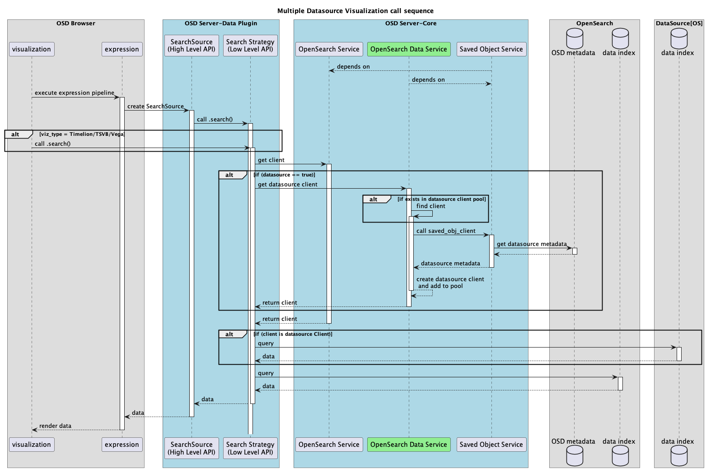
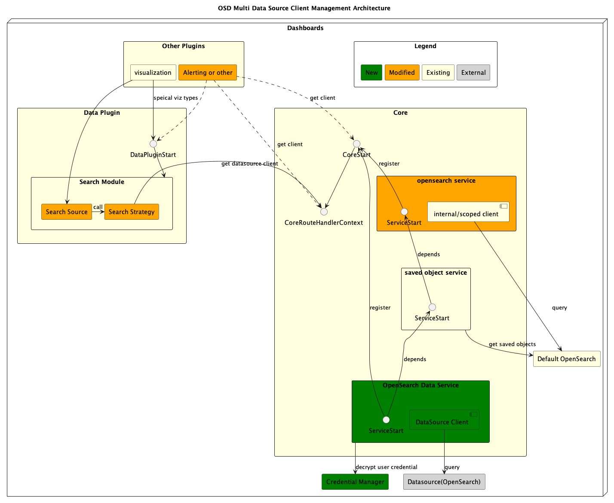

# [OpenSearch Dashboards Multi Data Source] Client Management

## 1. Problem Statement

This design is part of the OpenSearch Dashboards multi data source project [[RFC](https://github.com/opensearch-project/OpenSearch-Dashboards/issues/1388)], where we need to manage and expose clients. Connections are established through creating OpenSearch clients. Then clients can be used by caller to interact with any data source(OpenSearch is the only data source type in scope at this phase).

**Overall the critical problems we are solving are:**

1. How to set up connection(clients) for different data sources?
2. How to expose data source clients to callers through clean interfaces?
3. How to maintain backwards compatibility if user turn off this feature?
4. How to manage multiple clients/connection efficiently, and not consume all the memory?(P1)

## 2. Requirements

1. **Accessibility**:
   1. Clients need to be accessible by other OpenSearch Dashboards plugins or modules through interfaces, in all stages of the plugin lifecycle. E.g “Setup”, and “Start”
   2. Clients should be accessible by plugin through request handler context.
2. **Client Management**: Clients needs to be reused in a resource-efficient way to not harm the performance (P1)
3. **Backwards compatibility**: if user enables this feature and later disabled it. Any related logic should be able to take in this config change, and deal with any user cases.
   1. Either switching to connect to default OpenSearch cluster
   2. Or blocking the connection to data source, and throw error message
4. **Auditing:** Need to log different user query on different data sources, for troubleshooting, or log analysis

## 3. Architecture/Dataflow

- We are adding a new service in core to manage data source clients, and expose interface for plugins and modules to access data source client.
- Existing OpenSearch service and saved object services is supposed to be non-affected by this change

#### 3.1 Dataflow of plugin(use viz plugin as example) call sequence to retrieve data form any datasource.



#### 3.2 Architecture Diagram



## 4. Detailed Design

### 4.0 Answer some critical design questions

**1.** **How to set up connection(clients) for different datasources?**
Similar to how current OpenSearch Dashboards talks to default OS by creating opensearch node.js client using [opensearch-js](https://github.com/opensearch-project/opensearch-js) library, for datasources we also create clients for each. Critical params that differentiate data sources are `url` and `auth`

```ts
const { Client } = require(['@opensearch-project/opensearch'](https://github.com/opensearch-project/opensearch-js));

const **dataSourceClient** = new Client({
    node: url,
    auth: {
        username,
        password,
    },
    ...OtherClientOptions
});

dataSourceClient.search()
dataSourceClient.ping()
```

**2. How to expose datasource clients to callers through clean interfaces?**
We create an `opensearch_data_service` in core. Similar to existing `openearch_service`, which provides client of default OS cluster. This new service will be dedicated to provide clients for data sources. Following the same paradigm we can register this new service to `CoreStart`, `CoreRouteHandlerContext` , in order to expose data source client to plugins and modules. The interface is exposed from new service, and thus it doesn’t mess up with any existing services, and keeps the interface clean.

```
*// Existing*
*const defaultClient: OpenSearchClient = core.opensearch.client.asCurrentUser
*
// With openearch_data_services added
const dataSourceClient: OpenSearchClient = core.openearchData.client
```

**3.How to maintain backwards compatibility if user turn off this feature?**
Context is user can only turn off this feature by updating `opensearch_dashboards.yml` and reboot. Configs are accessible from `ConfigService` in core.

1. **Browser side**, is datasource feature is turned off, browser should detect the config change and update UI not allowing request to submit to datasource. If the request is not submitted to a datasource, the logic won’t return a datasource client at all.
2. **Server side**, if user submits the request to datasource manually, on purpose. Or the plugin tries to access datasource client from server side. In the corresponding core service we’ll have a **flag** that maps to the **enable_multi_datasource** boolean config, and throw error if API is called while this feature is turned off.

**4.How to manage multiple clients/connection efficiently, and not consume all the memory?**

- P0, we keep a map of unique clients. No size limit.
- For datasources with different endpoint, user client Pooling (E.g. LRU cache)
- For data sources with same endpoint, but different user, use connection pooling strategy (child client) provided by opensearch-js.

### 4.1 Create `core → opensearch_data_service.ts -> class: OpenSearchDataService`

- Extend from [OpenSearchService](https://github.com/opensearch-project/OpenSearch-Dashboards/blob/3d6dd638d021f383a4c6ab750c83a1d30d3787b3/src/core/server/opensearch/opensearch_service.ts#L60) to reuse utility functions
- Instance variables
  - SavedObjectClient
  - DataSourceClusterClient
- Add `savedObject` as dependency, E.g
  - interface StartDeps {
    savedObjects: InternalSavedObjectsServiceStart;
    }
- **setup()**:
  - Override setup() to not to initialize anything non-related to datasource, such as scoped client， internal client and legacy-related
  - Initialize `DataSourceClient` object
  - **return:** nothing
- **start():**
  - **input**: `{ savedObjects, auditTrail }: StartDeps`
  - Initialize saved object client.
  - **return:** createOrFindClient(<datasourceId>)
- **stop():** close all datasource clients and child clients
- Other
  - Register this service to related interfaces such as `CoreStart/CoreSetup`
  - Create corresponding service interfaces such as `InternalOpenSearchDataServiceStart`

### 4.2 Refactor `core → opensearch -> client` module

Currently [`core-opensearch`](https://github.com/opensearch-project/OpenSearch-Dashboards/tree/d7004dc5b0392477fdd54ac66b29d231975a173b/src/core/server/opensearch)module contains 2 major parts.

- **opensearch_service**: hold a `ClusterClient` instance
- **[client module](https://github.com/opensearch-project/OpenSearch-Dashboards/tree/d7004dc5b0392477fdd54ac66b29d231975a173b/src/core/server/opensearch/client)**: the utilities and interfaces for creating `ClusterClient`
  - internalClient: read only. (create as OpenSearch Dashboards internal user, system user)
  - ScopedClient: read only. (as current user)
  - asScoped(): function that create child clients of the read only ScopeClient for current user

We’ll only make changes in the client module

**4.2.1 Create `IDataSourceClient` Interface**

Similar to Existing `IClusterClient`

```ts
export interface IClusterClient {
  readonly asInternalUser: OpenSearchClient;
  asScoped: (request: ScopeableRequest) => IScopedClusterClient;
}
```

`IDataSourceClient` represents an OpenSearch data source API client created by the platform. It allows to call API on behalf of the user defined in the datasource saved

```ts
export interface IDataSourceClient {
  asDataSource: (dataSourceId: String) => Promise<OpenSearchClient>;
  close: () => Promise<void>;
}
```

**4.2.2 Create `DataSourceClient` Class**

- extends `IDataSourceClient`
- Add local variable **isDataSourceEnabled**
  - The value of flag is mapped to the boolean configuration “enable_multi_datasource” in `opensearch_dashboards.yml`. Flag to determine if feature is enabled. If turned off, any access to dataSourceClient will be rejected and throw error
- Add local variable **rootDataSourceClientCollection**
  - Map<datasource id, Client> (initialize as empty or take user config to add Clients)
- Implement the new function `asDataSource` as shown in above `IDataSourceClient` interface. Params and return type is clear

  - **Functionality**
    - Throw error if **isDataSourceEnabled == false**
    - Look up Client Pool by datasource id, return client if existed
    - Use `Saved_Object` Client to retrieve datas source info from OpenSearch Dashboards system index and parse to `DataSource` object
    - Call credential manager utilities to **decrypt** user credentials from `DataSource` Object
    - Create Client using dataSource metadata, and decrypted user credential
      - Optimization: If same endpoint but different user credential, we’ll leverage the openearch-js connection pooling strategy to create client by `.child()`

### 4.3 Register datasource client to core context

This is for plugin to access data source client via request handler. For example, by `core.client.search(params)`. It’s a very common use case for plugin to access cluster while handling request. In fact data plugin uses it in its search module to get client, and I’ll talk about it in details in next section.

**4.3.1 Update `RequestHandlerContext` interface**

- **param**
  - **dataSourceId**: need it to retrieve **datasource info** for either creating new client, or loop up the client pool
- **return type:** OpenSearchClient
  ```ts
  export interface RequestHandlerContext {
    core: {
      savedObjects: {
        client: SavedObjectsClientContract;
        typeRegistry: ISavedObjectTypeRegistry;
      };
      opensearch: {
        client: IScopedClusterClient;
        legacy: {
          client: ILegacyScopedClusterClient;
        };
      };
      opensearchData: {
        getClient(dataSourceId: String): Promise<OpenSearchClient>; // method
      };
      ...
    };
  }
  ```

**4.3.2 Update** **`CoreOpenSearchRouteHandlerContext`** **class**

- Create class `CoreOpenSearchDataRouteHandlerContext`

  ```ts
  class CoreOpenSearchDataRouteHandlerContext {
            constructor(
              private readonly opensearchDataStart: InternalOpenSearchDataServiceStart
            ) {}

            public getClient(dataSourceId: string) {
                return async () => {
                  try {
                    await this.opensearchDataStart.client.asDataSource(dataSourceId)
                  }
              }
            }
  ```

- Register to `CoreRouteHandlerContext`

  ```ts
   export class CoreRouteHandlerContext {
        #auditor?: Auditor;

        readonly opensearch: CoreOpenSearchRouteHandlerContext;
        readonly savedObjects: CoreSavedObjectsRouteHandlerContext;
        readonly uiSettings: CoreUiSettingsRouteHandlerContext;
        **readonly dataSource CoreOpenSearchDataRouteHandlerContext**

        constructor(
          private readonly coreStart: InternalCoreStart,
          private readonly request: OpenSearchDashboardsRequest
        ) {
          this.savedObjects = new CoreSavedObjectsRouteHandlerContext(
            this.coreStart.savedObjects,
            this.request
          );
          this.opensearch = new CoreOpenSearchRouteHandlerContext(
            this.coreStart.opensearch,
            this.request,
          );
          this.uiSettings = new CoreUiSettingsRouteHandlerContext(
            this.coreStart.uiSettings,
            this.savedObjects
          );
          this.dataSource = new CoreOpenSearchDataRouteHandlerContext(
            this.coreStart.opensearchData
          )
        }

  ```

### 4.4 Refactor data plugin search module to call core API to get datasource client

`Search strategy` is the low level API of data plugin search module. It retrieve clients and query OpenSearch. It needs to be refactored to switch between default client and datasource client, depending on whether a request is send to datasource or not.

Currently default client is retrieved by search module of data plugin to interact with OpenSearch by this API call. Ref: [opensearch-search-strategy.ts](https://github.com/opensearch-project/opensearch-dashboards/blob/e3b34df1dea59a253884f6da4e49c3e717d362c9/src/plugins/data/server/search/opensearch_search/opensearch_search_strategy.ts#L75)

```ts
const client: OpenSearchClient = core.opensearch.client.asCurrentUser;
// use API provided by opensearch-js lib to interact with OpenSearch
client.search(params);
```

Similarly we’ll have the following for datasource use case. `AsCurrentUser` is something doesn’t make sense for datasource, because it’s always the “current” user credential defined in the “datasource”, that we are using to create the client, or look up the client pool.

```ts
if (request.dataSource) {
    await client: OpenSearchClient =
    core.opensearchData.getClient(<datasourceId>)
} else {
// existing logic to retrieve default client
  client: OpenSearchClient = core.opensearch.client.asCurrentUser
}

// use API provided by opensearch-js lib to interact with OpenSearch
client.ping()
client.search(params)
```

### 4.5 Client Management

When loading a dashboard with visualizations, each visualization sends at least 1 request to server side to retrieve data. With multiple data source feature enabled, multiple requests are being sent to multiple datasources, that requires multiple clients. If we return a new client **per request**, it will soon fill up the memory and sockets with idle clients hanging there. Of course we can close a client anytime. But the connection is supposed to be kept alive for easy reload and periodic pulling data. Therefore, we should come up with better solution to manage clients efficiently.

#### P0: **const dataSourceClientPool = Map<dataSourceId, client>()**

- Keep all datasource clients in a Map
- Map enables easy look up. The input for getting a data source client is `dataSourceId`. If a client was created with same datasource, we can easily find it and return to caller. Otherwise we create a new client to return to caller, and add to the Map.
- While stopping the service, we can close all the connections by looping the Map and calling `client.close()` for each.
- For data sources with same endpoint, but different user, use connection pooling strategy (child client) provided by opensearch-js.

#### P1: Client pooling by LRU cache

- key: data source endpoint
- value: OpenSearch client object
- configurable pool size
- use existing js lru-cache lib

```ts
import LRUCache from 'lru-cache';

export class OpenSearchClientPool {
  private cache?: LRUCache<string, Client>
  ...
```

## 5. Audit & Logging

[#1986](https://github.com/opensearch-project/OpenSearch-Dashboards/issues/1986)
