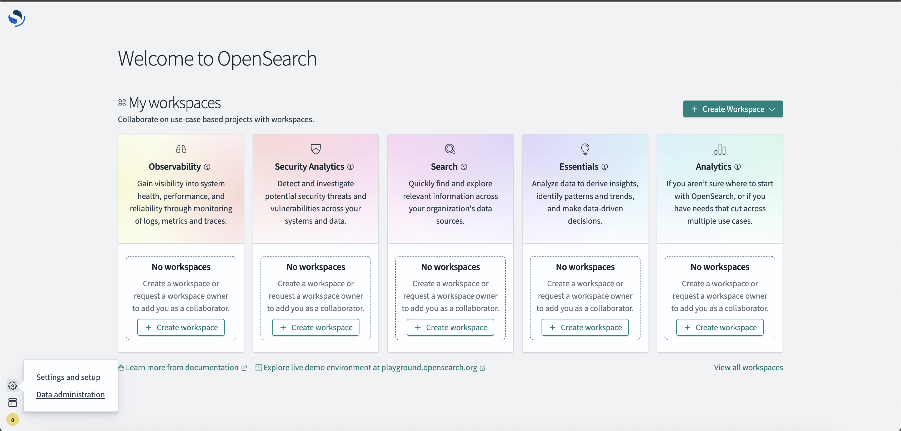
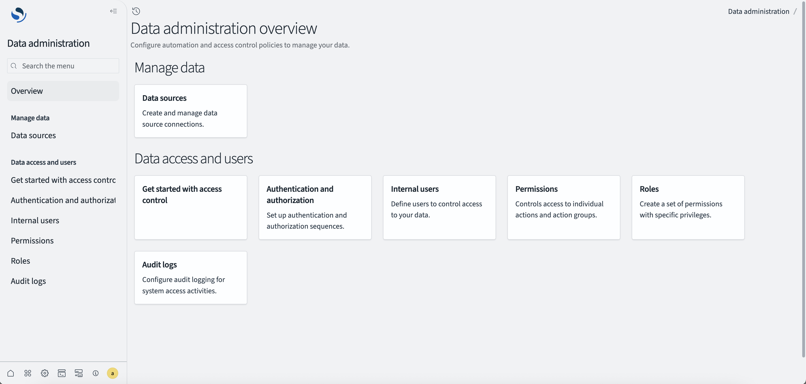
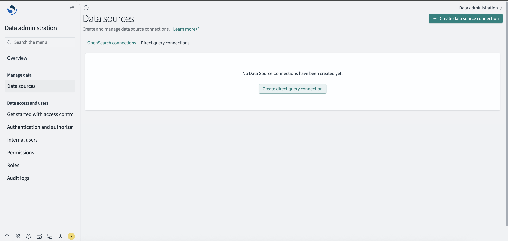
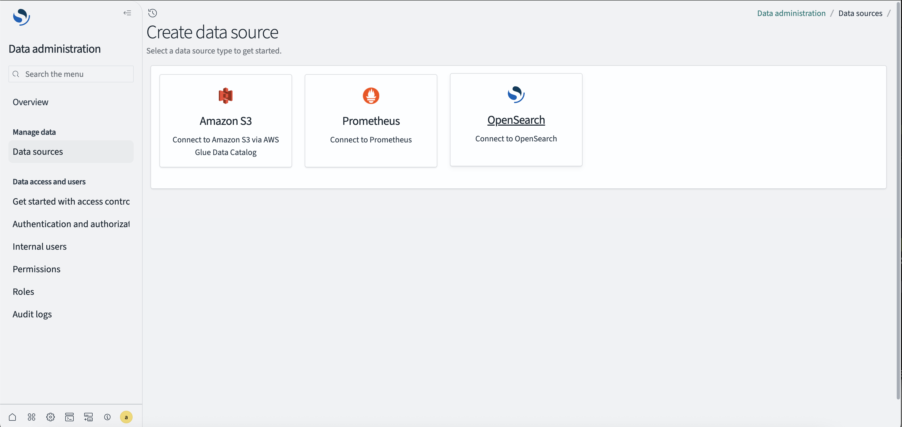
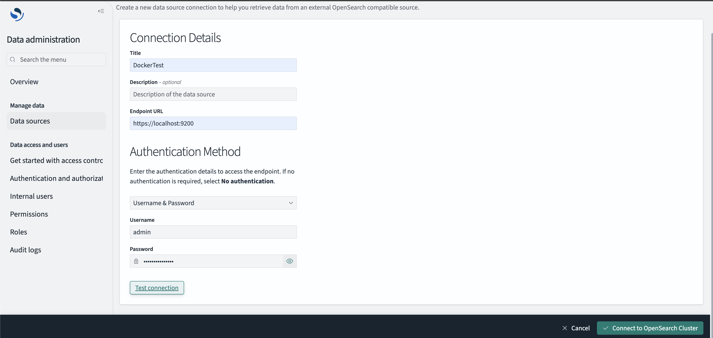
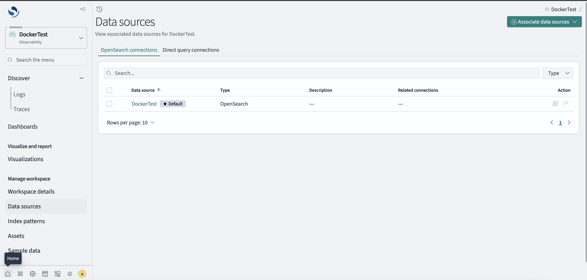
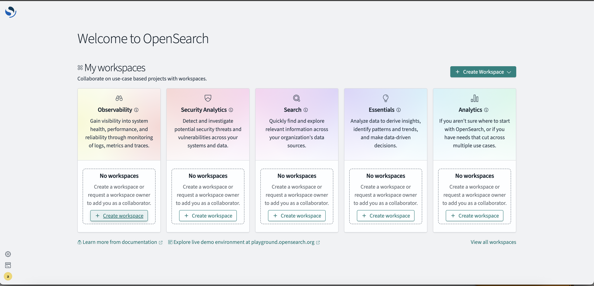
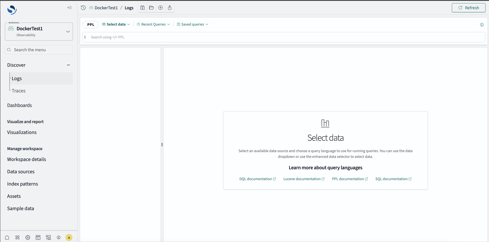

# Explore Plugin (experimental)

This plugin is experimental and will change in future releases.

The Explore plugin represents an evolution of the Discover experience in OpenSearch Dashboards, providing enhanced query capabilities and multi-dataset support.

## Overview

This plugin introduces a query-driven data exploration experience while maintaining compatibility with the existing Discover functionality. It serves as a forward-looking replacement for Discover that will eventually become the primary data exploration interface.

## Why a New Plugin?

Creating a separate plugin instead of directly modifying Discover allows us to:

1. Prevent regression on the existing Discover plugin while implementing new features
2. Build a new architecture for a query-driven experience
3. Enable incremental adoption as users transition to the new experience

## Relationship to Other Plugins

### Discover Plugin
Explore builds upon Discover's core functionality while enhancing it with multi-dataset support and flexible query capabilities. Eventually, Explore will replace Discover entirely as a backward-compatible upgrade.

### Data Explorer Plugin
While Data Explorer provides a consolidated view of all data exploration tools, Explore focuses specifically on the search and analysis experience within that broader ecosystem.

## Running the Plugin

To run the Explore plugin:

```bash
yarn start:explore
```

## For OpenSearch Dashboards 3.3 Docker and Binary Releases

For OpenSearch Dashboards 3.3 Docker and binary releases, follow these steps:

Update your `config/opensearch_dashboards.yml` file with the following configuration block enabled:

```yaml
# ===========================================
# The new OpenSearch Dashboards Experience
# Enable the following three flags together for the new OpenSearch Dashboards discover features
# ===========================================

# Set the value of this setting to true to enable multiple data source feature.
# data_source.enabled: false

# Set the value to true to enable workspace feature
# Please note, workspace will not work with multi-tenancy. To enable workspace feature, you need to disable multi-tenancy first with `opensearch_security.multitenancy.enabled: false`
# workspace.enabled: false

# explore.enabled: false
```

Once the above flags are enabled, when users visit the home page, they will see the workspace page.

### Creating a Data Source



1. Click "Data administration" to navigate to the Data administration overview page



2. Click "Data sources" and then "Create direct query connection"



3. Follow the creation workflow and fill in the required connection details





4. After receiving a successful "Test connection" result, click "Connect to OpenSearch Cluster"

5. Once the data source is created, click the "Home" button to return to the workspace page



### Creating an Observability Workspace



1. From the workspace page, click "Observability" and then "+ Create workspace"


2. Fill out the information and associate the data source you just created, then press "Create workspace"



3. You will be automatically entered into your new workspace where you can create or select an index pattern to explore your data.

## Enhanced Trace Observability in OpenSearch Dashboards 3.3

Built on the Discover interface and new in 3.3, Discover Traces provides a central interface for querying and exploring traces across large distributed systems. Traces includes a click-to-filter interface, allowing construction of complex PPL queries without having to write them. When a trace requires deeper investigation, a new trace details page reveals individual trace journeys, displaying complete metadata, attributes, and execution context for that specific operation.
A
To enable the Discover Traces functionality, enable the following experimental setting in your `config/opensearch_dashboards.yml` file:

```yaml
# @experimental Set the value to true to enable discover traces
# explore.discoverTraces.enabled: true
```

For detailed setup instructions and configuration guidance for the Discover Traces feature, please refer to the [Traces Setup Documentation](https://github.com/opensearch-project/OpenSearch-Dashboards/blob/main/src/plugins/explore/public/application/pages/traces/README.md).

## Future Plans

The long-term goal is for Explore to completely replace the Discover plugin. This transition will happen gradually while maintaining backward compatibility to ensure a smooth transition for users and developers who have built workflows around Discover.