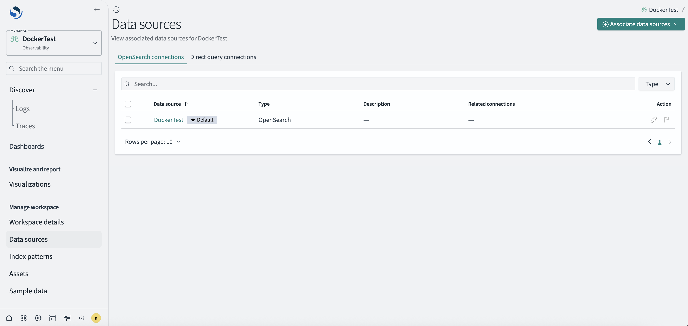
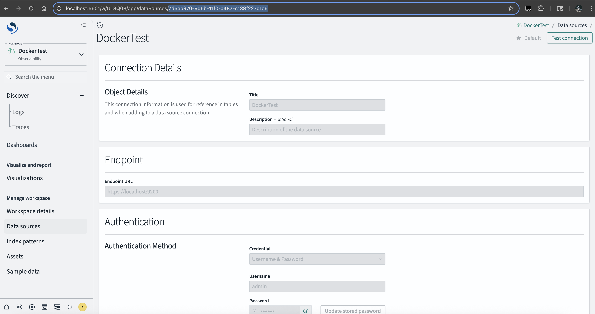
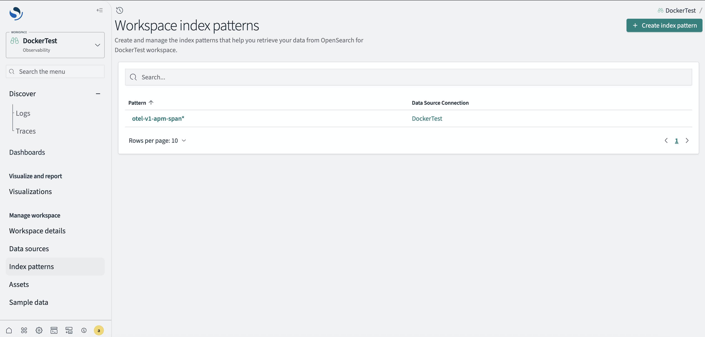
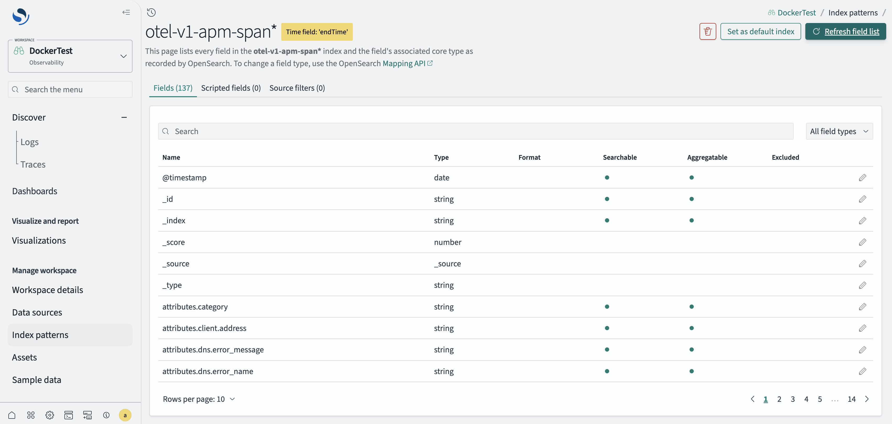
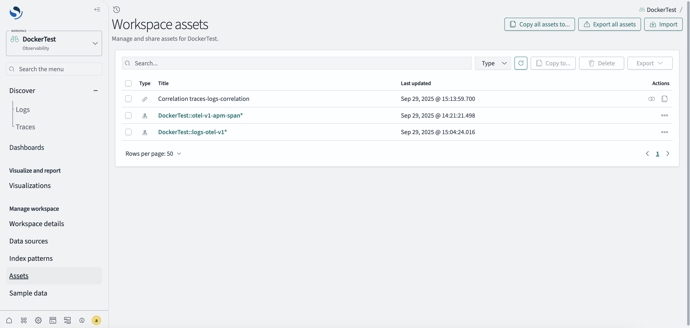
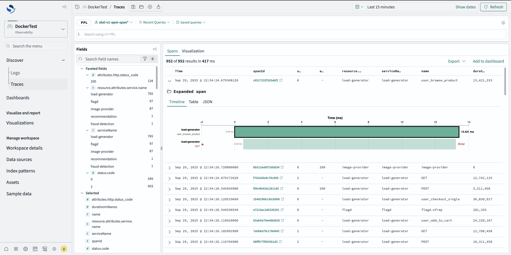

# Discover Traces (Experimental)

## Overview

### Query trace data with Discover Traces

Built on the Discover interface and new in 3.3, Discover Traces provides a centralized interface for querying and exploring traces across large distributed systems. It includes a click-to-filter interface, allowing construction of complex PPL queries without having to write them manually. When a trace requires deeper investigation, a new trace details page reveals individual trace journeys, displaying complete metadata, attributes, and execution context for that specific operation. To activate this functionality, please refer to the step-by-step guide below.


### Explore interactive node-based visualizations with React Flow

3.3 adds the React Flow library to OpenSearch Dashboards core as an experimental feature, providing a standardized framework for interactive node-based visualizations. This integration eliminates version conflicts that occurred when individual plugins bundled copies of the library, providing a consistent user experience. The library is currently being used with the Discover: Traces feature to render service maps that visualize trace spans and service dependencies. Unlike traditional charting libraries, React Flow specializes in workflow and network diagrams, offering drag-and-drop interactions, custom node components, and efficient rendering of thousands of nodes while maintaining accessibility compliance.


### Trace to Log correlation

When both trace and log index patterns are configured with proper correlation objects, OpenSearch Dashboards 3.3 enables seamless navigation between traces and their associated logs. This powerful feature allows developers and operators to quickly jump from a trace span to related log entries, providing complete context for debugging and troubleshooting distributed systems. The correlation is established through common identifiers like trace IDs and span IDs, creating a unified observability experience that bridges the gap between structured traces and detailed log messages.


## For OpenSearch Dashboards 3.3 Docker and Binary Releases

Update your `config/opensearch_dashboards.yml` file with the following configuration block enabled:

```yaml
# ===========================================
# The new OpenSearch Dashboards Experience
# Enable the following four flags together for the new OpenSearch Dashboards discover features
# ===========================================

# Set the value of this setting to true to enable multiple data source feature.
# data_source.enabled: false

# Set the value to true to enable workspace feature
# Please note, workspace will not work with multi-tenancy. To enable workspace feature, you need to disable multi-tenancy first with `opensearch_security.multitenancy.enabled: false`
# workspace.enabled: false

# explore.enabled: false

# @experimental Set the value to true to enable discover traces
# explore.discoverTraces.enabled: true
```

## Setup

You should follow the steps from the [Explore setup guide](https://github.com/opensearch-project/OpenSearch-Dashboards/blob/main/src/plugins/explore/README.md) to create the data source and workspace first.

### Create a Trace Index Pattern

After creating your data source and workspace, you need to create a trace index pattern to enable trace data visualization.

1. **Get your data source ID** by going to the data source page and clicking on the data source you wish to create the index pattern for.

   

2. **Copy the data source ID** from the URL after clicking the data source.

   

3. **Run the following command** in your terminal to create an index pattern and associate it as a trace signal:

   ```bash
   # Replace <username> with your OpenSearch username (e.g., admin)
   # Replace <password> with your OpenSearch password
   # Replace <port> with your OpenSearch Dashboards port (default: 5601)
   # Replace <workspace_id> with your workspace ID (found in workspace URL or API)
   # Replace <index_pattern_id> with desired ID for the index pattern
   # Replace <index_pattern_title> with the index pattern to match (supports wildcards) 
   # <index_pattern_title> OTel standard of <otel-v1-apm-span*>
   # Replace <time_field> with the timestamp field name in your indices
   # <time_field> OTel standard of <endTime>
   # Replace <data_source_id> with your data source ID (found in Data sources page)

   curl -u '<username>:<password>' -X POST \
     'http://localhost:<port>/w/<workspace_id>/api/saved_objects/index-pattern/<index_pattern_id>' \
     -H 'osd-xsrf: true' \
     -H 'Content-Type: application/json' \
     -d '{
       "attributes": {
         "title": "<index_pattern_title>",
         "timeFieldName": "<time_field>",
         "signalType": "traces"
       },
       "references": [
         {
           "type": "data-source",
           "name": "dataSource",
           "id": "<data_source_id>"
         }
       ]
     }'

   # Example
   curl -u 'admin:Welcomeuser@123' -X POST \
     'http://localhost:5601/w/UL8Q0B/api/saved_objects/index-pattern/otel-traces' \
     -H 'osd-xsrf: true' \
     -H 'Content-Type: application/json' \
     -d '{
       "attributes": {
         "title": "otel-v1-apm-span*",
         "timeFieldName": "endTime",
         "signalType": "traces"
       },
       "references": [
         { "type": "data-source", "name": "dataSource", "id": "7d5eb970-9d5b-11f0-a487-c138f227c1e6" }
       ]
     }'
   # Output
   {"type":"index-pattern","id":"otel-traces","attributes":{"title":"otel-v1-apm-span*","timeFieldName":"endTime","signalType":"traces"},"references":[{"type":"data-source","name":"dataSource","id":"7d5eb970-9d5b-11f0-a487-c138f227c1e6"}],"migrationVersion":{"index-pattern":"7.6.0"},"updated_at":"2025-09-29T21:18:19.911Z","version":"WzExMywxXQ==","workspaces":["UL8Q0B"],"namespaces":["default"]}%
   ```

4. **Navigate to the Index patterns page** and click on the created index pattern after the command is successfully run.

   

5. **Refresh the field list** by clicking "Refresh field list" on the index pattern page.

   

### (Optional) Create a Logs Index Pattern

If you have logs data that you want to associate with traces, you can create a logs index pattern.

1. **Run the following command** in your terminal to create an index pattern and associate it as a log signal:

   ```bash
   # Replace <username> with your OpenSearch username (e.g., admin)
   # Replace <password> with your OpenSearch password
   # Replace <port> with your OpenSearch Dashboards port (default: 5601)
   # Replace <workspace_id> with your workspace ID (found in workspace URL or API)
   # Replace <index_pattern_id> with desired ID for the index pattern
   # Replace <index_pattern_title> with the index pattern to match (supports wildcards)
   # <index_pattern_title> OTel standard of <logs-otel-v1*>
   # Replace <time_field> with the timestamp field name in your indices
   # <time_field> OTel standard of <time>
   # Replace <data_source_id> with your data source ID (found in Data sources page)

   curl -u '<username>:<password>' -X POST \
     'http://localhost:<port>/w/<workspace_id>/api/saved_objects/index-pattern/<index_pattern_id>' \
     -H 'osd-xsrf: true' \
     -H 'Content-Type: application/json' \
     -d '{
       "attributes": {
         "title": "<index_pattern_title>",
         "timeFieldName": "<time_field>",
         "signalType": "logs"
       },
       "references": [
         {
           "type": "data-source",
           "name": "dataSource",
           "id": "<data_source_id>"
         }
       ]
     }'

   # Example
   curl -u 'admin:Welcomeuser@123' -X POST \
     'http://localhost:5601/w/UL8Q0B/api/saved_objects/index-pattern/otel-logs' \
     -H 'osd-xsrf: true' \
     -H 'Content-Type: application/json' \
     -d '{
       "attributes": {
         "title": "logs-otel-v1*",
         "timeFieldName": "time",
         "signalType": "logs"
       },
       "references": [
         {
           "type": "data-source",
           "name": "dataSource",
           "id": "7d5eb970-9d5b-11f0-a487-c138f227c1e6"
         }
       ]
     }'

   # Output
   {"type":"index-pattern","id":"otel-logs","attributes":{"title":"logs-otel-v1*","timeFieldName":"@timestamp","signalType":"logs"},"references":[{"type":"data-source","name":"dataSource","id":"7d5eb970-9d5b-11f0-a487-c138f227c1e6"}],"migrationVersion":{"index-pattern":"7.6.0"},"updated_at":"2025-09-29T21:59:50.038Z","version":"WzExNywxXQ==","workspaces":["UL8Q0B"],"namespaces":["default"]}%
   ```

2. **Follow the earlier steps** to "Refresh field list" for the logs index pattern.

### (Optional) Correlating Logs to Traces

To enable correlation between your logs and traces data, you can create a correlation object that links them together.

1. **Run the following command** to create a traces-logs correlation:

   ```bash
   # Replace <username> with your OpenSearch username
   # Replace <password> with your OpenSearch password
   # Replace <port> with your OpenSearch Dashboards port (default: 5601)
   # Replace <workspace_id> with your workspace ID
   # Replace <correlation_id> with desired ID for the correlation
   # Replace <traces_index_id> with your traces index pattern ID (e.g., otel-traces)
   # Replace <logs_index_id> with your logs index pattern ID (e.g., otel-logs)
   # Replace <span_id_field> with the span ID field name in your logs (e.g., spanId)
   # Replace <trace_id_field> with the trace ID field name in your logs (e.g., traceId)
   # Replace <log_message_field> with the log message field name (e.g., body or message)
   # Replace <timestamp_field> with the timestamp field name in your logs (e.g., @timestamp)

   curl -u '<username>:<password>' -X POST \
     'http://localhost:<port>/w/<workspace_id>/api/saved_objects/correlations/<correlation_id>' \
     -H 'osd-xsrf: true' \
     -H 'Content-Type: application/json' \
     -d '{
       "attributes": {
         "correlationType": "Traces-Logs-Correlation",
         "version": "1.0.0",
         "entities": [
           {
             "tracesDataset": {
               "id": "references[0].id"
             }
           },
           {
             "logsDataset": {
               "meta": {
                 "logSpanIdField": "<span_id_field>",
                 "logTraceIdField": "<trace_id_field>",
                 "logMessage": "<log_message_field>",
                 "timestamp": "<timestamp_field>"
               },
               "id": "references[1].id"
             }
           }
         ]
       },
       "references": [
         {
           "name": "entities[0].index",
           "type": "index-pattern",
           "id": "<traces_index_id>"
         },
         {
           "name": "entities[1].index",
           "type": "index-pattern",
           "id": "<logs_index_id>"
         }
       ]
     }'

   # Example
   curl -u 'admin:Welcomeuser@123' -X POST \
     'http://localhost:5601/w/UL8Q0B/api/saved_objects/correlations/traces-logs-correlation' \
     -H 'osd-xsrf: true' \
     -H 'Content-Type: application/json' \
     -d '{
       "attributes": {
         "correlationType": "Traces-Logs-Correlation",
         "version": "1.0.0",
         "entities": [
           {
             "tracesDataset": {
               "id": "references[0].id"
             }
           },
           {
             "logsDataset": {
               "meta": {
                 "logSpanIdField": "spanId",
                 "logTraceIdField": "traceId",
                 "logMessage": "body",
                 "timestamp": "@timestamp"
               },
               "id": "references[1].id"
             }
           }
         ]
       },
       "references": [
         {
           "name": "entities[0].index",
           "type": "index-pattern",
           "id": "otel-traces"
         },
         {
           "name": "entities[1].index",
           "type": "index-pattern",
           "id": "otel-logs"
         }
       ]
     }'
   # Output
   {"type":"correlations","id":"traces-logs-correlation","attributes":{"correlationType":"Traces-Logs-Correlation","version":"1.0.0","entities":[{"tracesDataset":{"id":"references[0].id"}},{"logsDataset":{"meta":{"logSpanIdField":"spanId","logTraceIdField":"traceId","logMessage":"body","timestamp":"@timestamp"},"id":"references[1].id"}}]},"references":[{"name":"entities[0].index","type":"index-pattern","id":"otel-traces"},{"name":"entities[1].index","type":"index-pattern","id":"otel-logs"}],"updated_at":"2025-09-29T22:13:59.700Z","version":"WzE0NCwxXQ==","workspaces":["UL8Q0B"],"namespaces":["default"]}%
   ```

2. **Verify the correlation object** was created by visiting the "Assets" page where it will be named "Correlation <correlation_id>".

   

## Using Discover Traces

You can now use the Discover Traces experience. Navigate to the Traces page and select your trace index to start exploring your trace data.


