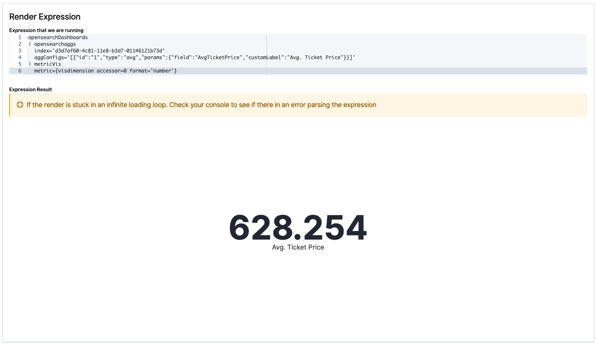

# `expressions` plugin

This plugin provides methods which will parse & execute an _expression pipeline_
string for you, as well as a series of registries for advanced users who might
want to incorporate their own functions, types, and renderers into the service
for use in their own application.

`Expressions` is a simple custom language designed to write a chain of functions that _pipe_ its output to the
input of the next function. When two or more such functions are chained together, it is an expressions pipeline. Since it is a custom language, any expression can be represented as a string. Functions can be configured using arguments provided. The final output of the expression pipeline can either be rendered using
one of the _renderers_ registered in `expressions` plugin or made to output the result of the final function in the chain.

> It is not necessary to chain functions and a single function can be used in isolation.

Expressions power visualizations in Dashboard.

Below is an example of an expression that renders a metric visualization that aggregates the average value for the field `AvgTicketPrice` in the index. It does so by first fetching the opensearch dashboards global context, pipes it into the `opensearchaggs` function that fetches the aggregate data and pipes its result to the `metricVis` function that renders a metric visualization for the data.

```
opensearchDashboards
| opensearchaggs 
  index='d3d7af60-4c81-11e8-b3d7-01146121b73d' 
  aggConfigs='[{"id":"1","type":"avg","params":{"field":"AvgTicketPrice","customLabel":"Avg. Ticket Price"}}]'
| metricVis
  metric={visdimension accessor=0 format='number'}
```



## Anatomy of an expression

Consider the example below where the expression performs the following. It takes an input, sleeps for 2000ms and then returns the square of the input as its final output

```
sleep time=2000 | square
```

**Note:** The above example expression functions are only available with the `--run-examples` flag

The whole string is an expression. `sleep` and `square` are expression functions registered with the expression plugin. `time=2000` is the argument passed to the `sleep` funciton with the value `2000`. `|` is used to denote pipe between the two functions. Every expression can take an input. In the example above, the input provided will be passed on by the sleep function to the square function.

## Using Expressions

### Execute Expressions

One of the two ways an expressions can be used is to execute an expression to return a value. This can be done using the `expressions.execute` or `expressions.run` command. The primary difference being that the `execute` method returns an `ExecutionContract` that tracks the progress of the execution and can be used to interact with the expression.

```js
const expression = `sleep time=2000 | square`;
const execution = expressions.execute(expression, input);
```

**Note:** The above example expression functions are only available with the `--run-examples` flag

### Rendering Expressions

The other way an expression can be used is to render an output using one of the _renderers_ registered in `expressions` plugin. This can be done using a few ways, the easiest of which is to use the `ReactExpressionRenderer` component. 

```jsx
const expressionString = `avatar name="OpenSearch Dashboards" size="xl"`;
<ReactExpressionRenderer expression={expressionString} />
```

**Note:** The above example expression functions are only available with the `--run-examples` flag

## Custom expressions

Users can  extend the service to incorporate their own functions, types, and renderers. Examples of these can be found in `./examples/expressions_example/common/expression_functions` and can be registered using the `registerFunction`, `registertype` and `registerRenderer` api's from the expression setup contract.

## Playground

Working with expressions can sometimes be a little tricky. To make this easier we have an example plugin with some examples, a playground to run your own expression functions and explorer to view all the registered expression functions and their propoerties. It can be started up using the `--run-examples` flag and found under the `Developer examples` option in the main menu.

```sh
yarn start --run-examples
```


