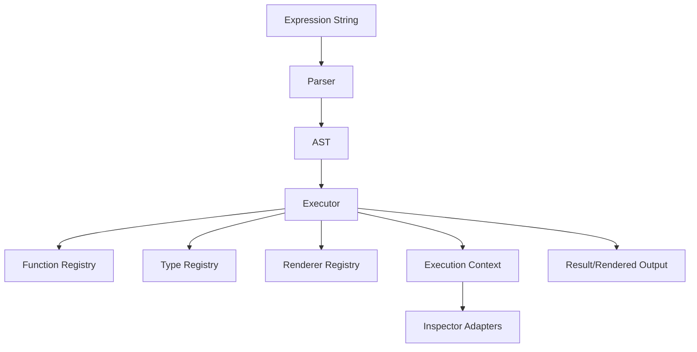
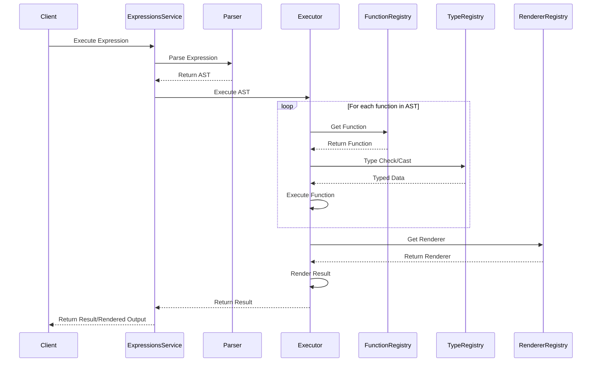
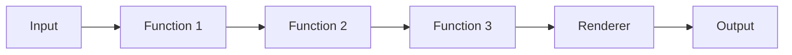

# Expressions Plugin Design

## Overview

The Expressions plugin provides a flexible and extensible system for creating, manipulating, and rendering data transformations and visualizations in OpenSearch Dashboards. This document outlines the high-level architecture and key components of the plugin.

## Architecture

The Expressions plugin is built around a core set of components that work together to parse, execute, and render expressions.

### Key Components

1. **Parser**: Converts expression strings into Abstract Syntax Trees (ASTs).
2. **AST (Abstract Syntax Tree)**: Represents the structure of an expression.
3. **Executor**: Manages the execution of expressions.
4. **Function Registry**: Stores and manages registered expression functions.
5. **Type Registry**: Manages data types used in expressions.
6. **Renderer Registry**: Stores renderers for visualizing expression outputs.
7. **Execution Context**: Provides shared state and utilities during execution.
8. **Inspector Adapters**: Collect debugging information during execution.

## Execution Flow

The execution of an expression follows these steps:

## Data Flow

The data flow through an expression chain:

## Extension Points

The Expressions plugin is designed to be extensible. Key extension points include:

1. **Custom Functions**: Developers can create and register new functions.
2. **Custom Types**: New data types can be added to the type system.
3. **Custom Renderers**: New renderers can be created for custom visualizations.
4. **Inspector Adapters**: Custom adapters can be added for specialized debugging.
